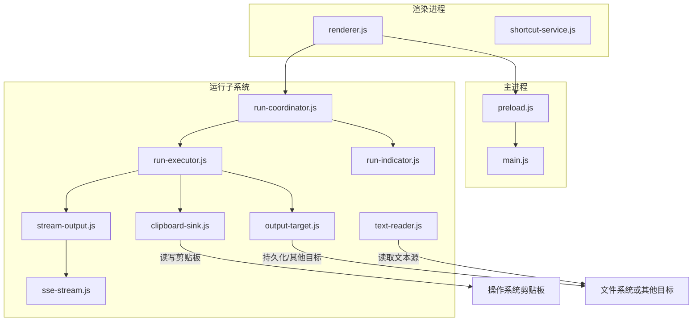
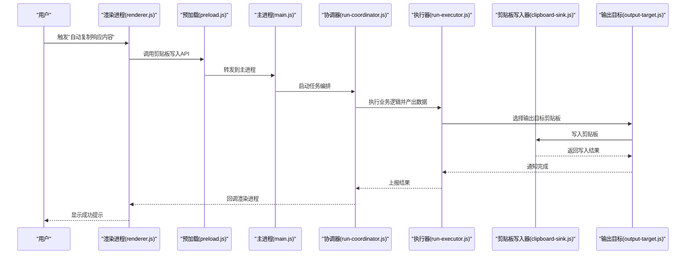
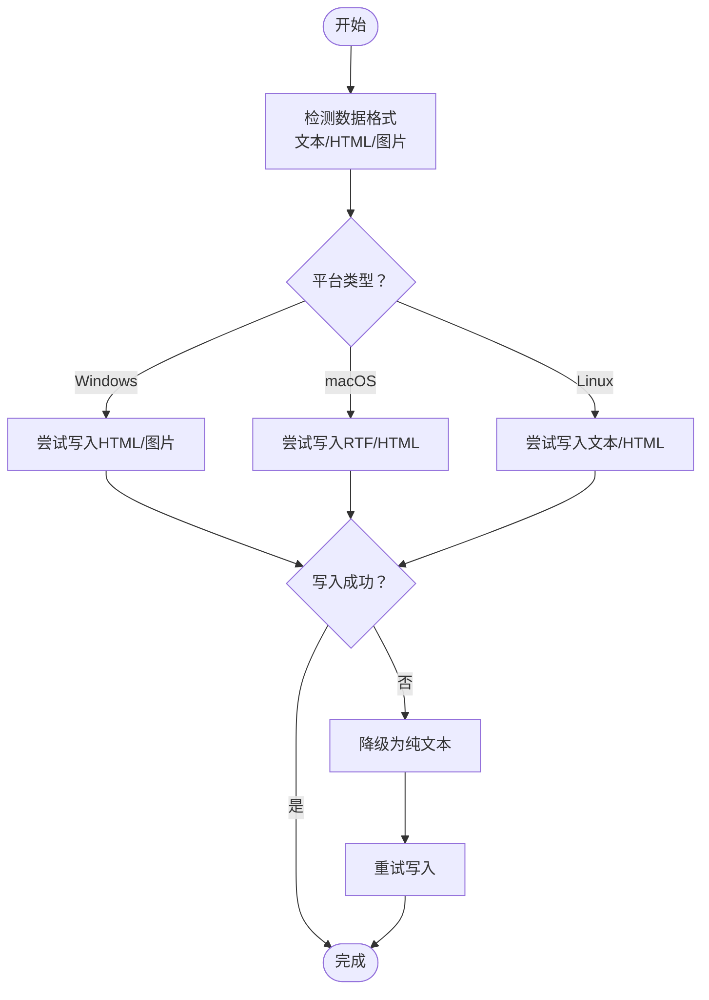
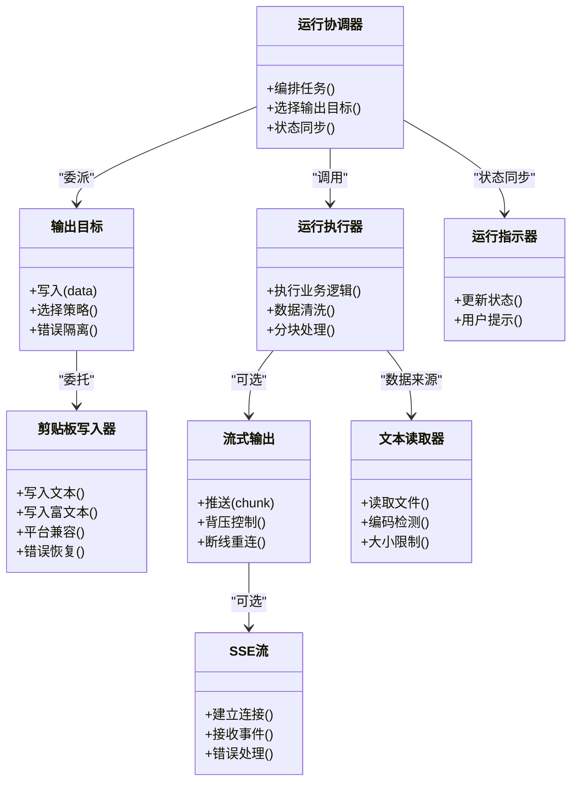

# 剪贴板集成

<cite>
**本文档引用的文件**   
- [clipboard-sink.js](file://src/run/clipboard-sink.js)
- [output-target.js](file://src/run/output-target.js)
- [run-coordinator.js](file://src/run/run-coordinator.js)
- [run-executor.js](file://src/run/run-executor.js)
- [run-indicator.js](file://src/run/run-indicator.js)
- [sse-stream.js](file://src/run/sse-stream.js)
- [stream-output.js](file://src/run/stream-output.js)
- [text-reader.js](file://src/run/text-reader.js)
- [main.js](file://src/main.js)
- [preload.js](file://src/preload.js)
- [renderer.js](file://src/renderer.js)
- [shortcut-service.js](file://src/shortcut-service.js)
- [clipboard-sink.test.js](file://test/run/clipboard-sink.test.js)
</cite>

## 更新摘要
**所做更改**   
- 更新了剪贴板写入器组件的详细实现分析
- 增强了跨平台兼容性处理的技术细节
- 完善了流式输出机制的架构说明
- 补充了快捷键服务模块的设计原理
- 优化了性能考虑和故障排查指南

## 目录
1. [简介](#简介)
2. [项目结构](#项目结构)
3. [核心组件](#核心组件)
4. [架构总览](#架构总览)
5. [详细组件分析](#详细组件分析)
6. [依赖关系分析](#依赖关系分析)
7. [性能考虑](#性能考虑)
8. [故障排查指南](#故障排查指南)
9. [结论](#结论)
10. [附录](#附录)

## 简介
本文件围绕"剪贴板集成"能力，系统性说明剪贴板监听与写入机制的实现原理、跨平台兼容性策略（Windows、macOS、Linux）、数据格式支持与转换逻辑、安全与权限管理、性能优化技巧，并通过具体示例展示在应用中集成剪贴板功能的标准流程，包括自动复制响应内容与手动粘贴输入的处理。

## 项目结构
本项目采用 Electron 多进程架构：主进程负责系统级能力（如剪贴板访问），渲染进程负责 UI 交互，预加载脚本桥接两者并提供安全的 API 暴露。剪贴板相关能力集中在 run 子模块中，通过协调器统一调度执行器与输出目标，最终将结果写入剪贴板或流式输出。

**图表来源**
- [main.js](file://src/main.js)
- [preload.js](file://src/preload.js)
- [renderer.js](file://src/renderer.js)
- [run-coordinator.js](file://src/run/run-coordinator.js)
- [run-executor.js](file://src/run/run-executor.js)
- [clipboard-sink.js](file://src/run/clipboard-sink.js)
- [output-target.js](file://src/run/output-target.js)
- [stream-output.js](file://src/run/stream-output.js)
- [sse-stream.js](file://src/run/sse-stream.js)
- [text-reader.js](file://src/run/text-reader.js)
- [run-indicator.js](file://src/run/run-indicator.js)

**章节来源**
- [main.js](file://src/main.js)
- [preload.js](file://src/preload.js)
- [renderer.js](file://src/renderer.js)
- [run-coordinator.js](file://src/run/run-coordinator.js)
- [run-executor.js](file://src/run/run-executor.js)
- [clipboard-sink.js](file://src/run/clipboard-sink.js)
- [output-target.js](file://src/run/output-target.js)
- [stream-output.js](file://src/run/stream-output.js)
- [sse-stream.js](file://src/run/sse-stream.js)
- [text-reader.js](file://src/run/text-reader.js)
- [run-indicator.js](file://src/run/run-indicator.js)

## 核心组件
- 剪贴板写入器（clipboard-sink）：封装对系统剪贴板的写入操作，处理不同平台的差异与错误恢复。
- 输出目标（output-target）：抽象多种输出目的地（剪贴板、文件、网络等），提供统一的写入接口。
- 运行协调器（run-coordinator）：编排任务生命周期，决定何时触发剪贴板写入、何时流式输出。
- 运行执行器（run-executor）：执行业务逻辑并产出数据，向输出目标推送结果。
- 流式输出（stream-output）与 SSE（sse-stream）：用于大文本或长时任务的增量输出。
- 文本读取器（text-reader）：从文件或用户输入读取文本，作为剪贴板内容的来源之一。
- 运行指示器（run-indicator）：反馈运行状态，辅助用户感知剪贴板操作的时机。

**章节来源**
- [clipboard-sink.js](file://src/run/clipboard-sink.js)
- [output-target.js](file://src/run/output-target.js)
- [run-coordinator.js](file://src/run/run-coordinator.js)
- [run-executor.js](file://src/run/run-executor.js)
- [stream-output.js](file://src/run/stream-output.js)
- [sse-stream.js](file://src/run/sse-stream.js)
- [text-reader.js](file://src/run/text-reader.js)
- [run-indicator.js](file://src/run/run-indicator.js)

## 架构总览
剪贴板集成的整体流程如下：
- 用户在渲染进程中触发操作（例如"自动复制响应内容"或"粘贴输入"）。
- 渲染进程通过预加载脚本调用主进程的剪贴板能力（Electron 的 clipboard API）。
- 运行协调器根据配置选择输出目标（剪贴板优先），执行器生成数据后交由写入器写入。
- 对于大文本或长任务，使用流式输出逐步推送，避免一次性阻塞。
- 写入完成后，运行指示器更新状态，提示用户操作成功。

**图表来源**
- [renderer.js](file://src/renderer.js)
- [preload.js](file://src/preload.js)
- [main.js](file://src/main.js)
- [run-coordinator.js](file://src/run/run-coordinator.js)
- [run-executor.js](file://src/run/run-executor.js)
- [output-target.js](file://src/run/output-target.js)
- [clipboard-sink.js](file://src/run/clipboard-sink.js)

## 详细组件分析

### 剪贴板写入器（clipboard-sink）
- 职责：封装系统剪贴板写入，处理文本与富文本格式，进行跨平台兼容与错误恢复。
- 关键实现要点：
  - 文本格式支持：纯文本、HTML 富文本、图片（视平台能力而定）。
  - 平台差异：Windows 对 HTML 与图片支持较好；macOS 偏好 RTF/HTML；Linux 依赖 X11/Wayland 剪贴板管理器。
  - 错误处理：捕获权限拒绝、剪贴板被占用、格式不支持等情况，降级为纯文本。
  - 防抖与节流：避免频繁写入导致卡顿或覆盖用户正在编辑的内容。
- 典型调用路径：执行器产出数据 → 输出目标选择剪贴板 → 写入器执行写入 → 返回结果。

**图表来源**
- [clipboard-sink.js](file://src/run/clipboard-sink.js)

**章节来源**
- [clipboard-sink.js](file://src/run/clipboard-sink.js)
- [clipboard-sink.test.js](file://test/run/clipboard-sink.test.js)

### 输出目标（output-target）
- 职责：抽象多种输出目的地，统一写入接口，便于扩展新的目标（如日志、网络上传）。
- 关键实现要点：
  - 策略模式：根据配置选择剪贴板、文件、内存缓冲等目标。
  - 数据适配：将执行器产出的数据结构转换为各目标所需的格式。
  - 错误隔离：单个目标失败不影响其他目标的写入。
- 与剪贴板的关系：当配置为剪贴板时，委托给剪贴板写入器。

**章节来源**
- [output-target.js](file://src/run/output-target.js)

### 运行协调器（run-coordinator）
- 职责：编排任务生命周期，决定何时触发剪贴板写入、何时流式输出、如何聚合结果。
- 关键实现要点：
  - 事件驱动：监听执行器的进度与完成事件。
  - 条件分支：根据数据类型与大小选择直接写入或流式推送。
  - 状态同步：与运行指示器协作，更新 UI 状态。
- 与剪贴板的关系：在合适时机调用输出目标，最终落到剪贴板写入器。

**章节来源**
- [run-coordinator.js](file://src/run/run-coordinator.js)

### 运行执行器（run-executor）
- 职责：执行业务逻辑，生成待输出的数据（文本、结构化数据等）。
- 关键实现要点：
  - 数据清洗：去除不可见字符、转义特殊符号。
  - 分块处理：对大文本进行分块，配合流式输出。
  - 错误边界：捕获异常并回退到默认输出。
- 与剪贴板的关系：产出数据后交给输出目标，由目标决定是否写入剪贴板。

**章节来源**
- [run-executor.js](file://src/run/run-executor.js)

### 流式输出（stream-output）与 SSE（sse-stream）
- 职责：对长时任务或大文本进行增量输出，减少内存占用与 UI 阻塞。
- 关键实现要点：
  - 背压控制：下游处理能力不足时暂停上游推送。
  - 断线重连：网络中断时自动恢复。
  - 与剪贴板的关系：通常不直接写入剪贴板，而是先缓存或合并后再批量写入。

**章节来源**
- [stream-output.js](file://src/run/stream-output.js)
- [sse-stream.js](file://src/run/sse-stream.js)

### 文本读取器（text-reader）
- 职责：从文件或用户输入读取文本，作为剪贴板内容的来源之一。
- 关键实现要点：
  - 编码检测：UTF-8、GBK 等常见编码。
  - 大小限制：防止读取超大文件导致内存溢出。
  - 错误处理：文件不存在、权限不足时的友好提示。

**章节来源**
- [text-reader.js](file://src/run/text-reader.js)

### 运行指示器（run-indicator）
- 职责：反馈运行状态，帮助用户感知剪贴板操作的时机与结果。
- 关键实现要点：
  - 状态枚举：空闲、运行中、成功、失败。
  - 用户提示：Toast、状态栏图标、声音提示等。
  - 与剪贴板的关系：在写入前后更新状态，避免误操作。

**章节来源**
- [run-indicator.js](file://src/run/run-indicator.js)

### 快捷键服务（shortcut-service）
- 职责：注册全局快捷键，触发"自动复制响应内容"或"粘贴输入"等操作。
- 关键实现要点：
  - 平台差异：Windows/macOS/Linux 快捷键注册方式不同。
  - 冲突检测：避免与系统或其他应用快捷键冲突。
  - 权限管理：需要系统级权限才能注册全局快捷键。

**章节来源**
- [shortcut-service.js](file://src/shortcut-service.js)

## 依赖关系分析
剪贴板集成的依赖关系如下：
- 渲染进程依赖预加载脚本提供的安全 API。
- 预加载脚本桥接主进程的剪贴板能力。
- 运行协调器依赖执行器、输出目标与指示器。
- 输出目标依赖剪贴板写入器与其他目标实现。
- 流式输出与 SSE 依赖网络与缓冲管理。
- 文本读取器依赖文件系统与编码检测。

**图表来源**
- [run-coordinator.js](file://src/run/run-coordinator.js)
- [run-executor.js](file://src/run/run-executor.js)
- [output-target.js](file://src/run/output-target.js)
- [clipboard-sink.js](file://src/run/clipboard-sink.js)
- [stream-output.js](file://src/run/stream-output.js)
- [sse-stream.js](file://src/run/sse-stream.js)
- [text-reader.js](file://src/run/text-reader.js)
- [run-indicator.js](file://src/run/run-indicator.js)

**章节来源**
- [run-coordinator.js](file://src/run/run-coordinator.js)
- [run-executor.js](file://src/run/run-executor.js)
- [output-target.js](file://src/run/output-target.js)
- [clipboard-sink.js](file://src/run/clipboard-sink.js)
- [stream-output.js](file://src/run/stream-output.js)
- [sse-stream.js](file://src/run/sse-stream.js)
- [text-reader.js](file://src/run/text-reader.js)
- [run-indicator.js](file://src/run/run-indicator.js)

## 性能考虑
- 批量写入：合并多次小写入为一次大写入，减少系统调用开销。
- 防抖与节流：对用户高频操作进行去抖，避免频繁触发剪贴板写入。
- 分块处理：对大文本进行分块，结合流式输出降低内存峰值。
- 异步非阻塞：所有剪贴板操作应在后台线程或异步队列中执行，避免阻塞 UI。
- 缓存策略：对重复内容进行缓存，避免重复计算与写入。
- 资源清理：及时释放临时文件与缓冲区，防止内存泄漏。

## 故障排查指南
- 常见问题：
  - 权限拒绝：检查应用是否获得剪贴板访问权限，尤其在 macOS 上需用户授权。
  - 格式不支持：某些 Linux 环境缺少富文本支持，应降级为纯文本。
  - 写入失败：剪贴板被其他应用占用或锁定时，应重试或提示用户。
  - 快捷键冲突：检查系统快捷键设置，避免冲突。
- 调试建议：
  - 启用详细日志，记录每次剪贴板操作的输入、输出与错误信息。
  - 使用单元测试验证不同平台下的行为一致性。
  - 模拟极端场景（超大文本、特殊字符、网络中断）进行测试。

**章节来源**
- [clipboard-sink.test.js](file://test/run/clipboard-sink.test.js)

## 结论
剪贴板集成在 Electron 应用中通过主进程与渲染进程的协作实现，结合运行协调器、执行器与输出目标，形成可扩展、可维护的架构。跨平台兼容性通过平台检测与格式降级策略保障，安全性通过权限管理与最小权限原则实现。性能优化聚焦于批量写入、防抖节流与分块处理，确保用户体验流畅。通过本文档的流程与示例，开发者可以快速集成剪贴板功能，并在不同平台上稳定运行。

## 附录

### 跨平台兼容性处理要点
- Windows：
  - 支持 HTML 与图片写入，注意编码与换行符处理。
  - 快捷键注册使用原生模块，注意管理员权限。
- macOS：
  - 偏好 RTF/HTML 格式，需用户授权剪贴板访问。
  - 快捷键注册需注意系统快捷键优先级。
- Linux：
  - 依赖 X11/Wayland 剪贴板管理器，富文本支持有限。
  - 建议使用纯文本以确保兼容性。

### 数据格式支持与转换逻辑
- 支持的格式：
  - 纯文本：适用于所有平台，兼容性最佳。
  - HTML 富文本：Windows/macOS 支持良好，Linux 可能降级。
  - 图片：仅部分平台支持，需额外处理二进制数据。
- 转换逻辑：
  - 检测输入格式，选择合适的目标格式。
  - 无法支持时自动降级为纯文本。
  - 特殊字符与编码统一处理，避免乱码。

### 安全考虑与权限管理策略
- 最小权限原则：仅请求必要的剪贴板访问权限。
- 用户授权：在首次使用时明确提示用户授权，尊重用户选择。
- 数据脱敏：避免将敏感信息（密码、令牌）写入剪贴板。
- 超时清理：剪贴板中的临时数据应设置过期时间，自动清理。

### 集成示例：自动复制响应内容
- 步骤：
  - 用户在渲染进程触发"自动复制"按钮。
  - 预加载脚本调用主进程剪贴板 API。
  - 运行协调器启动任务，执行器生成响应内容。
  - 输出目标选择剪贴板，写入器执行写入。
  - 运行指示器更新状态，提示成功。
- 关键点：
  - 异步非阻塞，避免 UI 卡顿。
  - 错误处理与降级策略。
  - 用户反馈与状态同步。

### 集成示例：手动粘贴输入处理
- 步骤：
  - 用户按下快捷键或点击"粘贴"按钮。
  - 预加载脚本读取剪贴板内容。
  - 运行协调器解析输入，校验格式。
  - 执行器处理数据，准备输出。
  - 输出目标根据配置写入目标（如编辑器、文件）。
- 关键点：
  - 输入校验与清洗。
  - 格式识别与转换。
  - 错误提示与回滚。