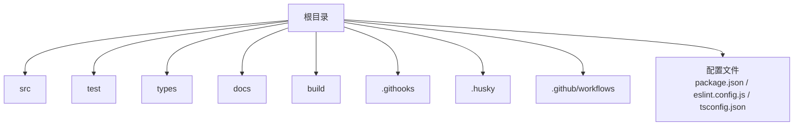
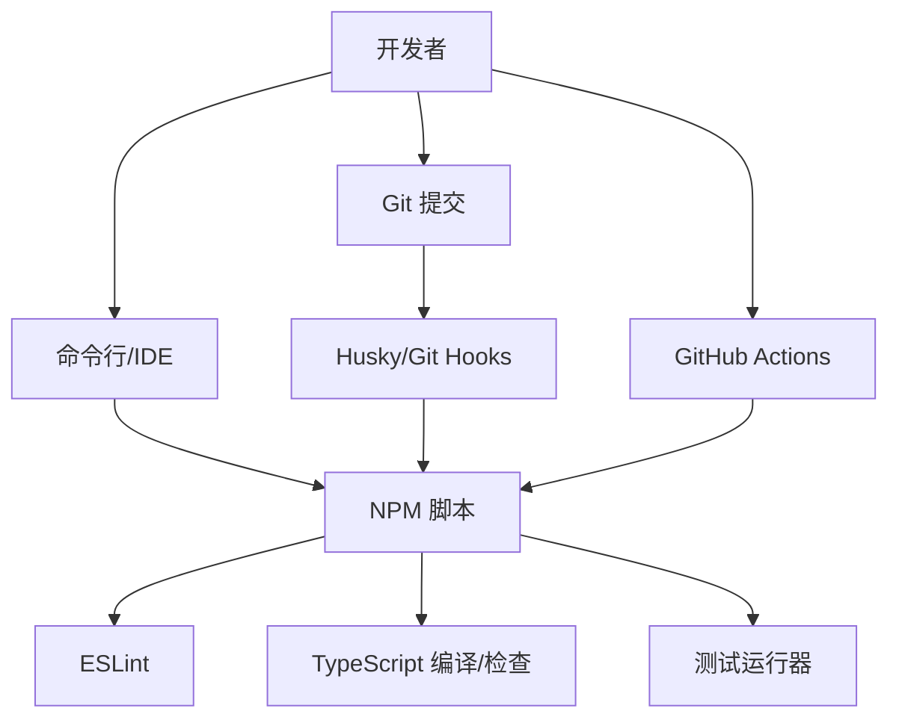
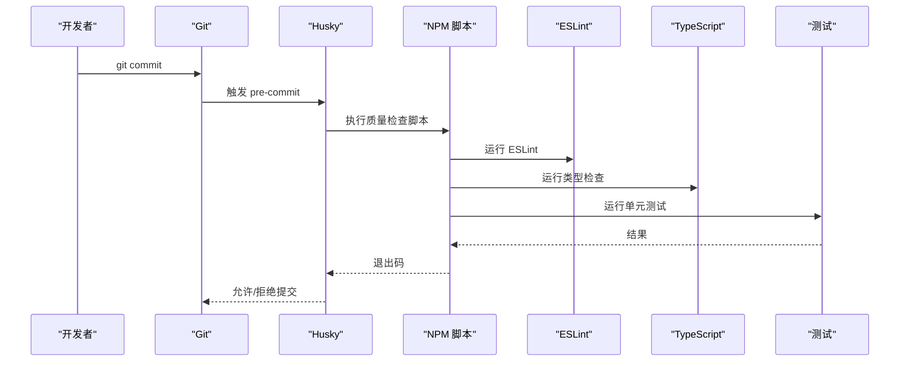
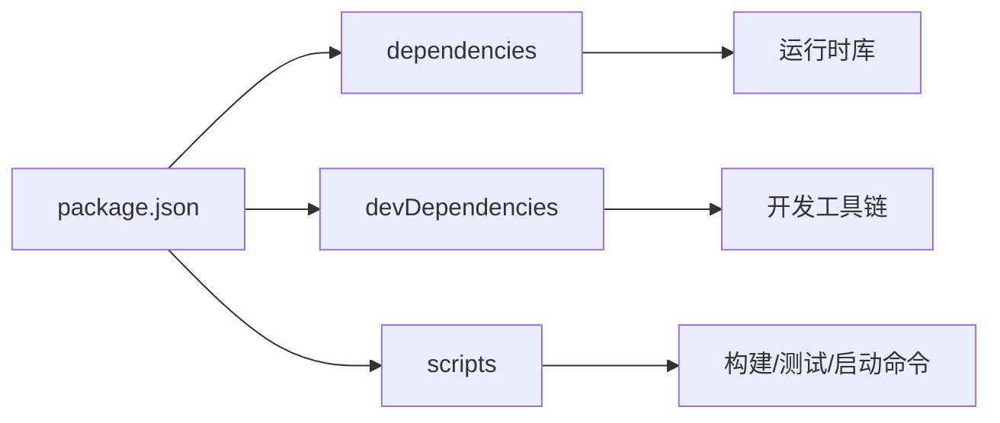

# 开发环境搭建

<cite>
**本文档引用的文件**   
- [package.json](file://package.json)
- [eslint.config.js](file://eslint.config.js)
- [tsconfig.json](file://tsconfig.json)
- [.gitignore](file://.gitignore)
- [README.md](file://README.md)
- [diagnose.js](file://diagnose.js)
- [src/main.js](file://src/main.js)
- [src/preload.js](file://src/preload.js)
- [src/renderer.js](file://src/renderer.js)
</cite>

## 更新摘要
**所做更改**
- 添加了完整的中文开发环境搭建指南
- 包含依赖管理程序、代码质量工具配置、Git hooks 设置和调试技巧
- 更新了项目结构说明，涵盖 Electron/Node 应用架构
- 增强了故障排查指南和性能考虑部分

## 目录
1. [简介](#简介)
2. [项目结构](#项目结构)
3. [核心组件](#核心组件)
4. [架构总览](#架构总览)
5. [详细组件分析](#详细组件分析)
6. [依赖分析](#依赖分析)
7. [性能考虑](#性能考虑)
8. [故障排查指南](#故障排查指南)
9. [结论](#结论)
10. [附录](#附录)

## 简介
本指南面向首次参与项目的开发者，目标是帮助你在本地快速搭建可运行的开发环境。内容涵盖：
- Node.js 版本与包管理器选择
- 依赖安装与脚本命令
- 代码质量工具（ESLint、TypeScript、格式化）
- Git Hooks 配置与使用
- 调试技巧与常用命令
- IDE（VS Code）插件与工作区设置建议
- 热重载与自动化构建流程
- 扩展开发体验的示例（新增工具与优化）

## 项目结构
仓库采用典型的 Electron/Node 应用结构，包含源码、测试、类型定义、文档与构建产物等目录。关键目录说明：
- src：主进程、渲染进程与预加载脚本
- test：单元测试
- types：全局类型声明
- docs：架构决策与领域文档
- build：构建输出
- .githooks/.husky：Git hooks 相关
- .github/workflows：CI 工作流

[本节为概念性概览，不直接分析具体文件]

## 核心组件
- 运行环境与入口
  - Node.js：用于执行脚本、构建与测试
  - 包管理器：npm/yarn/pnpm 任选其一，推荐与团队保持一致
  - 入口脚本：main.js、preload.js、renderer.js 构成 Electron 应用基础
- 代码质量
  - ESLint：统一代码风格与静态检查
  - TypeScript：类型检查与编译配置
  - 格式化：建议配合 Prettier（若启用）
- 质量门禁
  - Git Hooks：提交前自动运行 lint、格式化和测试
  - CI：GitHub Actions 在 PR/Merge 时验证

**章节来源**
- [package.json:1-200](file://package.json#L1-L200)
- [eslint.config.js:1-200](file://eslint.config.js#L1-L200)
- [tsconfig.json:1-200](file://tsconfig.json#L1-L200)
- [src/main.js:1-200](file://src/main.js#L1-L200)
- [src/preload.js:1-200](file://src/preload.js#L1-L200)
- [src/renderer.js:1-200](file://src/renderer.js#L1-L200)

## 架构总览
下图展示开发环境中的主要角色与交互关系：开发者通过 CLI 或 IDE 触发脚本；脚本调用 ESLint、TS 编译器、测试运行器；Git Hooks 在提交前拦截并执行质量检查；CI 在云端重复相同步骤。

[本节为概念性架构图，不直接映射到具体文件]

## 详细组件分析

### Node.js 与包管理器
- Node.js 版本要求
  - 查看 package.json 的 engines 字段以确认最低版本
  - 建议使用 nvm/fnm 管理多版本，避免系统级冲突
- 包管理器选择
  - npm：默认随 Node 提供，兼容性好
  - yarn/pnpm：更快的安装与更严格的依赖解析
  - 锁定依赖：确保使用 package-lock.json/yarn.lock/pnpm-lock.yaml
- 安装依赖
  - 在项目根目录执行包管理器安装命令
  - 如遇网络问题，配置镜像源

**章节来源**
- [package.json:1-200](file://package.json#L1-L200)

### 代码质量工具：ESLint
- 配置文件
  - 使用 eslint.config.js（Flat Config），集中管理规则与插件
- 常见规则
  - 语言特性：ESNext、Node.js
  - 风格：缩进、引号、分号、空格
  - 最佳实践：禁止未使用变量、强制返回类型
- 集成方式
  - 作为 NPM 脚本运行
  - 在 VS Code 中通过插件实时提示

**章节来源**
- [eslint.config.js:1-200](file://eslint.config.js#L1-L200)
- [package.json:1-200](file://package.json#L1-L200)

### 代码质量工具：TypeScript
- 配置文件
  - tsconfig.json 控制编译目标、模块系统、严格模式等
- 典型选项
  - target/module：决定输出与运行时兼容性
  - strict：开启严格类型检查
  - paths：路径别名（可选）
- 集成方式
  - 在构建或检查阶段运行 tsc --noEmit
  - 编辑器内实时错误提示

**章节来源**
- [tsconfig.json:1-200](file://tsconfig.json#L1-L200)
- [package.json:1-200](file://package.json#L1-L200)

### 代码格式化
- 推荐工具
  - Prettier：统一代码风格
  - EditorConfig：跨编辑器一致的基础样式
- 集成方式
  - 保存时自动格式化
  - 与 ESLint 规则对齐，避免冲突

[本节为通用指导，不直接分析具体文件]

### Git Hooks 与 Husky
- 作用
  - 在 commit 或 push 前自动执行 lint、格式化、测试
- 配置要点
  - 使用 .husky 目录存放钩子脚本
  - 将质量检查命令封装为 NPM 脚本，供钩子调用
- 工作流程
  - 开发者提交 -> Husky 拦截 -> 执行脚本 -> 失败则阻止提交

**章节来源**
- [package.json:1-200](file://package.json#L1-L200)

### 调试技巧与常用命令
- 诊断脚本
  - 使用 diagnose.js 快速定位环境问题（Node 版本、依赖完整性等）
- 常用命令
  - 安装依赖、运行 lint、类型检查、测试、启动应用
- 调试方法
  - VS Code 调试配置（Node/Electron）
  - 控制台日志与断点

**章节来源**
- [diagnose.js:1-200](file://diagnose.js#L1-L200)
- [package.json:1-200](file://package.json#L1-L200)

### IDE 配置建议（VS Code）
- 推荐插件
  - ESLint、Prettier、TypeScript 官方支持、EditorConfig
- 工作区设置
  - 保存时自动格式化
  - 启用 ESLint 修复与提示
  - 忽略无关文件（node_modules、build 等）

**章节来源**
- [.gitignore:1-200](file://.gitignore#L1-L200)

### 热重载与自动化构建
- 开发服务器
  - 根据应用类型选择合适的热重载方案（如 Vite/Webpack/Nodemon）
- 构建流程
  - 清理、编译、打包、产物校验
- 自动化
  - 结合 Git Hooks 与 CI 保证一致性

[本节为通用指导，不直接分析具体文件]

### 添加新开发工具的示例
- 步骤
  - 安装依赖（包管理器）
  - 更新 NPM 脚本
  - 配置 ESLint/TS 集成
  - 在 VS Code 中启用插件与工作区设置
  - 在 Git Hooks 中加入检查步骤
- 验证
  - 本地运行脚本与测试
  - 提交触发 Hooks 验证

[本节为通用指导，不直接分析具体文件]

## 依赖分析
- 运行时依赖
  - 由 package.json 的 dependencies 声明
- 开发依赖
  - 由 devDependencies 声明（lint、测试、构建工具）
- 锁定文件
  - 确保团队成员使用一致的依赖版本

**章节来源**
- [package.json:1-200](file://package.json#L1-L200)

## 性能考虑
- 依赖安装
  - 使用缓存与并行安装策略
- 构建与测试
  - 增量构建、按需运行测试
- 编辑器体验
  - 合理排除大目录，减少索引开销

[本节为通用指导，不直接分析具体文件]

## 故障排查指南
- 常见问题
  - Node 版本不匹配：使用版本管理器切换
  - 依赖缺失或版本不一致：删除锁定文件后重新安装
  - ESLint/TS 报错：按提示修复或调整配置
  - Git Hooks 失败：检查脚本权限与路径
- 诊断工具
  - 运行 diagnose.js 获取环境信息
  - 查看终端输出与日志

**章节来源**
- [diagnose.js:1-200](file://diagnose.js#L1-L200)
- [package.json:1-200](file://package.json#L1-L200)

## 结论
通过遵循本指南，你可以在本地快速搭建稳定高效的开发环境，利用 ESLint、TypeScript、Git Hooks 与 IDE 插件提升代码质量与开发效率。建议在团队内统一工具链与配置，并通过 CI 保障一致性。

[本节为总结性内容，不直接分析具体文件]

## 附录
- 参考文档
  - README.md：项目背景与使用说明
- 相关文件
  - src/main.js、src/preload.js、src/renderer.js：Electron 应用入口与渲染逻辑

**章节来源**
- [README.md:1-200](file://README.md#L1-L200)
- [src/main.js:1-200](file://src/main.js#L1-L200)
- [src/preload.js:1-200](file://src/preload.js#L1-L200)
- [src/renderer.js:1-200](file://src/renderer.js#L1-L200)