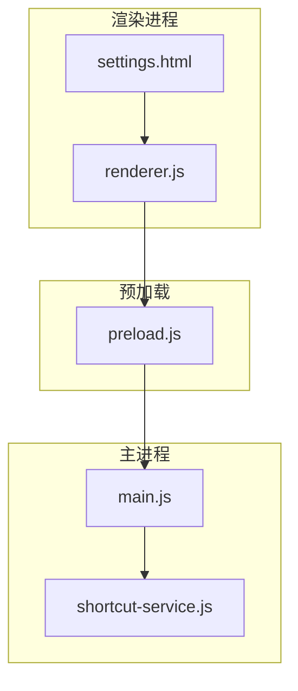
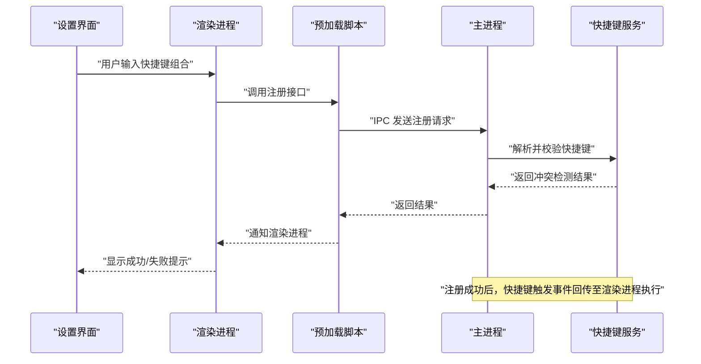
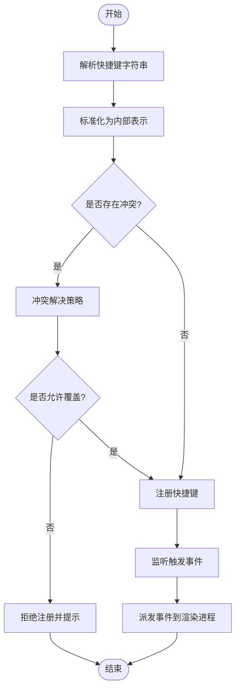
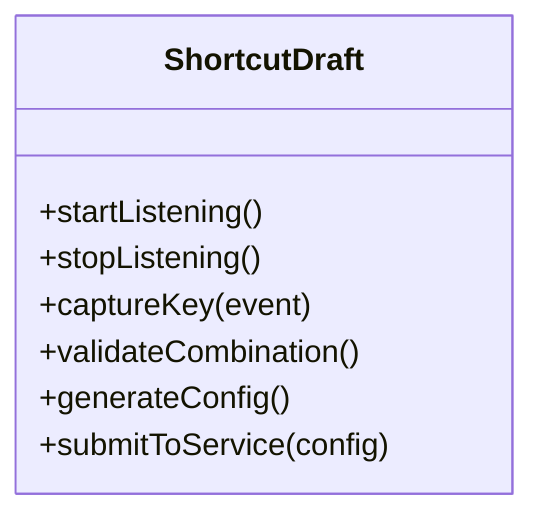
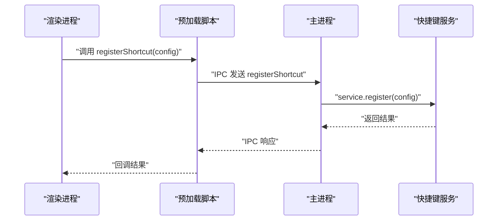
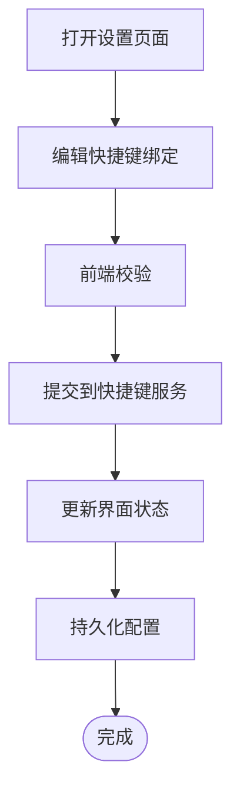

# 快捷键服务

<cite>
**本文引用的文件**   
- [shortcut-service.js](file://src/shortcut-service.js)
- [shortcut-draft.js](file://src/shortcut-draft.js)
- [main.js](file://src/main.js)
- [preload.js](file://src/preload.js)
- [renderer.js](file://src/renderer.js)
- [settings.html](file://src/settings.html)
- [shortcut-service.test.js](file://test/shortcut-service.test.js)
- [shortcut-draft.test.js](file://test/shortcut-draft.test.js)
- [package.json](file://package.json)
</cite>

## 更新摘要
**所做更改**   
- 更新了全局快捷键注册机制的详细中文文档
- 增强了冲突检测机制的技术说明
- 完善了跨进程通信解决方案的描述
- 添加了流程图和组件分析图表
- 优化了架构总览和详细组件分析部分

## 目录
1. [简介](#简介)
2. [项目结构](#项目结构)
3. [核心组件](#核心组件)
4. [架构总览](#架构总览)
5. [详细组件分析](#详细组件分析)
6. [依赖关系分析](#依赖关系分析)
7. [性能考量](#性能考量)
8. [故障排查指南](#故障排查指南)
9. [结论](#结论)
10. [附录](#附录)

## 简介
本文件为"快捷键服务"的全面技术文档，聚焦于全局快捷键的注册、监听与处理机制；解释冲突检测与解决策略；描述配置存储格式与动态更新流程；给出跨平台映射差异的处理方式；提供添加新快捷键绑定的示例路径与最佳实践；并覆盖测试策略与调试方法。目标是让开发者在不干扰用户其他操作的前提下，实现强大且易用的快捷键能力。

## 项目结构
本项目采用 Electron 架构，快捷键相关代码主要分布在主进程与渲染进程之间：
- 主进程负责系统级快捷键注册与事件分发
- 预加载脚本桥接主进程与渲染进程
- 渲染进程负责 UI 交互与配置编辑
- 快捷键服务模块封装了注册、监听、冲突检测与配置管理

**图示来源** 
- [main.js](file://src/main.js)
- [shortcut-service.js](file://src/shortcut-service.js)
- [preload.js](file://src/preload.js)
- [renderer.js](file://src/renderer.js)
- [settings.html](file://src/settings.html)

**章节来源**
- [main.js](file://src/main.js)
- [shortcut-service.js](file://src/shortcut-service.js)
- [preload.js](file://src/preload.js)
- [renderer.js](file://src/renderer.js)
- [settings.html](file://src/settings.html)

## 核心组件
- 快捷键服务（主进程）：负责全局快捷键的注册、注销、监听与事件派发，以及冲突检测与解决。
- 草稿编辑器（渲染进程）：用于交互式创建/编辑快捷键绑定，校验组合键合法性，生成最终配置。
- 主进程入口：初始化快捷键服务，订阅来自渲染进程的指令，转发到快捷键服务。
- 预加载脚本：暴露安全的 IPC 接口给渲染进程调用。
- 设置界面：提供可视化配置入口，支持动态更新快捷键绑定。

**章节来源**
- [shortcut-service.js](file://src/shortcut-service.js)
- [shortcut-draft.js](file://src/shortcut-draft.js)
- [main.js](file://src/main.js)
- [preload.js](file://src/preload.js)
- [settings.html](file://src/settings.html)

## 架构总览
快捷键服务在 Electron 中的整体交互如下：
- 渲染进程通过预加载脚本调用 IPC 接口，提交新的快捷键绑定或查询当前状态
- 主进程接收请求后交由快捷键服务进行解析、冲突检测与注册
- 快捷键触发时，主进程将事件回传到渲染进程，由业务逻辑执行具体动作
- 配置持久化存储在应用设置中，支持热更新

**图示来源** 
- [main.js](file://src/main.js)
- [preload.js](file://src/preload.js)
- [shortcut-service.js](file://src/shortcut-service.js)
- [settings.html](file://src/settings.html)

## 详细组件分析

### 快捷键服务（主进程）
职责：
- 解析快捷键字符串为平台无关的内部表示
- 维护已注册快捷键集合，进行冲突检测
- 注册/注销系统级快捷键，监听触发事件
- 向渲染进程派发触发事件，携带上下文信息
- 读取/写入配置，支持动态更新

关键流程：
- 注册流程：解析 -> 去重 -> 冲突检测 -> 注册 -> 回调注册结果
- 监听流程：系统事件 -> 匹配内部表示 -> 查找对应处理器 -> 执行回调
- 冲突解决：优先策略（最近注册优先/用户显式覆盖）、回退提示、禁用重复项

**图示来源** 
- [shortcut-service.js](file://src/shortcut-service.js)

**章节来源**
- [shortcut-service.js](file://src/shortcut-service.js)

### 草稿编辑器（渲染进程）
职责：
- 捕获用户按键组合，实时预览
- 校验组合键合法性（如修饰键、功能键）
- 生成可序列化的快捷键配置对象
- 与快捷键服务交互，提交注册请求

关键特性：
- 防抖与节流，避免频繁触发
- 本地临时存储草稿，支持撤销/重做
- 错误提示与友好反馈

**图示来源** 
- [shortcut-draft.js](file://src/shortcut-draft.js)

**章节来源**
- [shortcut-draft.js](file://src/shortcut-draft.js)

### 主进程入口与预加载脚本
- 主进程初始化快捷键服务，建立 IPC 通道
- 预加载脚本暴露安全 API，限制渲染进程直接访问系统 API
- 事件路由：将快捷键触发事件从主进程转发到渲染进程指定频道

**图示来源** 
- [main.js](file://src/main.js)
- [preload.js](file://src/preload.js)
- [shortcut-service.js](file://src/shortcut-service.js)

**章节来源**
- [main.js](file://src/main.js)
- [preload.js](file://src/preload.js)

### 设置界面（渲染进程）
- 提供可视化配置表单，支持新增/删除/修改快捷键
- 实时验证与冲突提示
- 保存配置后触发快捷键服务动态更新

**图示来源** 
- [settings.html](file://src/settings.html)

**章节来源**
- [settings.html](file://src/settings.html)

## 依赖关系分析
- 快捷键服务依赖 Electron 的全局快捷键 API（主进程）
- 预加载脚本依赖 IPC 通信机制
- 渲染进程依赖预加载暴露的 API
- 配置文件通常位于应用设置目录，支持 JSON 格式

**图示来源** 
- [main.js](file://src/main.js)
- [preload.js](file://src/preload.js)
- [shortcut-service.js](file://src/shortcut-service.js)
- [package.json](file://package.json)

**章节来源**
- [package.json](file://package.json)

## 性能考量
- 快捷键解析与冲突检测应在 O(n) 复杂度内完成，n 为已注册快捷键数量
- 使用哈希表或键值索引加速匹配
- 批量注册时合并更新，减少系统 API 调用次数
- 避免在主线程执行耗时操作，必要时异步处理

[本节为通用指导，不直接分析具体文件]

## 故障排查指南
常见问题与定位方法：
- 快捷键未生效：检查是否成功注册、是否被其他程序占用、平台差异
- 冲突提示频繁：查看冲突检测逻辑与覆盖策略
- 事件未触发：确认 IPC 通道是否正常、事件名是否一致
- 配置未持久化：检查写入路径与权限

建议调试步骤：
- 启用日志输出，记录注册/触发/冲突事件
- 使用单元测试验证解析与冲突检测逻辑
- 在设置界面增加"测试快捷键"按钮，即时反馈

**章节来源**
- [shortcut-service.test.js](file://test/shortcut-service.test.js)
- [shortcut-draft.test.js](file://test/shortcut-draft.test.js)

## 结论
快捷键服务通过主进程集中管理全局快捷键，结合渲染进程的友好交互与预加载的安全桥接，实现了可扩展、可配置、跨平台的快捷键能力。遵循本文的最佳实践与冲突解决策略，可在不影响用户体验的前提下，提供强大而稳定的快捷键功能。

[本节为总结性内容，不直接分析具体文件]

## 附录

### 快捷键配置存储格式
- 推荐 JSON 格式，包含键位组合、修饰键、目标动作等字段
- 支持版本字段，便于后续扩展
- 默认值与必填项校验在前端与后端共同保证

[本节为概念性说明，不直接分析具体文件]

### 跨平台差异处理
- Windows/macOS/Linux 对修饰键命名与行为存在差异
- 统一抽象层将平台差异转换为内部标准表示
- 提供平台检测与适配逻辑，确保一致性体验

[本节为概念性说明，不直接分析具体文件]

### 添加新快捷键绑定的示例路径
- 在设置界面新增输入控件
- 在草稿编辑器中捕获并校验新组合键
- 在快捷键服务中注册新动作处理器
- 更新 IPC 接口以支持新绑定类型

**章节来源**
- [settings.html](file://src/settings.html)
- [shortcut-draft.js](file://src/shortcut-draft.js)
- [shortcut-service.js](file://src/shortcut-service.js)

### 测试策略与调试方法
- 单元测试覆盖快捷键解析、冲突检测、注册流程
- 集成测试模拟真实用户交互，验证端到端流程
- 调试工具记录事件流与状态变化，辅助问题定位

**章节来源**
- [shortcut-service.test.js](file://test/shortcut-service.test.js)
- [shortcut-draft.test.js](file://test/shortcut-draft.test.js)