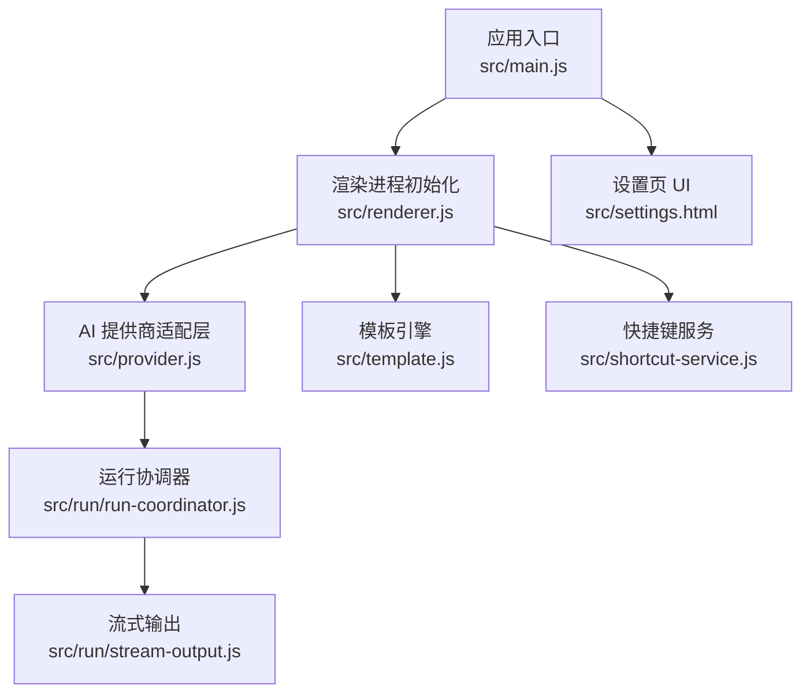
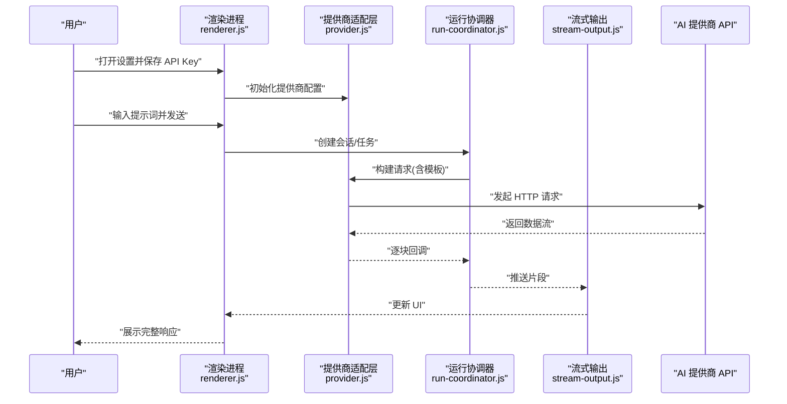
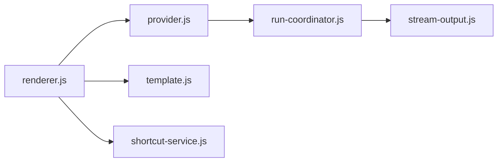

# 快速开始

<cite>
**本文引用的文件**   
- [README.md](file://README.md)
- [package.json](file://package.json)
- [src/main.js](file://src/main.js)
- [src/renderer.js](file://src/renderer.js)
- [src/provider.js](file://src/provider.js)
- [src/settings.html](file://src/settings.html)
- [src/shortcut-service.js](file://src/shortcut-service.js)
- [src/template.js](file://src/template.js)
- [src/run/run-coordinator.js](file://src/run/run-coordinator.js)
- [src/run/stream-output.js](file://src/run/stream-output.js)
</cite>

## 目录
1. [简介](#简介)
2. [项目结构](#项目结构)
3. [核心组件](#核心组件)
4. [架构总览](#架构总览)
5. [详细组件分析](#详细组件分析)
6. [依赖关系分析](#依赖关系分析)
7. [性能注意事项](#性能注意事项)
8. [故障排查指南](#故障排查指南)
9. [结论](#结论)
10. [附录](#附录)

## 简介
本快速开始指南帮助你在 5 分钟内完成 prompt_gogo 的安装、首次运行与基础使用，涵盖 Node.js 环境要求、依赖安装、AI 服务提供商 API Key 配置（OpenAI、Anthropic、Google）、基本对话流程、快捷键与界面自定义，以及常见问题解决方案。

## 项目结构
prompt_gogo 是一个基于 Electron 的桌面应用，采用主进程与渲染进程分离架构：
- 主进程负责应用生命周期、系统级能力与任务编排
- 渲染进程提供用户界面与交互
- provider 模块抽象多 AI 提供商调用
- run 子模块负责流式输出与执行协调

图表来源
- [src/main.js](file://src/main.js)
- [src/renderer.js](file://src/renderer.js)
- [src/settings.html](file://src/settings.html)
- [src/provider.js](file://src/provider.js)
- [src/template.js](file://src/template.js)
- [src/shortcut-service.js](file://src/shortcut-service.js)
- [src/run/run-coordinator.js](file://src/run/run-coordinator.js)
- [src/run/stream-output.js](file://src/run/stream-output.js)

章节来源
- [README.md](file://README.md)
- [package.json](file://package.json)

## 核心组件
- 应用入口与窗口管理：负责创建主/渲染进程、加载页面、注册全局快捷键
- 设置页：集中配置 AI 提供商 API Key、主题与显示选项
- 提供商适配层：统一封装 OpenAI、Anthropic、Google 等调用接口
- 模板引擎：将用户提示词与上下文组装为模型可识别格式
- 快捷键服务：监听并处理全局快捷键触发
- 运行协调器与流式输出：协调请求生命周期，实时推送响应片段

章节来源
- [src/main.js](file://src/main.js)
- [src/renderer.js](file://src/renderer.js)
- [src/settings.html](file://src/settings.html)
- [src/provider.js](file://src/provider.js)
- [src/template.js](file://src/template.js)
- [src/shortcut-service.js](file://src/shortcut-service.js)
- [src/run/run-coordinator.js](file://src/run/run-coordinator.js)
- [src/run/stream-output.js](file://src/run/stream-output.js)

## 架构总览
下图展示了从用户输入到 AI 响应的端到端流程，包括设置校验、模板渲染、请求发送与流式输出。

图表来源
- [src/renderer.js](file://src/renderer.js)
- [src/provider.js](file://src/provider.js)
- [src/run/run-coordinator.js](file://src/run/run-coordinator.js)
- [src/run/stream-output.js](file://src/run/stream-output.js)

## 详细组件分析

### 安装与环境准备
- 系统要求
  - 操作系统：Windows / macOS / Linux
  - Node.js：建议使用 LTS 版本（参考 package.json 中的 engines 字段）
  - npm 或 yarn 包管理器
- 安装步骤
  - 克隆仓库并进入项目根目录
  - 安装依赖：执行包管理器安装命令
  - 首次运行：启动应用以生成默认配置与窗口

章节来源
- [package.json](file://package.json)
- [README.md](file://README.md)

### 首次运行与基础配置
- 启动应用后，打开“设置”页面
- 在设置中配置 AI 提供商 API Key（见下一节）
- 保存设置后，回到主界面即可开始对话

章节来源
- [src/settings.html](file://src/settings.html)
- [src/renderer.js](file://src/renderer.js)

### 配置 AI 服务提供商 API Key
- OpenAI
  - 在设置页选择 OpenAI 作为提供商
  - 填入你的 OpenAI API Key
  - 可选：指定模型名称与基础 URL（如需代理）
- Anthropic
  - 选择 Anthropic 提供商
  - 填入 API Key
  - 可选：指定模型名称
- Google
  - 选择 Google 提供商
  - 填入 API Key
  - 可选：指定模型名称与区域

说明
- 不同提供商的配置项可能略有差异，具体以设置页表单为准
- 建议先保存并测试连接，确认能成功获取响应

章节来源
- [src/settings.html](file://src/settings.html)
- [src/provider.js](file://src/provider.js)

### 基本使用教程
- 创建新对话
  - 在主界面点击“新建对话”按钮
  - 为新对话命名（可选）
- 发送提示词
  - 在输入框中输入提示词
  - 按回车或点击发送
- 查看响应结果
  - 支持流式输出，内容会逐步显示
  - 可在对话历史中回溯与复制

章节来源
- [src/renderer.js](file://src/renderer.js)
- [src/run/stream-output.js](file://src/run/stream-output.js)

### 快捷键操作指南
- 常用快捷键
  - 新建对话：Ctrl/Cmd + N
  - 发送提示词：Enter
  - 停止生成：Esc
  - 切换提供商：Ctrl/Cmd + Shift + P
- 自定义快捷键
  - 在设置页中查看当前快捷键映射
  - 根据提示修改绑定（如支持）

章节来源
- [src/shortcut-service.js](file://src/shortcut-service.js)
- [src/settings.html](file://src/settings.html)

### 界面自定义选项
- 主题与外观
  - 支持浅色/深色主题切换
  - 字体大小与消息气泡样式可调
- 行为偏好
  - 自动滚动、是否显示时间戳、是否启用流式输出
- 语言与本地化
  - 根据系统语言或手动选择界面语言

章节来源
- [src/settings.html](file://src/settings.html)
- [src/renderer.js](file://src/renderer.js)

### 模板与上下文
- 模板变量
  - 支持在提示词中使用变量占位符
  - 系统会自动注入上下文信息（如历史对话、系统提示）
- 自定义模板
  - 在设置页编辑模板文本
  - 预览效果并保存

章节来源
- [src/template.js](file://src/template.js)
- [src/settings.html](file://src/settings.html)

## 依赖关系分析
- 外部依赖
  - Electron：跨平台桌面应用框架
  - HTTP 客户端：用于调用各 AI 提供商 API
  - 事件总线：用于进程间通信与状态同步
- 内部模块耦合
  - renderer.js 依赖 provider.js 进行 API 调用
  - run-coordinator.js 协调请求生命周期并与 stream-output.js 协作
  - shortcut-service.js 独立监听全局快捷键事件

图表来源
- [src/renderer.js](file://src/renderer.js)
- [src/provider.js](file://src/provider.js)
- [src/template.js](file://src/template.js)
- [src/shortcut-service.js](file://src/shortcut-service.js)
- [src/run/run-coordinator.js](file://src/run/run-coordinator.js)
- [src/run/stream-output.js](file://src/run/stream-output.js)

章节来源
- [package.json](file://package.json)
- [src/main.js](file://src/main.js)

## 性能注意事项
- 流式输出优先：启用流式输出可减少首字节延迟
- 合理缓存：对相同提示词与上下文进行去重缓存
- 并发控制：限制同时进行的请求数量，避免 API 限流
- 内存管理：及时释放大对象与取消未完成的请求

[本节为通用指导，不直接分析具体文件]

## 故障排查指南
- 网络连接问题
  - 检查代理设置是否正确
  - 确认防火墙或企业网络未拦截出站请求
  - 尝试更换网络环境
- API 密钥验证失败
  - 确认 Key 有效且未过期
  - 检查所选提供商与模型名称是否匹配
  - 查看错误码并对照提供商文档
- 流式输出异常
  - 确认服务端支持 SSE 或分块传输
  - 检查浏览器/渲染进程日志
- 快捷键无效
  - 确认快捷键未被系统或其他应用占用
  - 重新绑定快捷键并重启应用

章节来源
- [src/provider.js](file://src/provider.js)
- [src/run/stream-output.js](file://src/run/stream-output.js)
- [src/shortcut-service.js](file://src/shortcut-service.js)

## 结论
通过本指南，你已掌握 prompt_gogo 的安装、配置与基础使用方法。建议进一步探索模板定制、快捷键优化与性能调优，以获得更流畅的 AI 对话体验。

[本节为总结性内容，不直接分析具体文件]

## 附录
- 常见问题速查
  - 无法启动应用：检查 Node.js 版本与依赖安装是否成功
  - 无响应或卡住：检查网络与 API Key，查看控制台日志
  - 界面不显示内容：确认流式输出开关与模板变量正确
- 资源链接
  - OpenAI 文档：https://platform.openai.com/docs
  - Anthropic 文档：https://docs.anthropic.com
  - Google AI 文档：https://ai.google.dev

[本节为补充信息，不直接分析具体文件]