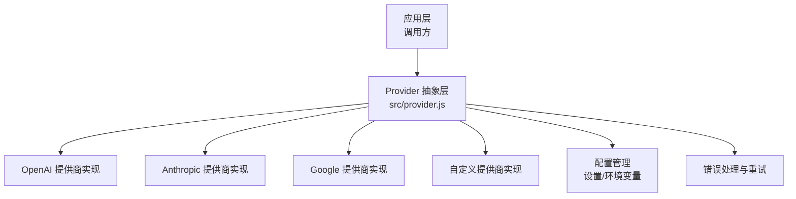
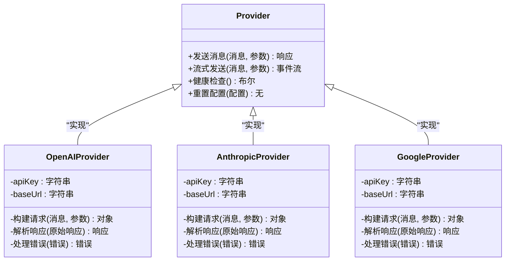
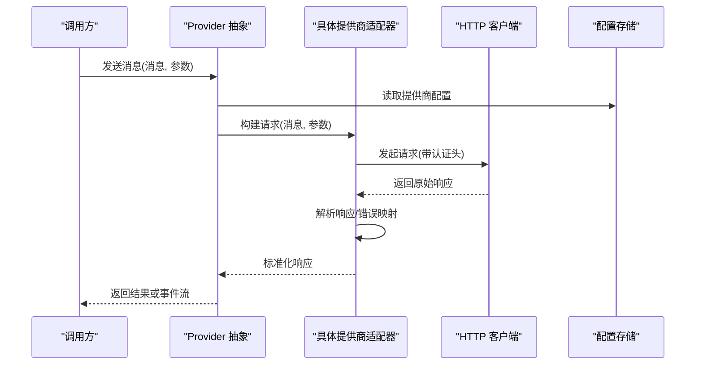
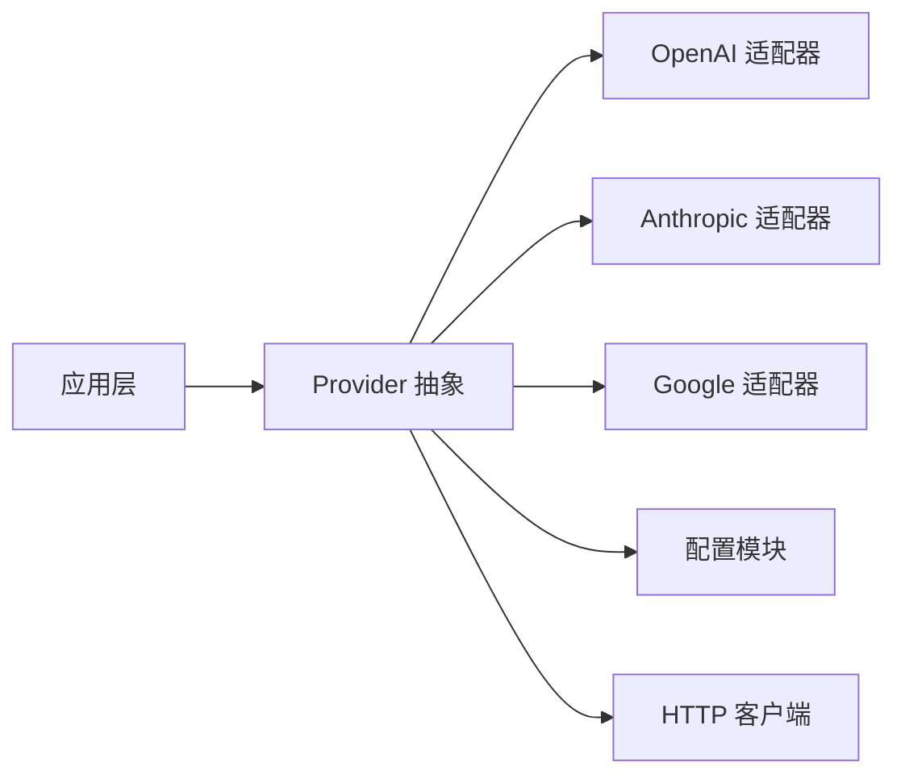

# 提供商系统

<cite>
**本文引用的文件**   
- [src/provider.js](file://src/provider.js)
- [test/provider.test.js](file://test/provider.test.js)
- [docs/adr/0002-multi-provider-architecture.md](file://docs/adr/0002-multi-provider-architecture.md)
- [package.json](file://package.json)
</cite>

## 目录
1. [简介](#简介)
2. [项目结构](#项目结构)
3. [核心组件](#核心组件)
4. [架构总览](#架构总览)
5. [详细组件分析](#详细组件分析)
6. [依赖分析](#依赖分析)
7. [性能考虑](#性能考虑)
8. [故障排查指南](#故障排查指南)
9. [结论](#结论)
10. [附录](#附录)

## 简介
本文件面向“提供商系统”的设计与实现，目标是解释多提供商架构的设计理念，说明如何通过统一的接口抽象支持不同的 AI 服务提供商（如 OpenAI、Anthropic、Google 等）。文档将详细描述 Provider 接口的定义（消息格式、参数配置、响应处理），提供添加新提供商的实现指南（接口实现、认证方式、错误处理），并说明提供商配置的存储与管理机制。同时包含测试策略与调试技巧，帮助开发者验证集成的正确性。

## 项目结构
围绕提供商系统的代码主要位于 src/provider.js，测试位于 test/provider.test.js，架构决策记录在 docs/adr/0002-multi-provider-architecture.md。该仓库采用以功能为中心的模块化组织：provider.js 暴露统一接口，测试覆盖关键路径，ADR 记录设计背景与权衡。

图表来源
- [src/provider.js](file://src/provider.js)
- [docs/adr/0002-multi-provider-architecture.md](file://docs/adr/0002-multi-provider-architecture.md)

章节来源
- [src/provider.js](file://src/provider.js)
- [docs/adr/0002-multi-provider-architecture.md](file://docs/adr/0002-multi-provider-architecture.md)

## 核心组件
- Provider 抽象接口：定义统一的请求/响应契约，包括消息格式、模型参数、流式与非流式响应、错误码与重试策略。
- 具体提供商实现：针对各厂商 API 的差异进行适配，封装认证、请求构造、响应解析与错误映射。
- 配置管理：集中管理密钥、端点、超时、重试次数等配置项，支持运行时切换与热更新。
- 错误处理：标准化错误类型、网络异常、鉴权失败、限流与业务错误，并提供可观测性与诊断信息。

章节来源
- [src/provider.js](file://src/provider.js)
- [docs/adr/0002-multi-provider-architecture.md](file://docs/adr/0002-multi-provider-architecture.md)

## 架构总览
多提供商架构通过“统一接口 + 适配器模式”解耦上层业务与底层厂商差异。调用方仅依赖 Provider 抽象，新增或替换提供商无需改动业务逻辑。

图表来源
- [src/provider.js](file://src/provider.js)

章节来源
- [src/provider.js](file://src/provider.js)

## 详细组件分析

### Provider 接口与数据模型
- 消息格式：统一的消息体包含角色、内容、工具调用与上下文元数据；不同提供商的字段映射由适配器负责。
- 参数配置：模型名称、温度、最大长度、频率惩罚、存在惩罚、安全级别等；默认值与校验在接口层完成。
- 响应处理：结构化结果、增量片段（流式）、使用量统计、延迟与成本估算；错误码标准化为内部枚举。
- 流式支持：基于事件或回调的分片推送，保证低延迟与可中断。

章节来源
- [src/provider.js](file://src/provider.js)

### 统一请求与响应流程

图表来源
- [src/provider.js](file://src/provider.js)

章节来源
- [src/provider.js](file://src/provider.js)

### 认证与配置管理
- 认证方式：API Key、Bearer Token、OAuth 等；敏感信息从配置存储读取，避免硬编码。
- 配置存储：支持环境变量、配置文件、运行时设置；提供校验、默认值与变更通知。
- 安全最佳实践：最小权限原则、密钥轮换、日志脱敏。

章节来源
- [src/provider.js](file://src/provider.js)

### 错误处理与重试策略
- 错误分类：网络错误、鉴权失败、限流、服务端错误、业务校验失败。
- 重试策略：指数退避、最大重试次数、幂等性判断、熔断保护。
- 可观测性：错误码、请求 ID、耗时、供应商诊断信息。

章节来源
- [src/provider.js](file://src/provider.js)

### 添加新提供商的实现指南
步骤概览：
1. 实现 Provider 接口：定义消息到目标 API 的请求构造、响应解析与错误映射。
2. 认证集成：接入目标平台的认证方式，确保密钥安全加载。
3. 配置项扩展：在配置管理中注册新提供商的配置键与校验规则。
4. 单元测试与集成测试：覆盖正常路径、边界条件、错误分支与流式场景。
5. 文档与示例：提供使用示例与常见问题解答。

章节来源
- [src/provider.js](file://src/provider.js)

### 具体代码示例（路径引用）
- 统一接口定义与调用入口：[src/provider.js](file://src/provider.js)
- 测试用例与断言示例：[test/provider.test.js](file://test/provider.test.js)
- 架构设计与权衡记录：[docs/adr/0002-multi-provider-architecture.md](file://docs/adr/0002-multi-provider-architecture.md)

章节来源
- [src/provider.js](file://src/provider.js)
- [test/provider.test.js](file://test/provider.test.js)
- [docs/adr/0002-multi-provider-architecture.md](file://docs/adr/0002-multi-provider-architecture.md)

## 依赖分析
- 内部依赖：Provider 抽象与具体实现之间松耦合；配置模块被所有提供商共享。
- 外部依赖：HTTP 客户端、JSON 解析、加密库（用于签名或令牌处理）。
- 潜在循环依赖：应避免在适配器中反向依赖高层模块，保持单向依赖。

图表来源
- [src/provider.js](file://src/provider.js)

章节来源
- [src/provider.js](file://src/provider.js)

## 性能考虑
- 连接复用与池化：减少握手开销，提升吞吐。
- 流式传输：降低首字节延迟，提升交互体验。
- 缓存与去重：对相同请求进行短期缓存，避免重复调用。
- 批处理与合并：批量请求与响应聚合，降低网络往返。
- 资源限制：并发上限、超时控制、内存占用监控。

## 故障排查指南
- 常见问题定位：
  - 认证失败：检查密钥有效性、过期时间、权限范围。
  - 限流与降级：观察速率限制、重试计数、熔断状态。
  - 响应解析错误：核对字段映射、版本兼容性、Schema 变更。
- 调试技巧：
  - 启用请求/响应日志（脱敏后），记录请求 ID 与耗时。
  - 使用本地 Mock 服务模拟目标平台行为。
  - 分阶段灰度发布，逐步扩大流量。
- 测试策略：
  - 单元测试：覆盖接口契约、错误映射、边界条件。
  - 集成测试：对接真实或沙箱环境，验证端到端流程。
  - 回归测试：捕获上游 API 变更带来的影响。

章节来源
- [test/provider.test.js](file://test/provider.test.js)
- [src/provider.js](file://src/provider.js)

## 结论
通过统一的 Provider 抽象与适配器模式，系统能够灵活扩展多种 AI 服务提供商，屏蔽底层差异，提升可维护性与可扩展性。完善的配置管理、错误处理与测试策略保障了集成的稳定性与可靠性。建议持续完善可观测性与性能优化，确保在高负载与多变环境下稳定运行。

## 附录
- 相关包信息与脚本：参见 [package.json](file://package.json)
- 架构决策参考：[docs/adr/0002-multi-provider-architecture.md](file://docs/adr/0002-multi-provider-architecture.md)