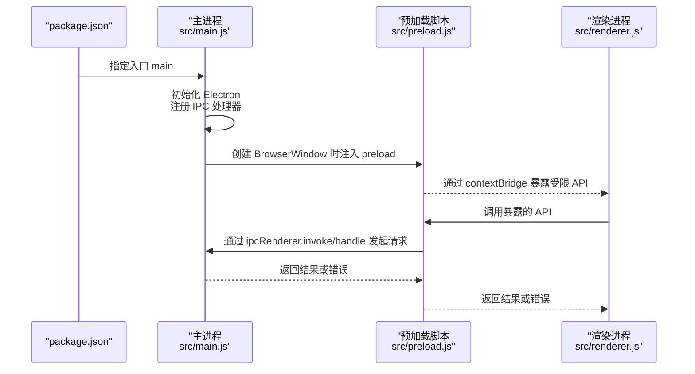
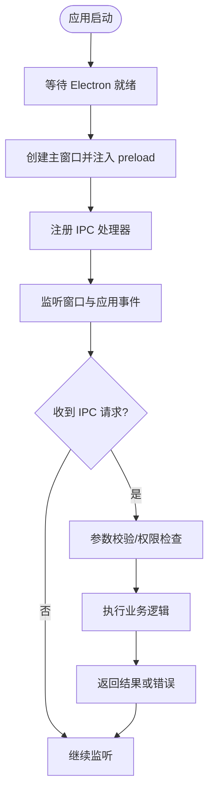
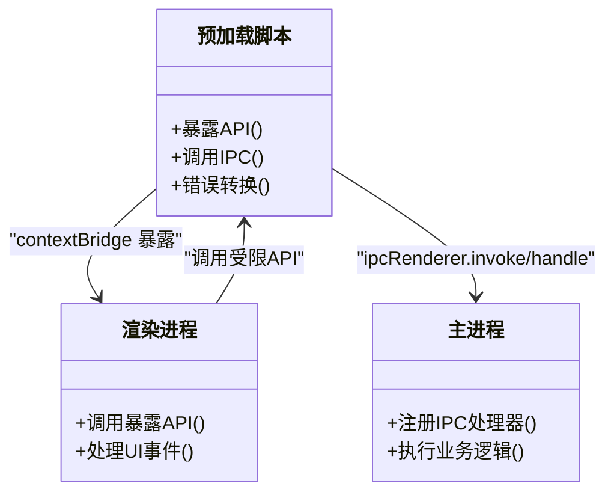
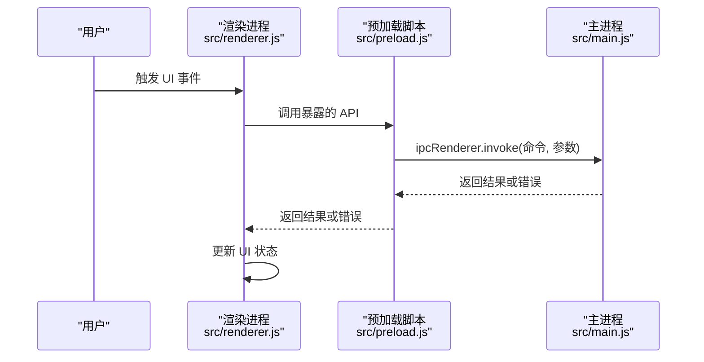
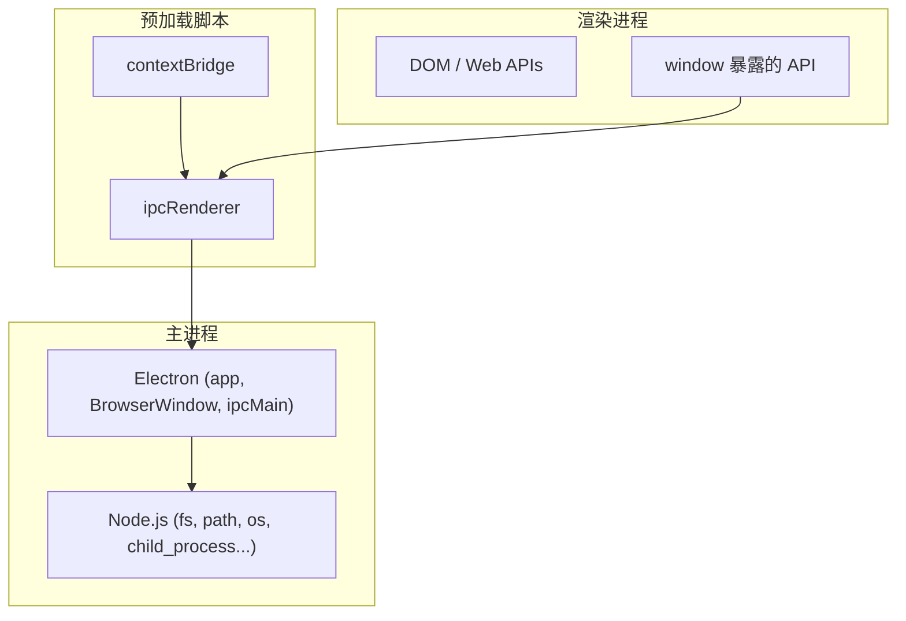

# Electron 应用架构

<cite>
**本文引用的文件**   
- [src/main.js](file://src/main.js)
- [src/preload.js](file://src/preload.js)
- [src/renderer.js](file://src/renderer.js)
- [package.json](file://package.json)
</cite>

## 目录
1. [简介](#简介)
2. [项目结构](#项目结构)
3. [核心组件](#核心组件)
4. [架构总览](#架构总览)
5. [详细组件分析](#详细组件分析)
6. [依赖关系分析](#依赖关系分析)
7. [性能考量](#性能考量)
8. [故障排查指南](#故障排查指南)
9. [结论](#结论)
10. [附录](#附录)

## 简介
本文件面向 Electron 应用的开发者与维护者，系统化阐述主进程、预加载脚本与渲染进程的协作模式。重点覆盖：
- 主进程启动流程、窗口管理与生命周期控制
- 预加载脚本的安全机制与 API 暴露策略
- 渲染进程的 UI 逻辑与用户交互处理
- IPC 通信模式（同步/异步）在进程间数据传递中的应用
- 架构图展示三进程职责划分与数据流向
- 安全最佳实践与性能优化建议

## 项目结构
Electron 应用的核心入口由 package.json 的 main 字段指定，指向 src/main.js。预加载脚本位于 src/preload.js，渲染进程入口为 src/renderer.js。三者通过 Electron 提供的 IPC 通道进行通信，形成“主进程管资源与系统能力、预加载桥接安全 API、渲染进程专注 UI 与交互”的经典分层。

```mermaid
graph TB
A["package.json<br/>main: src/main.js"] --> B["主进程<br/>src/main.js"]
B --> C["预加载脚本<br/>src/preload.js"]
C --> D["渲染进程<br/>src/renderer.js"]
B < --> |IPC| D
C < --> |contextBridge| D
```

图表来源
- [package.json](file://package.json)
- [src/main.js](file://src/main.js)
- [src/preload.js](file://src/preload.js)
- [src/renderer.js](file://src/renderer.js)

章节来源
- [package.json](file://package.json)

## 核心组件
- 主进程（src/main.js）
  - 负责应用生命周期管理、窗口创建与销毁、菜单/托盘等系统级能力
  - 通过 IPC 提供受控的系统 API 给渲染进程
- 预加载脚本（src/preload.js）
  - 在渲染进程上下文之前执行，作为“安全桥”，仅暴露必要 API
  - 使用 contextBridge.exposeInMainWorld 将最小化 API 暴露到 window
- 渲染进程（src/renderer.js）
  - 负责 UI 渲染、事件监听、业务交互
  - 通过 window 上被暴露的 API 调用主进程能力（推荐异步方式）

章节来源
- [src/main.js](file://src/main.js)
- [src/preload.js](file://src/preload.js)
- [src/renderer.js](file://src/renderer.js)

## 架构总览
下图展示了三个进程的职责边界与数据流向。主进程持有 Node.js 能力与系统 API；预加载脚本对 API 做白名单式暴露；渲染进程只接触受限 API，并通过 IPC 与主进程通信。



图表来源
- [package.json](file://package.json)
- [src/main.js](file://src/main.js)
- [src/preload.js](file://src/preload.js)
- [src/renderer.js](file://src/renderer.js)

## 详细组件分析

### 主进程（src/main.js）
- 启动流程
  - 等待 Electron 就绪后创建主窗口
  - 配置窗口行为（大小、可见性、是否可调整等）
  - 设置应用退出行为（如关闭最后一个窗口时退出）
- 窗口管理
  - 统一维护窗口实例，避免重复创建
  - 监听窗口生命周期事件（如 close、closed），清理资源
- 生命周期控制
  - 监听 app 的 ready、window-all-closed、activate 等事件
  - 根据平台差异处理 Dock/菜单栏等行为
- IPC 服务端
  - 使用 ipcMain.handle/ipcMain.on 注册处理器
  - 对外暴露最小集的系统能力（如文件系统、剪贴板、路径等）
  - 对敏感操作进行权限校验与参数校验



图表来源
- [src/main.js](file://src/main.js)

章节来源
- [src/main.js](file://src/main.js)

### 预加载脚本（src/preload.js）
- 安全机制
  - 运行在隔离上下文，拥有 Node.js 能力但不可直接访问 window
  - 通过 contextBridge.exposeInMainWorld 仅暴露白名单 API
  - 所有暴露方法内部封装 IPC 调用，禁止直接调用危险 API
- API 暴露策略
  - 按功能域拆分接口（如 fs、path、shell、clipboard 等）
  - 每个接口明确输入输出类型，便于前端类型提示与校验
  - 优先暴露异步 API（invoke/handle），避免阻塞渲染线程
- 错误处理
  - 捕获主进程异常并转换为标准错误对象
  - 区分网络/IO/权限等不同错误类别，便于上层处理



图表来源
- [src/preload.js](file://src/preload.js)
- [src/renderer.js](file://src/renderer.js)
- [src/main.js](file://src/main.js)

章节来源
- [src/preload.js](file://src/preload.js)

### 渲染进程（src/renderer.js）
- UI 逻辑
  - 监听 DOM 事件（点击、输入、拖拽等）
  - 更新视图状态，驱动用户交互反馈
- 用户交互处理
  - 通过 window 上的受限 API 调用主进程能力
  - 使用 Promise 风格的异步调用，避免阻塞 UI
- 错误与状态管理
  - 捕获并展示用户友好的错误信息
  - 管理本地状态与 UI 状态的一致性



图表来源
- [src/renderer.js](file://src/renderer.js)
- [src/preload.js](file://src/preload.js)
- [src/main.js](file://src/main.js)

章节来源
- [src/renderer.js](file://src/renderer.js)

### IPC 通信模式
- 异步通信（推荐）
  - 使用 ipcRenderer.invoke / ipcMain.handle
  - 适合请求-响应场景，自动处理序列化与错误传播
- 同步通信（谨慎使用）
  - 使用 ipcRenderer.send / ipcMain.on
  - 仅在必要时使用，避免阻塞渲染线程导致卡顿
- 事件广播
  - 使用 ipcRenderer/on 与 ipcMain/on 实现单向通知
  - 适用于日志上报、进度推送等非响应式场景


图表来源
- [src/main.js](file://src/main.js)
- [src/preload.js](file://src/preload.js)
- [src/renderer.js](file://src/renderer.js)

章节来源
- [src/main.js](file://src/main.js)
- [src/preload.js](file://src/preload.js)
- [src/renderer.js](file://src/renderer.js)

## 依赖关系分析
- 外部依赖
  - Electron：提供主/渲染进程、IPC、窗口管理等核心能力
  - Node.js：在主进程与预加载脚本中可用（受安全限制）
- 内部依赖
  - 主进程依赖 Electron 模块（app、BrowserWindow、ipcMain 等）
  - 预加载脚本依赖 contextBridge、ipcRenderer
  - 渲染进程依赖 window 暴露的 API 与 DOM API



图表来源
- [src/main.js](file://src/main.js)
- [src/preload.js](file://src/preload.js)
- [src/renderer.js](file://src/renderer.js)

章节来源
- [src/main.js](file://src/main.js)
- [src/preload.js](file://src/preload.js)
- [src/renderer.js](file://src/renderer.js)

## 性能考量
- 主进程
  - 避免在主线程执行耗时任务，必要时使用 worker 或子进程
  - 合理缓存频繁读取的配置与元数据
  - 批量处理 IPC 消息，减少往返次数
- 预加载脚本
  - 保持轻量，避免复杂计算
  - 对 I/O 操作进行节流与去抖
- 渲染进程
  - 使用 requestAnimationFrame 或虚拟列表优化长列表渲染
  - 避免同步 IPC 调用，防止 UI 卡顿
  - 合理使用 Debounce/Throttle 处理高频事件（滚动、输入）

[本节为通用指导，不直接分析具体文件]

## 故障排查指南
- 常见问题定位
  - 窗口未显示：检查 BrowserWindow 创建参数与 show 时机
  - IPC 无响应：确认主进程是否注册对应处理器，参数是否匹配
  - 权限错误：检查主进程中对敏感操作的权限校验逻辑
  - 内存泄漏：确保窗口关闭时释放事件监听与定时器
- 调试技巧
  - 使用 Chrome DevTools 调试渲染进程
  - 在主进程启用日志输出，记录关键路径与异常堆栈
  - 对 IPC 调用增加超时与重试机制，提升健壮性

章节来源
- [src/main.js](file://src/main.js)
- [src/preload.js](file://src/preload.js)
- [src/renderer.js](file://src/renderer.js)

## 结论
本架构遵循“最小暴露、职责分离、异步优先”的原则：主进程集中管理系统与资源，预加载脚本严格限定 API 暴露面，渲染进程专注 UI 与交互。通过清晰的 IPC 契约与良好的错误处理，可实现稳定、安全且高性能的桌面应用。建议在迭代过程中持续收敛暴露 API、完善类型定义与测试覆盖，以提升可维护性与安全性。

[本节为总结性内容，不直接分析具体文件]

## 附录
- 安全最佳实践
  - 始终禁用 nodeIntegration 与 contextIsolation=false
  - 仅通过 contextBridge 暴露最小必要 API
  - 对所有 IPC 输入进行严格校验与白名单过滤
  - 避免在渲染进程中直接访问 Node.js 模块
- 性能优化清单
  - 使用异步 IPC，避免阻塞渲染线程
  - 对大文件/大数据流采用分块传输与背压控制
  - 合理拆分主进程任务，必要时引入 worker 线程
  - 使用懒加载与按需加载减少初始包体积

[本节为通用指导，不直接分析具体文件]