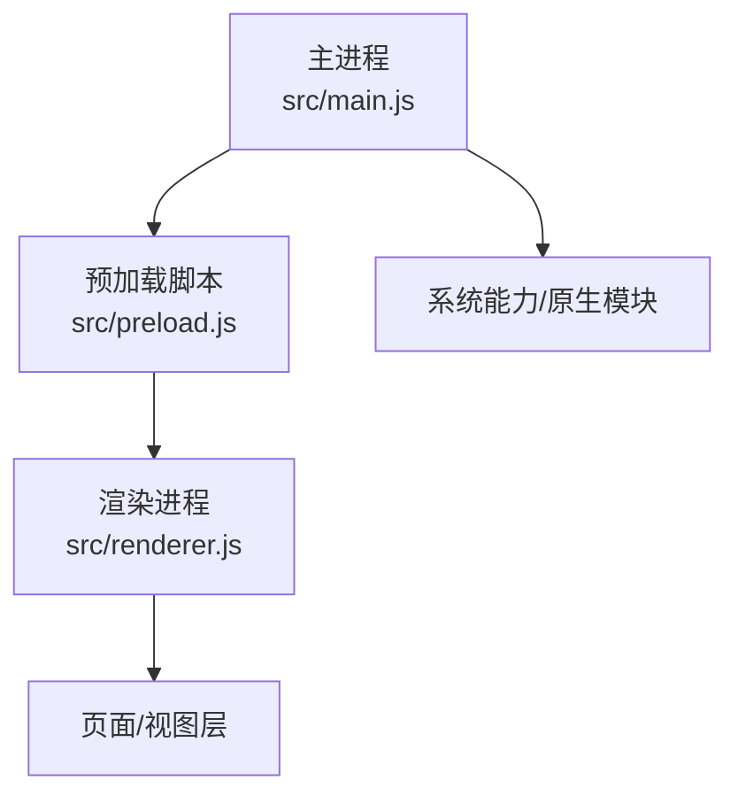
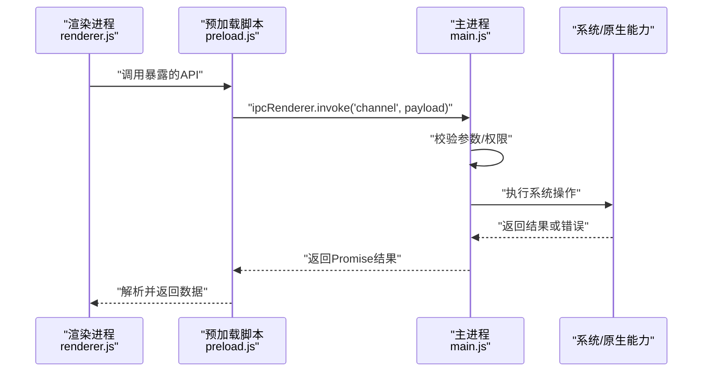
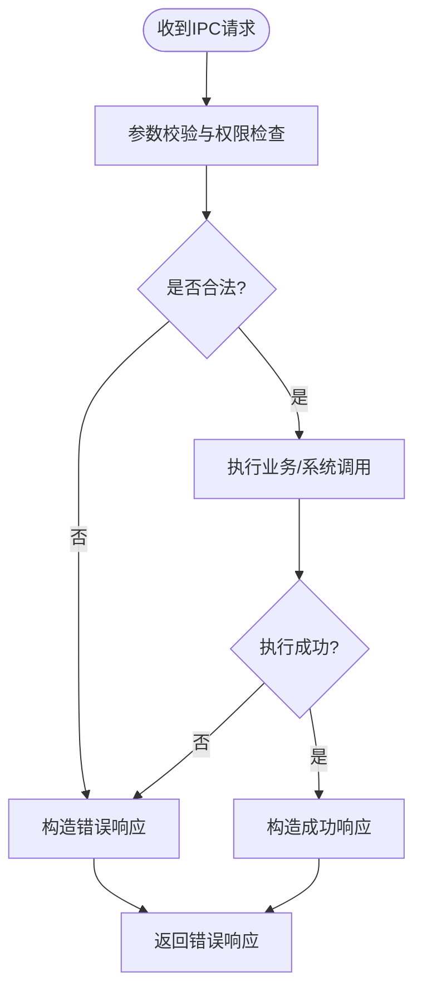
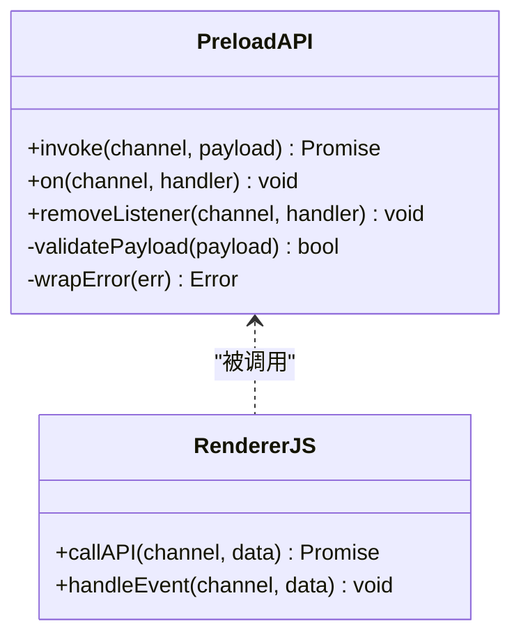
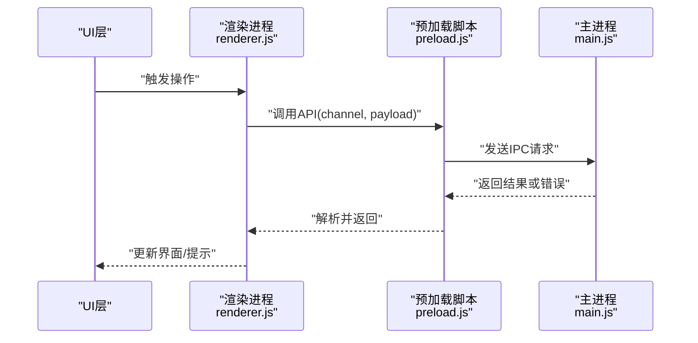

# IPC 通信机制

<cite>
**本文档引用的文件**   
- [main.js](file://src/main.js)
- [preload.js](file://src/preload.js)
- [renderer.js](file://src/renderer.js)
- [package.json](file://package.json)
</cite>

## 目录
1. [简介](#简介)
2. [项目结构](#项目结构)
3. [核心组件](#核心组件)
4. [架构总览](#架构总览)
5. [详细组件分析](#详细组件分析)
6. [依赖关系分析](#依赖关系分析)
7. [性能考虑](#性能考虑)
8. [故障排查指南](#故障排查指南)
9. [结论](#结论)
10. [附录](#附录)

## 简介
本文件围绕 Electron 主进程与渲染进程之间的 IPC（进程间通信）机制，结合本项目源码中的实际实现，系统阐述：
- 主进程与渲染进程的通信模式
- 自定义 IPC 事件的设计与实现
- 数据传输格式、序列化机制与错误处理策略
- 异步通信最佳实践与性能考量
- 常见使用场景的代码示例路径
- 安全注意事项与调试技巧

## 项目结构
本项目为典型的 Electron 应用结构，IPC 相关的关键文件位于 src 目录下：
- main.js：主进程入口，负责创建窗口、注册 IPC 通道、管理生命周期与资源。
- preload.js：预加载脚本，桥接主进程能力到渲染进程，暴露安全的 API。
- renderer.js：渲染进程逻辑，调用预加载暴露的 API 进行业务交互。
- package.json：项目元信息与依赖声明。

图表来源 
- [main.js](file://src/main.js)
- [preload.js](file://src/preload.js)
- [renderer.js](file://src/renderer.js)

章节来源
- [main.js](file://src/main.js)
- [preload.js](file://src/preload.js)
- [renderer.js](file://src/renderer.js)
- [package.json](file://package.json)

## 核心组件
- 主进程（main.js）
  - 职责：创建 BrowserWindow、注册 IPC 通道、处理来自渲染进程的请求、调用系统或原生能力、返回结果。
  - 关键点：通过 ipcMain 监听并响应自定义事件；对传入参数进行校验与白名单控制；统一错误封装与状态码。
- 预加载脚本（preload.js）
  - 职责：在受限环境中暴露最小化 API，屏蔽危险全局对象；将渲染进程调用转发至主进程 IPC 通道。
  - 关键点：仅暴露必要方法；对返回值进行类型约束；避免直接暴露 Node/Electron 内部对象。
- 渲染进程（renderer.js）
  - 职责：发起 IPC 请求、处理回调/事件、更新 UI、处理错误提示。
  - 关键点：使用 Promise 封装异步调用；统一错误处理与重试策略；避免阻塞主线程。

章节来源
- [main.js](file://src/main.js)
- [preload.js](file://src/preload.js)
- [renderer.js](file://src/renderer.js)

## 架构总览
下图展示主进程与渲染进程之间基于预加载脚本的 IPC 调用流程。

图表来源 
- [main.js](file://src/main.js)
- [preload.js](file://src/preload.js)
- [renderer.js](file://src/renderer.js)

## 详细组件分析

### 主进程 IPC 通道设计（main.js）
- 通道命名规范
  - 采用“模块.功能”形式，如 “fs.read”、“app.dialog”、“system.clipboard”，便于分类与审计。
- 参数校验与白名单
  - 对输入参数进行类型检查、长度限制与字段白名单过滤，防止注入与越权。
- 错误处理
  - 统一错误码与消息结构，区分网络、系统、业务三类错误；对敏感信息脱敏。
- 性能优化
  - 大对象分块传输；热点操作缓存；避免同步阻塞；合理设置超时与重试。

图表来源 
- [main.js](file://src/main.js)

章节来源
- [main.js](file://src/main.js)

### 预加载脚本桥接（preload.js）
- 暴露最小 API
  - 仅暴露必要的函数名与方法签名，隐藏底层 ipcRenderer/ipcMain 细节。
- 安全边界
  - 禁用不必要的上下文隔离特性；不直接暴露 Node 模块；对返回值做类型约束。
- 错误透传
  - 将主进程错误包装为标准错误对象，包含 code、message、stack（开发环境）。

图表来源 
- [preload.js](file://src/preload.js)
- [renderer.js](file://src/renderer.js)

章节来源
- [preload.js](file://src/preload.js)
- [renderer.js](file://src/renderer.js)

### 渲染进程调用（renderer.js）
- 调用方式
  - 使用 Promise 封装 invoke/on/removeListener，提供统一的 async/await 风格接口。
- 错误处理
  - 捕获网络/系统/业务错误，显示用户友好提示；支持重试与降级。
- 性能优化
  - 防抖/节流高频调用；批量合并请求；避免重复订阅事件。

图表来源 
- [renderer.js](file://src/renderer.js)
- [preload.js](file://src/preload.js)
- [main.js](file://src/main.js)

章节来源
- [renderer.js](file://src/renderer.js)
- [preload.js](file://src/preload.js)
- [main.js](file://src/main.js)

## 依赖关系分析
- 模块耦合
  - 渲染进程仅依赖预加载脚本暴露的 API，不直接访问主进程。
  - 主进程集中管理所有 IPC 通道，降低分散带来的安全风险。
- 外部依赖
  - 通过 package.json 声明 Electron 版本与依赖，确保运行时一致性。

图表来源 
- [renderer.js](file://src/renderer.js)
- [preload.js](file://src/preload.js)
- [main.js](file://src/main.js)
- [package.json](file://package.json)

章节来源
- [package.json](file://package.json)
- [main.js](file://src/main.js)
- [preload.js](file://src/preload.js)
- [renderer.js](file://src/renderer.js)

## 性能考虑
- 数据传输
  - 优先使用 JSON 序列化；超大对象分片传输；避免循环引用。
- 异步模型
  - 使用 invoke/on 异步模式，避免同步阻塞；合理设置超时与重试。
- 资源管理
  - 及时移除事件监听器；避免内存泄漏；对频繁操作加锁或队列化。
- 监控与度量
  - 记录关键通道的耗时与失败率；对热点通道进行缓存与限流。

[本节为通用指导，无需代码来源]

## 故障排查指南
- 常见问题
  - 通道未注册：确认主进程已正确监听对应 channel。
  - 参数校验失败：检查字段类型、必填项与白名单。
  - 跨域/上下文隔离：确保 preload 正确暴露 API，渲染进程未绕过预加载。
- 调试技巧
  - 在主进程打印请求日志与堆栈；在渲染进程捕获并输出错误详情。
  - 使用浏览器 DevTools 查看网络与事件流；对关键路径添加埋点。
- 恢复策略
  - 自动重试与退避；降级到本地缓存或离线模式；向用户反馈可操作建议。

章节来源
- [main.js](file://src/main.js)
- [preload.js](file://src/preload.js)
- [renderer.js](file://src/renderer.js)

## 结论
通过主进程集中式 IPC 管理、预加载脚本的最小化 API 暴露以及渲染进程的 Promise 封装，本项目实现了安全、高效且易维护的进程间通信。遵循参数校验、错误统一、异步非阻塞与资源清理等最佳实践，可在保证安全性的同时提升性能与可观测性。

[本节为总结，无需代码来源]

## 附录

### 常见 IPC 使用场景与示例路径
- 读取剪贴板内容
  - 渲染进程调用预加载 API，主进程读取系统剪贴板并返回文本。
  - 示例路径：[renderer.js](file://src/renderer.js)、[preload.js](file://src/preload.js)、[main.js](file://src/main.js)
- 打开系统对话框
  - 渲染进程请求选择文件或保存路径，主进程弹出系统对话框并返回路径。
  - 示例路径：[renderer.js](file://src/renderer.js)、[preload.js](file://src/preload.js)、[main.js](file://src/main.js)
- 读写本地配置
  - 渲染进程请求获取/更新配置，主进程读写配置文件并返回结果。
  - 示例路径：[renderer.js](file://src/renderer.js)、[preload.js](file://src/preload.js)、[main.js](file://src/main.js)
- 后台任务与进度上报
  - 渲染进程启动任务，主进程通过事件推送进度与结果。
  - 示例路径：[renderer.js](file://src/renderer.js)、[preload.js](file://src/preload.js)、[main.js](file://src/main.js)

[本节为概念性说明，无需代码来源]

### 安全注意事项
- 最小权限原则：仅暴露必要 API，禁止直接访问 Node/Electron 危险对象。
- 输入校验：严格校验与过滤用户输入，防止注入与越权。
- 输出脱敏：对错误信息、日志与返回值进行脱敏处理。
- 上下文隔离：启用 contextIsolation 与 nodeIntegration=false，确保预加载脚本唯一可信入口。
- 通道白名单：主进程仅允许已知 channel，拒绝未知请求。

[本节为通用安全建议，无需代码来源]

### 调试技巧清单
- 在主进程对每个 channel 打印入参、出参与耗时。
- 在渲染进程捕获并输出错误堆栈与调用链。
- 使用 DevTools 的 Console 与 Sources 断点调试。
- 对高频通道增加采样日志，避免日志风暴。
- 使用环境变量切换调试级别与开关。

[本节为通用调试建议，无需代码来源]