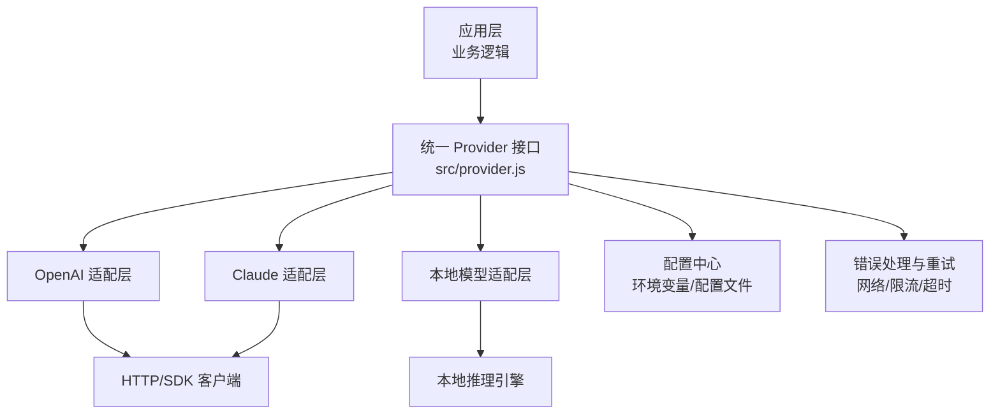
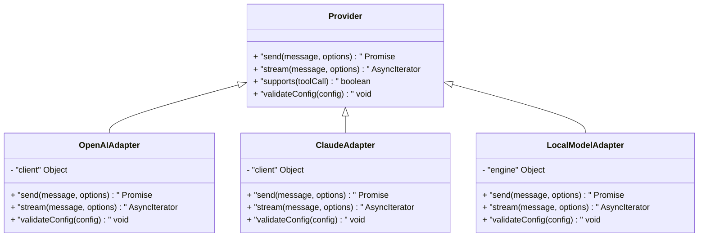
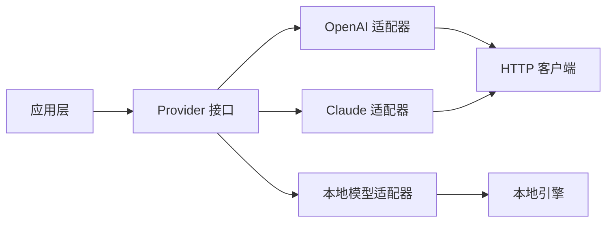

# Provider 架构设计

<cite>
**本文引用的文件**   
- [src/provider.js](file://src/provider.js)
- [test/provider.test.js](file://test/provider.test.js)
- [docs/adr/0002-multi-provider-architecture.md](file://docs/adr/0002-multi-provider-architecture.md)
- [package.json](file://package.json)
</cite>

## 目录
1. [简介](#简介)
2. [项目结构](#项目结构)
3. [核心组件](#核心组件)
4. [架构总览](#架构总览)
5. [详细组件分析](#详细组件分析)
6. [依赖关系分析](#依赖关系分析)
7. [性能考虑](#性能考虑)
8. [故障排查指南](#故障排查指南)
9. [结论](#结论)
10. [附录](#附录)

## 简介
本文件围绕“Provider 架构设计”展开，聚焦多 AI 服务提供商的统一接口抽象、实现规范与扩展机制。目标是让上层业务无需关心具体供应商差异，通过一致的 Provider 接口调用 OpenAI、Claude、本地模型等能力；同时涵盖配置管理、错误处理与重试策略，并给出新增供应商的实操步骤与最佳实践。

## 项目结构
本项目采用以功能模块为中心的组织方式，Provider 相关代码集中在 src/provider.js，测试位于 test/provider.test.js，架构决策记录在 docs/adr/0002-multi-provider-architecture.md。包管理与依赖定义见 package.json。

图表来源
- [src/provider.js](file://src/provider.js)
- [docs/adr/0002-multi-provider-architecture.md](file://docs/adr/0002-multi-provider-architecture.md)

章节来源
- [src/provider.js](file://src/provider.js)
- [docs/adr/0002-multi-provider-architecture.md](file://docs/adr/0002-multi-provider-architecture.md)
- [package.json](file://package.json)

## 核心组件
- 统一 Provider 接口：定义标准化的调用方法（如发送消息、流式输出、工具调用、参数校验等），屏蔽底层差异。
- 适配层实现：为不同供应商提供具体实现，负责协议转换、鉴权、参数映射与结果归一化。
- 配置管理：集中管理密钥、端点、模型名、并发与超时等设置，支持运行时切换。
- 错误处理与重试：对网络异常、限流、超时等进行统一捕获与恢复，提供指数退避与熔断保护。
- 可观测性：埋点日志、指标上报与调试开关，便于定位问题与优化性能。

章节来源
- [src/provider.js](file://src/provider.js)
- [docs/adr/0002-multi-provider-architecture.md](file://docs/adr/0002-multi-provider-architecture.md)

## 架构总览
Provider 架构遵循“接口抽象 + 适配器模式”，上层仅依赖统一接口，具体实现按需注入。配置驱动选择具体 Provider，错误处理与重试作为横切关注点贯穿调用链路。

图表来源
- [src/provider.js](file://src/provider.js)

章节来源
- [src/provider.js](file://src/provider.js)
- [docs/adr/0002-multi-provider-architecture.md](file://docs/adr/0002-multi-provider-architecture.md)

## 详细组件分析

### 统一 Provider 接口设计
- 目标：为所有 AI 服务提供一致的方法签名与返回结构，包括文本生成、流式响应、工具调用支持与配置校验。
- 关键职责：
  - 输入规范化：将不同供应商的参数映射到统一格式。
  - 输出归一化：统一返回结构，包含内容、元数据与错误信息。
  - 能力探测：暴露 supports() 方法用于特性检测（如工具调用、函数调用）。
  - 配置校验：确保密钥、端点、模型名等必填项有效。

章节来源
- [src/provider.js](file://src/provider.js)
- [docs/adr/0002-multi-provider-architecture.md](file://docs/adr/0002-multi-provider-architecture.md)

### 适配层实现规范
- OpenAI 适配层：负责与 OpenAI API 交互，处理鉴权、请求体构造、流式分块解析与错误码映射。
- Claude 适配层：对接 Anthropic 接口，处理系统提示、消息历史与工具调用的参数映射。
- 本地模型适配层：封装本地推理引擎（如 Ollama、LM Studio）的 HTTP/IPC 调用，处理模型加载与资源限制。

章节来源
- [src/provider.js](file://src/provider.js)
- [docs/adr/0002-multi-provider-architecture.md](file://docs/adr/0002-multi-provider-architecture.md)

### 配置管理
- 配置来源：环境变量优先，其次配置文件或运行时注入。
- 关键字段：provider、apiKey、baseUrl、model、timeout、maxRetries、temperature、topP 等。
- 校验规则：必填字段检查、格式校验（URL、密钥）、范围校验（温度、最大令牌数）。
- 动态切换：支持运行时根据上下文选择不同 provider 实例。

章节来源
- [src/provider.js](file://src/provider.js)
- [docs/adr/0002-multi-provider-architecture.md](file://docs/adr/0002-multi-provider-architecture.md)

### 错误处理与重试机制
- 错误分类：网络错误、认证失败、限流（429）、超时、服务端错误（5xx）、参数错误（4xx）。
- 重试策略：指数退避、抖动、最大重试次数、熔断器（连续失败后快速失败）。
- 降级策略：当某 provider 不可用时自动切换到备用 provider（如从云端回退到本地模型）。
- 可观测性：记录错误类型、耗时、重试次数与最终状态，便于监控与告警。

章节来源
- [src/provider.js](file://src/provider.js)
- [docs/adr/0002-multi-provider-architecture.md](file://docs/adr/0002-multi-provider-architecture.md)

### 流式输出与异步处理
- 流式接口：使用异步迭代器或事件流逐步返回 token，降低首字延迟。
- 背压控制：消费者消费速度影响上游发送速率，避免内存溢出。
- 中断与取消：支持用户主动停止生成，释放资源并清理中间状态。

章节来源
- [src/provider.js](file://src/provider.js)
- [docs/adr/0002-multi-provider-architecture.md](file://docs/adr/0002-multi-provider-architecture.md)

### 新增 AI 服务提供商的步骤
- 步骤概览：
  1. 创建新适配器类，继承统一 Provider 接口。
  2. 实现 send、stream、supports、validateConfig 等方法。
  3. 注册到工厂或配置中心，支持按名称选择。
  4. 编写单元测试覆盖正常路径、边界条件与错误场景。
  5. 集成端到端测试，验证配置、鉴权与流式输出。
- 关键点：
  - 严格遵循接口契约，确保返回结构一致。
  - 处理供应商特定错误码与限流策略。
  - 提供清晰的配置字段说明与默认值。

章节来源
- [src/provider.js](file://src/provider.js)
- [docs/adr/0002-multi-provider-architecture.md](file://docs/adr/0002-multi-provider-architecture.md)

### 代码示例路径（不展示具体代码）
- 统一接口定义与工厂：[src/provider.js](file://src/provider.js)
- 适配器实现示例：[src/provider.js](file://src/provider.js)
- 配置校验与合并：[src/provider.js](file://src/provider.js)
- 错误处理与重试逻辑：[src/provider.js](file://src/provider.js)
- 单元测试用例：[test/provider.test.js](file://test/provider.test.js)

章节来源
- [src/provider.js](file://src/provider.js)
- [test/provider.test.js](file://test/provider.test.js)

## 依赖关系分析
- 内部依赖：Provider 接口与多个适配器之间存在松耦合，通过工厂或配置注入解耦。
- 外部依赖：HTTP 客户端库、JSON 解析、日志与监控 SDK。
- 循环依赖：应避免在适配器中直接引用其他适配器，通过统一接口通信。
- 版本兼容性：对外部 SDK 进行版本锁定与兼容性测试。

图表来源
- [src/provider.js](file://src/provider.js)

章节来源
- [src/provider.js](file://src/provider.js)
- [package.json](file://package.json)

## 性能考虑
- 连接池与复用：复用 HTTP 连接，减少握手开销。
- 并发控制：限制并发请求数，避免触发限流。
- 缓存策略：对相同 prompt 的结果进行短期缓存，提升命中率。
- 流式传输：优先使用流式接口，降低内存占用与首字延迟。
- 资源清理：及时关闭连接与释放内存，防止泄漏。

## 故障排查指南
- 常见问题：
  - 认证失败：检查 apiKey、baseUrl、模型名是否正确。
  - 限流错误：调整 maxRetries、backoff 策略，或升级配额。
  - 超时错误：增加 timeout、检查网络状况。
  - 流式中断：确认消费者是否及时消费，避免背压堆积。
- 诊断手段：
  - 启用调试日志，记录请求与响应。
  - 使用健康检查接口验证 provider 可用性。
  - 监控关键指标：成功率、延迟、重试率、错误分布。

章节来源
- [src/provider.js](file://src/provider.js)
- [test/provider.test.js](file://test/provider.test.js)

## 结论
Provider 架构通过统一接口抽象与适配器模式，实现了多 AI 服务的无缝集成与灵活扩展。结合完善的配置管理、错误处理与重试机制，系统在稳定性、可维护性与性能方面具备良好表现。遵循本文档的规范与实践，可高效接入新的 AI 服务提供商。

## 附录
- 术语表：
  - Provider：统一接口抽象，屏蔽底层差异。
  - 适配器：具体供应商的实现层。
  - 流式输出：逐步返回生成内容的机制。
  - 重试策略：应对临时错误的恢复机制。
- 参考文档：
  - 架构决策记录：[docs/adr/0002-multi-provider-architecture.md](file://docs/adr/0002-multi-provider-architecture.md)
  - 包依赖清单：[package.json](file://package.json)