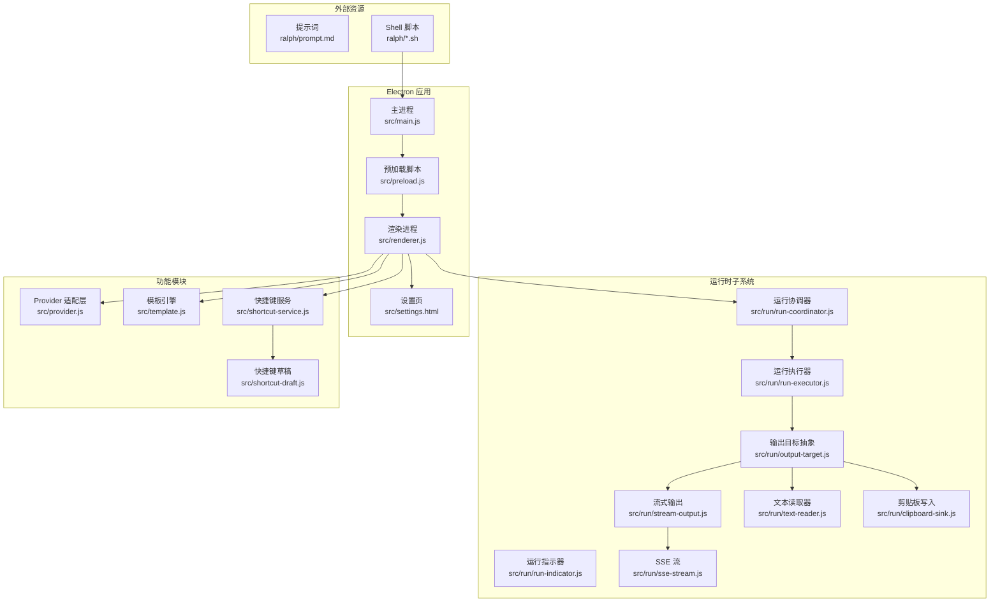
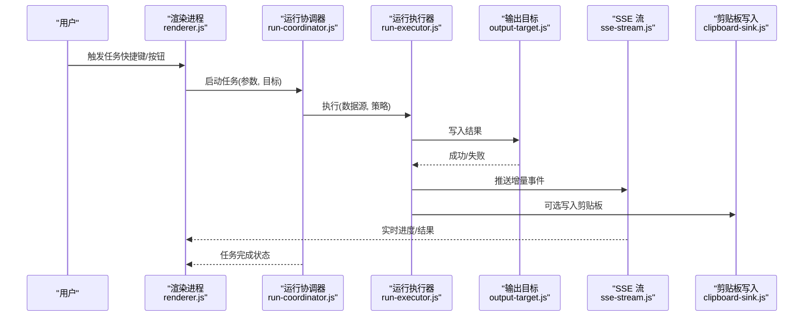
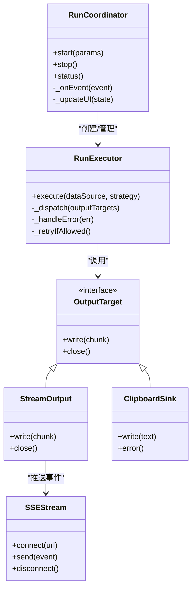
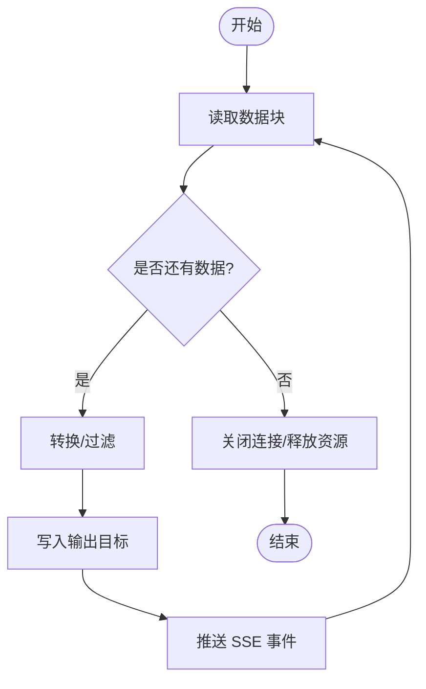
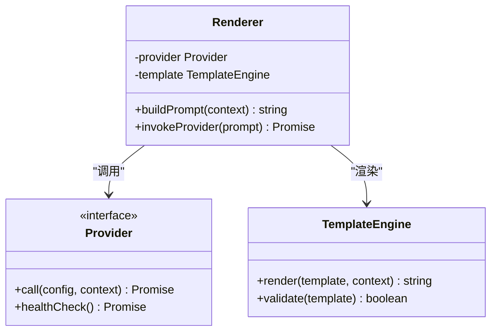
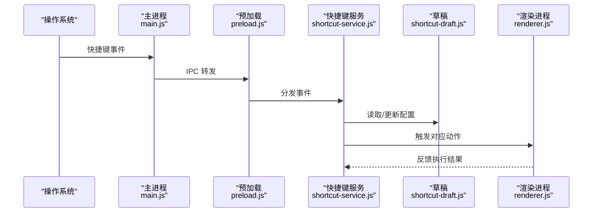
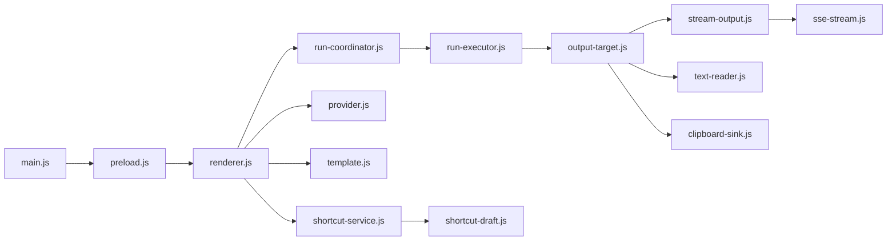

# Ralph 自动化框架

<cite>
**本文引用的文件**   
- [README.md](file://README.md)
- [package.json](file://package.json)
- [src/main.js](file://src/main.js)
- [src/preload.js](file://src/preload.js)
- [src/renderer.js](file://src/renderer.js)
- [src/provider.js](file://src/provider.js)
- [src/template.js](file://src/template.js)
- [src/shortcut-service.js](file://src/shortcut-service.js)
- [src/shortcut-draft.js](file://src/shortcut-draft.js)
- [src/settings.html](file://src/settings.html)
- [src/run/run-coordinator.js](file://src/run/run-coordinator.js)
- [src/run/run-executor.js](file://src/run/run-executor.js)
- [src/run/run-indicator.js](file://src/run/run-indicator.js)
- [src/run/output-target.js](file://src/run/output-target.js)
- [src/run/stream-output.js](file://src/run/stream-output.js)
- [src/run/sse-stream.js](file://src/run/sse-stream.js)
- [src/run/text-reader.js](file://src/run/text-reader.js)
- [src/run/clipboard-sink.js](file://src/run/clipboard-sink.js)
- [ralph/prompt.md](file://ralph/prompt.md)
- [ralph/afk.sh](file://ralph/afk.sh)
- [ralph/cronjobloop.sh](file://ralph/cronjobloop.sh)
- [ralph/once.sh](file://ralph/once.sh)
</cite>

## 目录
1. [简介](#简介)
2. [项目结构](#项目结构)
3. [核心组件](#核心组件)
4. [架构总览](#架构总览)
5. [详细组件分析](#详细组件分析)
6. [依赖关系分析](#依赖关系分析)
7. [性能考量](#性能考量)
8. [故障排查指南](#故障排查指南)
9. [结论](#结论)
10. [附录](#附录)

## 简介
Ralph 是一个基于 Electron 的桌面端自动化框架，围绕“提示词驱动”的工作流编排与执行能力构建。它通过主进程、预加载脚本与渲染进程的协作，提供快捷键服务、模板系统、多目标输出（文本、剪贴板、SSE 流等），以及统一的运行协调器与执行器，支持一次性任务与循环调度。项目同时提供 shell 脚本用于外部触发与定时任务，便于与系统级自动化集成。

## 项目结构
- src：Electron 应用源码，包含主进程入口、预加载脚本、渲染进程逻辑、快捷键服务、模板系统与运行子系统。
- ralph：与提示词和外部触发相关的资源与脚本。
- test：单元测试覆盖运行子系统、快捷键服务、模板与主题设置等。
- types：浏览器全局类型声明。
- docs：架构决策记录与代理领域文档。

图表来源
- [src/main.js](file://src/main.js)
- [src/preload.js](file://src/preload.js)
- [src/renderer.js](file://src/renderer.js)
- [src/run/run-coordinator.js](file://src/run/run-coordinator.js)
- [src/run/run-executor.js](file://src/run/run-executor.js)
- [src/run/output-target.js](file://src/run/output-target.js)
- [src/run/stream-output.js](file://src/run/stream-output.js)
- [src/run/sse-stream.js](file://src/run/sse-stream.js)
- [src/run/text-reader.js](file://src/run/text-reader.js)
- [src/run/clipboard-sink.js](file://src/run/clipboard-sink.js)
- [src/provider.js](file://src/provider.js)
- [src/template.js](file://src/template.js)
- [src/shortcut-service.js](file://src/shortcut-service.js)
- [src/shortcut-draft.js](file://src/shortcut-draft.js)
- [src/settings.html](file://src/settings.html)
- [ralph/prompt.md](file://ralph/prompt.md)
- [ralph/afk.sh](file://ralph/afk.sh)
- [ralph/cronjobloop.sh](file://ralph/cronjobloop.sh)
- [ralph/once.sh](file://ralph/once.sh)

章节来源
- [README.md](file://README.md)
- [package.json](file://package.json)

## 核心组件
- 运行协调器：负责任务的编排、生命周期管理与状态同步，统一对外暴露启动、停止、查询接口。
- 运行执行器：承载具体执行逻辑，按策略调用输出目标与数据源，处理错误与重试。
- 输出目标抽象：定义统一的写入接口，支持多种实现（文本、剪贴板、SSE 流等）。
- 流式输出与 SSE 流：将执行结果以增量方式推送至前端或外部消费者。
- 文本读取器：从文件或输入流中读取内容，供执行器消费。
- 剪贴板写入：将结果直接写入系统剪贴板，便于快速粘贴使用。
- Provider 适配层：屏蔽不同后端/服务的差异，提供一致的调用契约。
- 模板引擎：解析并填充提示词模板，支持变量替换与上下文注入。
- 快捷键服务与草稿：注册全局快捷键，管理快捷键配置与草稿保存。
- 设置页：提供用户可配置的界面，持久化偏好设置。

章节来源
- [src/run/run-coordinator.js](file://src/run/run-coordinator.js)
- [src/run/run-executor.js](file://src/run/run-executor.js)
- [src/run/output-target.js](file://src/run/output-target.js)
- [src/run/stream-output.js](file://src/run/stream-output.js)
- [src/run/sse-stream.js](file://src/run/sse-stream.js)
- [src/run/text-reader.js](file://src/run/text-reader.js)
- [src/run/clipboard-sink.js](file://src/run/clipboard-sink.js)
- [src/provider.js](file://src/provider.js)
- [src/template.js](file://src/template.js)
- [src/shortcut-service.js](file://src/shortcut-service.js)
- [src/shortcut-draft.js](file://src/shortcut-draft.js)
- [src/settings.html](file://src/settings.html)

## 架构总览
Ralph 采用典型的 Electron 三层架构：主进程负责系统级能力与生命周期管理；预加载脚本桥接主进程与渲染进程的安全通信；渲染进程承载 UI 与业务编排。运行子系统在渲染进程中组织，通过协调器与执行器解耦任务编排与具体执行细节，输出目标抽象使得新增输出渠道无需改动核心流程。Provider 与模板引擎为上层业务提供稳定契约与灵活的内容生成能力。

图表来源
- [src/renderer.js](file://src/renderer.js)
- [src/run/run-coordinator.js](file://src/run/run-coordinator.js)
- [src/run/run-executor.js](file://src/run/run-executor.js)
- [src/run/output-target.js](file://src/run/output-target.js)
- [src/run/sse-stream.js](file://src/run/sse-stream.js)
- [src/run/clipboard-sink.js](file://src/run/clipboard-sink.js)

## 详细组件分析

### 运行协调器与执行器
- 协调器负责创建执行上下文、维护任务状态、订阅执行器事件，并向 UI 广播进度与结果。
- 执行器根据策略选择数据源与输出目标，处理异常、重试与超时，确保任务可观测与可恢复。

图表来源
- [src/run/run-coordinator.js](file://src/run/run-coordinator.js)
- [src/run/run-executor.js](file://src/run/run-executor.js)
- [src/run/output-target.js](file://src/run/output-target.js)
- [src/run/stream-output.js](file://src/run/stream-output.js)
- [src/run/sse-stream.js](file://src/run/sse-stream.js)
- [src/run/clipboard-sink.js](file://src/run/clipboard-sink.js)

章节来源
- [src/run/run-coordinator.js](file://src/run/run-coordinator.js)
- [src/run/run-executor.js](file://src/run/run-executor.js)
- [src/run/output-target.js](file://src/run/output-target.js)
- [src/run/stream-output.js](file://src/run/stream-output.js)
- [src/run/sse-stream.js](file://src/run/sse-stream.js)
- [src/run/clipboard-sink.js](file://src/run/clipboard-sink.js)

### 文本读取器与流式输出
- 文本读取器负责从文件或标准输入读取数据块，支持断点续读与错误恢复。
- 流式输出将执行结果分片推送，降低内存占用并提升响应速度。

图表来源
- [src/run/text-reader.js](file://src/run/text-reader.js)
- [src/run/stream-output.js](file://src/run/stream-output.js)
- [src/run/sse-stream.js](file://src/run/sse-stream.js)

章节来源
- [src/run/text-reader.js](file://src/run/text-reader.js)
- [src/run/stream-output.js](file://src/run/stream-output.js)
- [src/run/sse-stream.js](file://src/run/sse-stream.js)

### Provider 适配层与模板引擎
- Provider 抽象了不同后端/服务的调用方式，统一返回结构与错误语义。
- 模板引擎解析提示词模板，注入上下文变量，支持条件分支与函数调用。

图表来源
- [src/provider.js](file://src/provider.js)
- [src/template.js](file://src/template.js)
- [src/renderer.js](file://src/renderer.js)

章节来源
- [src/provider.js](file://src/provider.js)
- [src/template.js](file://src/template.js)
- [src/renderer.js](file://src/renderer.js)

### 快捷键服务与草稿
- 快捷键服务注册全局快捷键，监听组合键事件，转发到渲染进程执行动作。
- 草稿模块保存未提交的快捷键配置，支持撤销与恢复。

图表来源
- [src/main.js](file://src/main.js)
- [src/preload.js](file://src/preload.js)
- [src/shortcut-service.js](file://src/shortcut-service.js)
- [src/shortcut-draft.js](file://src/shortcut-draft.js)
- [src/renderer.js](file://src/renderer.js)

章节来源
- [src/shortcut-service.js](file://src/shortcut-service.js)
- [src/shortcut-draft.js](file://src/shortcut-draft.js)
- [src/main.js](file://src/main.js)
- [src/preload.js](file://src/preload.js)
- [src/renderer.js](file://src/renderer.js)

### 设置页与主题
- 设置页提供可视化配置项，包括 Provider、模板、快捷键与输出目标等。
- 主题支持切换，持久化用户偏好。

章节来源
- [src/settings.html](file://src/settings.html)

### 外部触发与脚本
- ralph 目录下的 shell 脚本支持一次性任务、循环任务与空闲检测，便于与系统任务计划或外部工具集成。

章节来源
- [ralph/afk.sh](file://ralph/afk.sh)
- [ralph/cronjobloop.sh](file://ralph/cronjobloop.sh)
- [ralph/once.sh](file://ralph/once.sh)
- [ralph/prompt.md](file://ralph/prompt.md)

## 依赖关系分析
- 运行子系统内部耦合度低，协调器与执行器通过明确的事件与回调交互，输出目标通过抽象接口解耦。
- Provider 与模板引擎对渲染进程透明，便于扩展新的后端与模板语法。
- 快捷键服务与主进程通过 IPC 通信，避免渲染进程直接访问系统 API。

图表来源
- [src/renderer.js](file://src/renderer.js)
- [src/run/run-coordinator.js](file://src/run/run-coordinator.js)
- [src/run/run-executor.js](file://src/run/run-executor.js)
- [src/run/output-target.js](file://src/run/output-target.js)
- [src/run/stream-output.js](file://src/run/stream-output.js)
- [src/run/sse-stream.js](file://src/run/sse-stream.js)
- [src/run/text-reader.js](file://src/run/text-reader.js)
- [src/run/clipboard-sink.js](file://src/run/clipboard-sink.js)
- [src/provider.js](file://src/provider.js)
- [src/template.js](file://src/template.js)
- [src/shortcut-service.js](file://src/shortcut-service.js)
- [src/shortcut-draft.js](file://src/shortcut-draft.js)
- [src/main.js](file://src/main.js)
- [src/preload.js](file://src/preload.js)

章节来源
- [package.json](file://package.json)

## 性能考量
- 流式输出与分块读取可降低内存峰值，提高大文件处理的稳定性。
- SSE 推送适合长时任务，减少轮询开销。
- Provider 调用建议增加缓存与限流，避免频繁请求导致延迟与抖动。
- 快捷键事件处理应轻量，避免阻塞 UI 线程。

[本节为通用指导，不直接分析具体文件]

## 故障排查指南
- 任务无输出：检查输出目标配置与权限（如剪贴板写入）、SSE 连接状态。
- 模板渲染失败：确认模板语法与上下文变量完整性。
- Provider 调用异常：查看健康检查与错误码，必要时启用重试与降级。
- 快捷键无效：验证注册是否成功、冲突检测与系统权限。

章节来源
- [src/run/run-executor.js](file://src/run/run-executor.js)
- [src/run/stream-output.js](file://src/run/stream-output.js)
- [src/run/sse-stream.js](file://src/run/sse-stream.js)
- [src/template.js](file://src/template.js)
- [src/provider.js](file://src/provider.js)
- [src/shortcut-service.js](file://src/shortcut-service.js)

## 结论
Ralph 通过清晰的层次划分与抽象接口，实现了可扩展、可观测、易集成的自动化框架。运行子系统与 Provider/模板引擎的解耦设计，使新增输出渠道与后端服务变得简单。结合快捷键与外部脚本，Ralph 能够无缝融入桌面与工作流场景。

[本节为总结性内容，不直接分析具体文件]

## 附录
- 提示词资源位于 ralph/prompt.md，可作为模板与上下文的参考。
- Shell 脚本提供一次性与循环任务触发方式，便于与系统任务计划集成。

章节来源
- [ralph/prompt.md](file://ralph/prompt.md)
- [ralph/once.sh](file://ralph/once.sh)
- [ralph/cronjobloop.sh](file://ralph/cronjobloop.sh)
- [ralph/afk.sh](file://ralph/afk.sh)