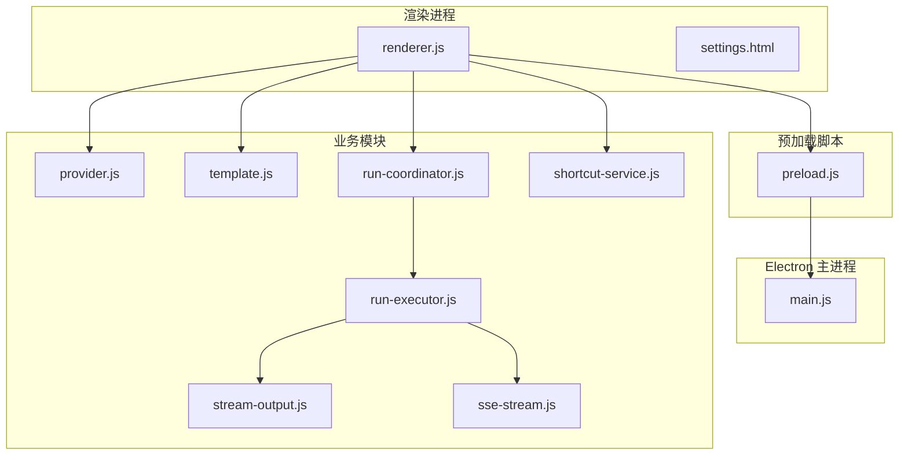
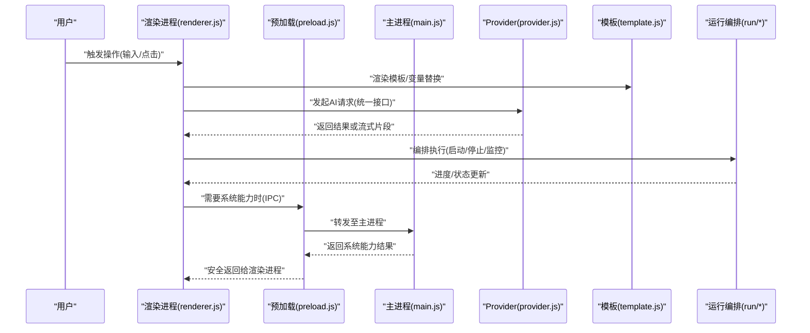
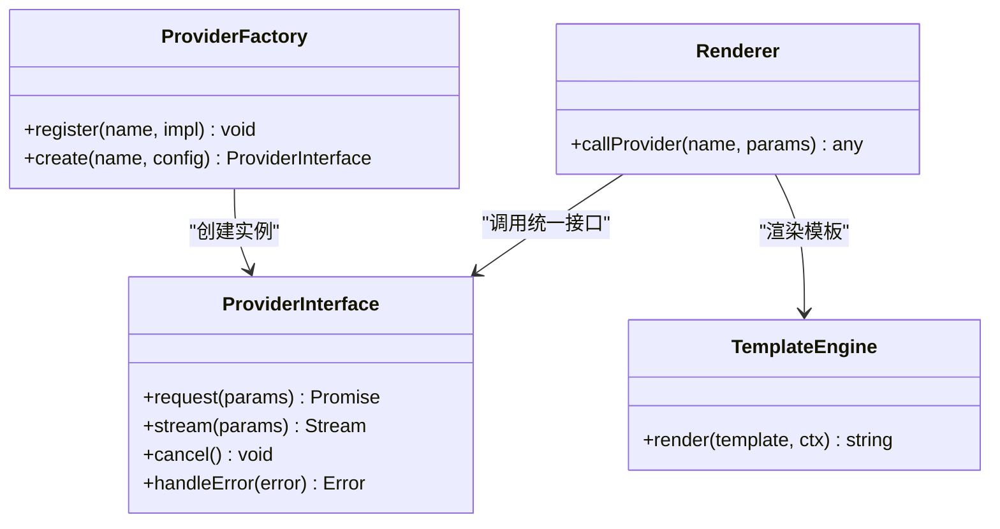
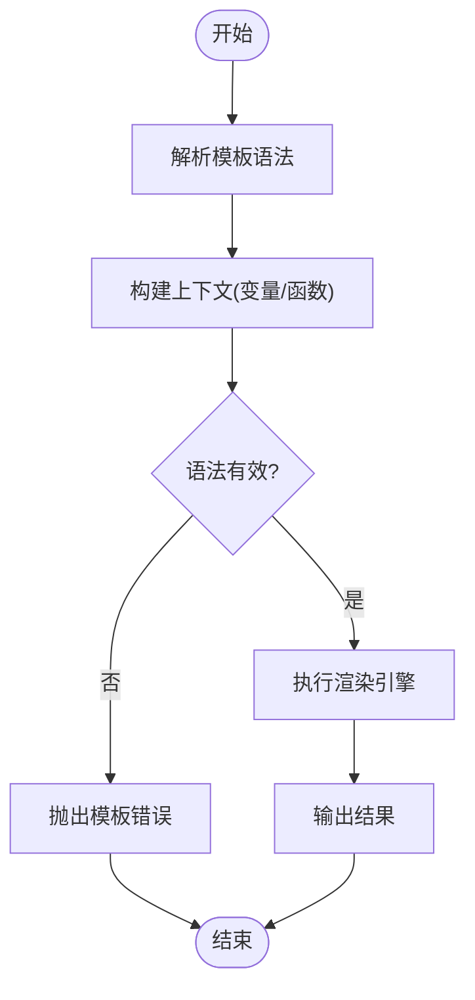
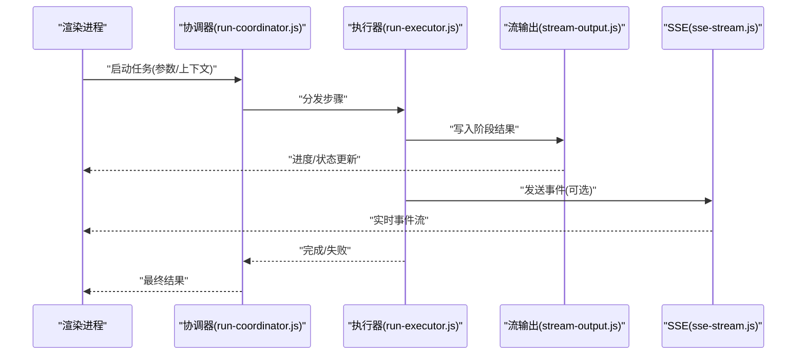
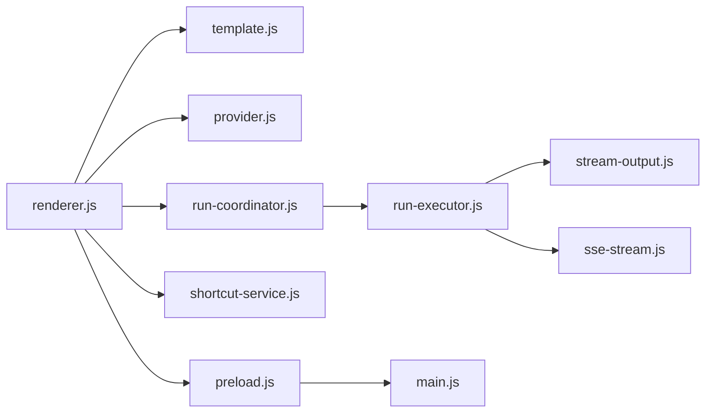

# 核心架构

<cite>
**本文引用的文件**   
- [src/main.js](file://src/main.js)
- [src/preload.js](file://src/preload.js)
- [src/renderer.js](file://src/renderer.js)
- [src/provider.js](file://src/provider.js)
- [src/template.js](file://src/template.js)
- [src/run/run-coordinator.js](file://src/run/run-coordinator.js)
- [src/run/run-executor.js](file://src/run/run-executor.js)
- [src/run/stream-output.js](file://src/run/stream-output.js)
- [src/run/sse-stream.js](file://src/run/sse-stream.js)
- [src/shortcut-service.js](file://src/shortcut-service.js)
- [src/settings.html](file://src/settings.html)
- [package.json](file://package.json)
</cite>

## 目录
1. [简介](#简介)
2. [项目结构](#项目结构)
3. [核心组件](#核心组件)
4. [架构总览](#架构总览)
5. [详细组件分析](#详细组件分析)
6. [依赖关系分析](#依赖关系分析)
7. [性能考量](#性能考量)
8. [故障排查指南](#故障排查指南)
9. [结论](#结论)
10. [附录](#附录)

## 简介
本文件为 prompt_gogo 的核心架构文档，聚焦 Electron 应用的三层架构（主进程、预加载脚本、渲染进程）的职责划分与数据流；阐述 Provider 架构如何统一抽象多种 AI 服务提供商；解析模板系统的设计原理（语法、变量替换、动态内容生成）；说明 IPC 通信模式在进程间数据传递中的应用；并给出错误处理策略与日志记录机制。文末提供架构图与数据流图，帮助开发者快速理解整体设计思路与技术决策。

## 项目结构
prompt_gogo 采用典型的 Electron 应用分层组织：
- 主进程入口与系统能力封装位于 src/main.js
- 安全桥接与 API 暴露位于 src/preload.js
- 渲染进程 UI 与交互逻辑位于 src/renderer.js
- 服务层与业务模块位于 src/provider.js、src/template.js、src/run/*、src/shortcut-service.js
- 配置与打包信息位于 package.json

**图表来源** 
- [src/main.js](file://src/main.js)
- [src/preload.js](file://src/preload.js)
- [src/renderer.js](file://src/renderer.js)
- [src/provider.js](file://src/provider.js)
- [src/template.js](file://src/template.js)
- [src/run/run-coordinator.js](file://src/run/run-coordinator.js)
- [src/run/run-executor.js](file://src/run/run-executor.js)
- [src/run/stream-output.js](file://src/run/stream-output.js)
- [src/run/sse-stream.js](file://src/run/sse-stream.js)
- [src/shortcut-service.js](file://src/shortcut-service.js)
- [src/settings.html](file://src/settings.html)

**章节来源**
- [package.json](file://package.json)

## 核心组件
- 主进程（main.js）
  - 负责窗口生命周期管理、菜单与快捷键注册、全局状态与持久化配置、IPC 通道定义与路由、与操作系统能力的交互（如剪贴板、文件系统）。
- 预加载脚本（preload.js）
  - 作为安全边界，仅向渲染进程暴露最小必要 API，通过 contextBridge 将受控的 IPC 调用方法注入到 window 对象，避免直接访问 Node.js 能力。
- 渲染进程（renderer.js）
  - 承载 UI 与用户交互，调用预加载暴露的方法进行 IPC 通信，驱动模板渲染、Provider 调用与运行编排。
- Provider 抽象（provider.js）
  - 统一多厂商 AI 服务的接口抽象，屏蔽差异，对外暴露一致的请求/流式响应/错误处理契约。
- 模板系统（template.js）
  - 实现模板语法解析、变量替换与上下文注入，支持动态内容生成与条件分支。
- 运行编排（run/*）
  - run-coordinator.js 协调任务生命周期；run-executor.js 执行具体步骤；stream-output.js 输出结果；sse-stream.js 处理 Server-Sent Events 流。
- 快捷键服务（shortcut-service.js）
  - 集中管理快捷键注册、冲突检测与事件分发。

**章节来源**
- [src/main.js](file://src/main.js)
- [src/preload.js](file://src/preload.js)
- [src/renderer.js](file://src/renderer.js)
- [src/provider.js](file://src/provider.js)
- [src/template.js](file://src/template.js)
- [src/run/run-coordinator.js](file://src/run/run-coordinator.js)
- [src/run/run-executor.js](file://src/run/run-executor.js)
- [src/run/stream-output.js](file://src/run/stream-output.js)
- [src/run/sse-stream.js](file://src/run/sse-stream.js)
- [src/shortcut-service.js](file://src/shortcut-service.js)

## 架构总览
下图展示 Electron 三层架构与关键模块之间的交互关系，以及 Provider 抽象对多厂商服务的统一接入方式。

**图表来源** 
- [src/renderer.js](file://src/renderer.js)
- [src/preload.js](file://src/preload.js)
- [src/main.js](file://src/main.js)
- [src/provider.js](file://src/provider.js)
- [src/template.js](file://src/template.js)
- [src/run/run-coordinator.js](file://src/run/run-coordinator.js)
- [src/run/run-executor.js](file://src/run/run-executor.js)
- [src/run/stream-output.js](file://src/run/stream-output.js)
- [src/run/sse-stream.js](file://src/run/sse-stream.js)

## 详细组件分析

### 主进程（main.js）职责与控制流
- 职责
  - 创建与管理 BrowserWindow，设置窗口行为与安全选项。
  - 注册全局快捷键与菜单项，委托 shortcut-service.js 统一管理。
  - 定义 IPC 通道，处理来自预加载的安全调用，封装系统能力（文件系统、剪贴板等）。
  - 维护应用级配置与状态，提供持久化读写接口。
- 控制流要点
  - 应用启动时初始化窗口与 IPC 路由。
  - 接收渲染进程的 IPC 请求，校验参数后调用底层能力或业务模块。
  - 将结果回传给预加载，再由预加载安全地返回给渲染进程。

**章节来源**
- [src/main.js](file://src/main.js)
- [src/shortcut-service.js](file://src/shortcut-service.js)

### 预加载脚本（preload.js）安全桥接
- 职责
  - 使用 contextBridge 暴露最小化的 API 给渲染进程。
  - 所有系统能力调用均通过 IPC 转发至主进程，确保渲染进程不直接访问 Node.js。
- 关键点
  - 严格白名单暴露方法名与参数类型。
  - 对返回值进行必要的数据清洗与类型约束。

**章节来源**
- [src/preload.js](file://src/preload.js)

### 渲染进程（renderer.js）UI 与交互
- 职责
  - 绑定 UI 事件，调用模板系统进行内容渲染。
  - 通过 Provider 统一接口发起 AI 请求，处理响应与错误。
  - 与运行编排模块协作，管理任务的启动、暂停、停止与状态同步。
  - 通过预加载暴露的 IPC 方法获取系统能力。
- 数据流
  - 用户输入 → 模板渲染 → Provider 调用 → 运行编排 → UI 更新。

**章节来源**
- [src/renderer.js](file://src/renderer.js)
- [src/template.js](file://src/template.js)
- [src/provider.js](file://src/provider.js)
- [src/run/run-coordinator.js](file://src/run/run-coordinator.js)
- [src/run/run-executor.js](file://src/run/run-executor.js)
- [src/run/stream-output.js](file://src/run/stream-output.js)
- [src/run/sse-stream.js](file://src/run/sse-stream.js)

### Provider 架构：统一多厂商 AI 服务
- 设计目标
  - 抽象不同 AI 提供商的请求格式、认证方式、流式响应与错误码差异。
  - 对外暴露一致的方法集：发起请求、订阅流、取消请求、错误处理。
- 扩展性
  - 新增提供商只需实现统一接口，并在注册表中声明。
  - 运行时根据配置选择具体提供商实例。
- 典型流程
  - 渲染进程调用统一接口 → Provider 内部适配 → 网络请求 → 流式/一次性响应 → 错误归一化。

**图表来源** 
- [src/provider.js](file://src/provider.js)
- [src/renderer.js](file://src/renderer.js)
- [src/template.js](file://src/template.js)

**章节来源**
- [src/provider.js](file://src/provider.js)

### 模板系统：语法、变量替换与动态内容生成
- 模板语法
  - 支持变量占位符、条件分支、循环迭代与函数调用。
  - 允许嵌套模板与自定义过滤器。
- 变量替换
  - 基于上下文对象进行深度解析，支持默认值与缺失字段回退。
- 动态内容生成
  - 结合 Provider 返回数据与运行状态，实时生成最终文本或结构化内容。
- 错误处理
  - 对未定义的变量、非法表达式进行友好提示与降级策略。

**图表来源** 
- [src/template.js](file://src/template.js)

**章节来源**
- [src/template.js](file://src/template.js)

### 运行编排：协调器与执行器
- run-coordinator.js
  - 管理任务生命周期（创建、调度、监控、销毁）。
  - 聚合执行器状态，向上游提供统一的进度与结果回调。
- run-executor.js
  - 按步骤执行具体任务，支持并行/串行策略。
  - 与流式输出和 SSE 集成，实时推送中间结果。
- stream-output.js / sse-stream.js
  - 标准化输出格式与事件协议，便于前端消费。

**图表来源** 
- [src/run/run-coordinator.js](file://src/run/run-coordinator.js)
- [src/run/run-executor.js](file://src/run/run-executor.js)
- [src/run/stream-output.js](file://src/run/stream-output.js)
- [src/run/sse-stream.js](file://src/run/sse-stream.js)

**章节来源**
- [src/run/run-coordinator.js](file://src/run/run-coordinator.js)
- [src/run/run-executor.js](file://src/run/run-executor.js)
- [src/run/stream-output.js](file://src/run/stream-output.js)
- [src/run/sse-stream.js](file://src/run/sse-stream.js)

### 快捷键服务（shortcut-service.js）
- 职责
  - 集中注册全局快捷键，处理冲突与优先级。
  - 将快捷键事件映射到具体动作，交由主进程或渲染进程执行。
- 集成点
  - 与 main.js 的菜单与快捷键注册联动。
  - 为渲染进程提供快捷操作入口（通过 IPC）。

**章节来源**
- [src/shortcut-service.js](file://src/shortcut-service.js)
- [src/main.js](file://src/main.js)

### 设置页（settings.html）
- 作用
  - 提供可视化配置界面，编辑应用设置（如默认 Provider、模板偏好、快捷键绑定）。
- 数据流
  - 渲染进程读取/保存设置 → 通过预加载 IPC 调用主进程持久化存储。

**章节来源**
- [src/settings.html](file://src/settings.html)
- [src/preload.js](file://src/preload.js)
- [src/main.js](file://src/main.js)

## 依赖关系分析
- 模块耦合
  - renderer.js 依赖 template.js、provider.js、run/*、shortcut-service.js。
  - preload.js 仅依赖 ipcRenderer/ipcMain 的安全桥接能力。
  - main.js 依赖 shortcut-service.js 与系统能力封装。
- 外部依赖
  - 通过 package.json 声明运行时依赖（如网络库、流处理库等）。
- 潜在循环依赖
  - 通过 Provider 抽象与运行编排解耦，避免渲染进程与业务模块的直接强耦合。

**图表来源** 
- [src/renderer.js](file://src/renderer.js)
- [src/template.js](file://src/template.js)
- [src/provider.js](file://src/provider.js)
- [src/run/run-coordinator.js](file://src/run/run-coordinator.js)
- [src/run/run-executor.js](file://src/run/run-executor.js)
- [src/run/stream-output.js](file://src/run/stream-output.js)
- [src/run/sse-stream.js](file://src/run/sse-stream.js)
- [src/shortcut-service.js](file://src/shortcut-service.js)
- [src/preload.js](file://src/preload.js)
- [src/main.js](file://src/main.js)

**章节来源**
- [package.json](file://package.json)

## 性能考量
- 流式处理
  - 使用 SSE 与流式输出减少首屏延迟，提升大模型响应的用户体验。
- 异步与并发
  - 执行器支持并行步骤，合理拆分 IO 密集型任务，避免阻塞主线程。
- 内存与资源
  - 及时释放临时对象与事件监听器，避免内存泄漏。
- 模板渲染
  - 缓存常用模板与上下文，减少重复解析开销。

[本节为通用指导，无需特定文件引用]

## 故障排查指南
- 常见错误分类
  - 模板错误：语法无效、变量缺失、函数不可用。
  - Provider 错误：认证失败、网络超时、响应格式异常。
  - 运行错误：步骤执行失败、流中断、状态不一致。
  - IPC 错误：通道未注册、参数校验失败、权限不足。
- 定位方法
  - 检查渲染控制台与主进程日志，确认错误堆栈与上下文。
  - 验证模板语法与上下文对象是否完整。
  - 核对 Provider 配置与网络连通性。
  - 审查 IPC 通道注册与参数类型。
- 恢复策略
  - 模板：提供默认值与降级渲染。
  - Provider：重试与切换备用提供商。
  - 运行：断点续跑与状态回滚。
  - IPC：重试与错误码映射。

**章节来源**
- [src/template.js](file://src/template.js)
- [src/provider.js](file://src/provider.js)
- [src/run/run-executor.js](file://src/run/run-executor.js)
- [src/preload.js](file://src/preload.js)
- [src/main.js](file://src/main.js)

## 结论
prompt_gogo 通过清晰的 Electron 三层架构与 Provider 抽象，实现了多厂商 AI 服务的统一接入与稳定运行。模板系统与运行编排模块增强了内容的灵活性与可观测性。IPC 安全桥接确保了渲染进程的最小权限原则。整体设计兼顾可扩展性、性能与可维护性，适合持续演进与生态扩展。

[本节为总结，无需特定文件引用]

## 附录
- 术语
  - 主进程：Electron 中拥有完整 Node.js 能力的进程。
  - 预加载脚本：在渲染进程之前执行，用于安全桥接。
  - 渲染进程：承载 UI 与用户交互的进程。
  - Provider：统一抽象不同 AI 服务提供商的接口层。
  - 模板系统：用于动态生成文本或结构化内容的引擎。
  - 运行编排：管理任务生命周期与执行流程的模块集合。

[本节为概念说明，无需特定文件引用]