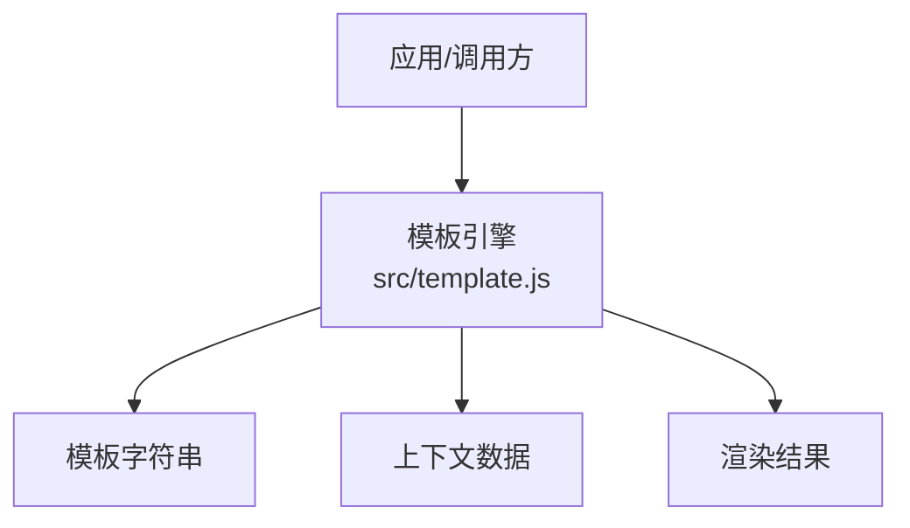
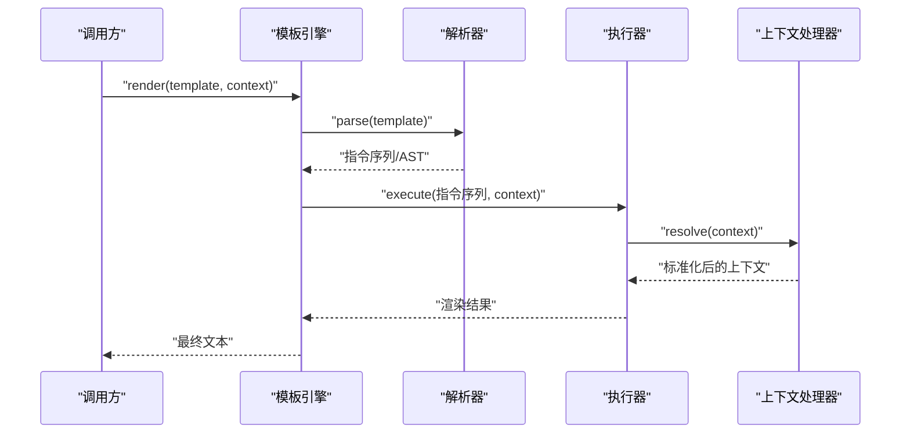
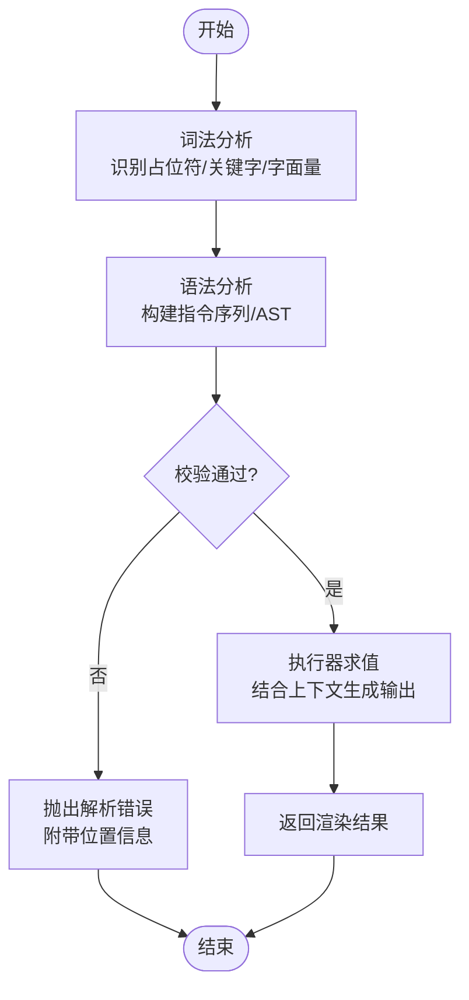
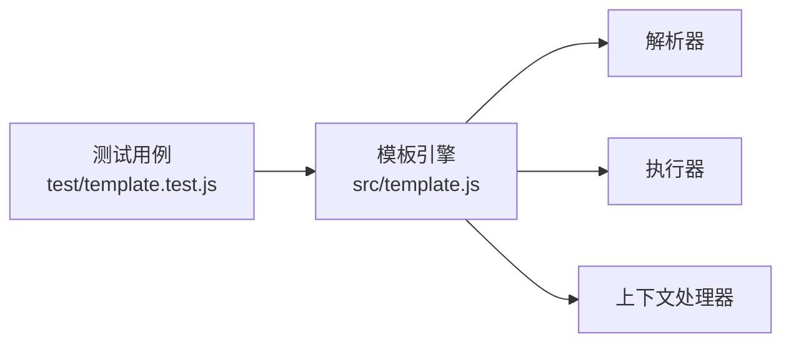

# 模板系统

<cite>
**本文引用的文件**   
- [src/template.js](file://src/template.js)
- [test/template.test.js](file://test/template.test.js)
</cite>

## 目录
1. [简介](#简介)
2. [项目结构](#项目结构)
3. [核心组件](#核心组件)
4. [架构总览](#架构总览)
5. [详细组件分析](#详细组件分析)
6. [依赖关系分析](#依赖关系分析)
7. [性能考虑](#性能考虑)
8. [故障排查指南](#故障排查指南)
9. [结论](#结论)
10. [附录](#附录)

## 简介
本文件面向模板系统的实现与使用，围绕以下目标展开：
- 深入解释模板语法设计：变量替换、条件判断、循环结构。
- 详细描述模板引擎的实现原理与解析过程。
- 说明动态内容生成机制与上下文数据处理。
- 提供丰富的使用示例，覆盖常见场景与高级用法。
- 解释模板缓存策略与性能优化建议。
- 包含模板调试技巧与错误处理方法。

## 项目结构
模板系统位于 src/template.js，测试用例位于 test/template.test.js。该模块对外暴露模板渲染能力，供上层业务调用以将模板字符串与上下文数据结合，生成最终文本。

图表来源
- [src/template.js](file://src/template.js)

章节来源
- [src/template.js](file://src/template.js)
- [test/template.test.js](file://test/template.test.js)

## 核心组件
- 模板解析器：负责扫描模板字符串，识别占位符、控制流标记（如条件、循环）等语法元素，并构建可执行的渲染计划。
- 执行器：基于解析结果，在给定上下文中求值并拼接输出。
- 上下文处理器：对输入数据进行规范化、安全过滤与类型转换，确保渲染稳定且安全。
- 缓存层（可选）：对已解析的模板或渲染结果进行缓存，减少重复开销。

章节来源
- [src/template.js](file://src/template.js)
- [test/template.test.js](file://test/template.test.js)

## 架构总览
模板引擎采用“解析-执行”两阶段模型：
- 解析阶段：将模板字符串转换为内部表示（如 AST 或指令序列）。
- 执行阶段：遍历指令序列，结合上下文数据计算并输出最终文本。

图表来源
- [src/template.js](file://src/template.js)

章节来源
- [src/template.js](file://src/template.js)

## 详细组件分析

### 模板语法设计
- 变量替换
  - 支持路径式访问，例如通过点号访问嵌套属性。
  - 支持默认值与空值处理，避免未定义导致的渲染失败。
- 条件判断
  - 支持 if/else 分支，依据上下文布尔表达式决定输出片段。
- 循环结构
  - 支持 for 循环，迭代数组或对象键值对，并提供索引与当前项。
- 转义与安全
  - 对输出进行必要的转义，防止注入风险。
- 扩展性
  - 可通过过滤器或函数扩展语法能力。

章节来源
- [src/template.js](file://src/template.js)
- [test/template.test.js](file://test/template.test.js)

### 解析与执行流程
- 词法分析：识别占位符、控制关键字、字面量与分隔符。
- 语法分析：构建指令序列或 AST，表达模板的结构与控制流。
- 执行求值：按顺序执行指令，在上下文中求值并拼接输出。
- 错误定位：记录模板位置信息，便于调试与提示。

图表来源
- [src/template.js](file://src/template.js)

章节来源
- [src/template.js](file://src/template.js)

### 动态内容生成与上下文处理
- 上下文规范化：统一数据类型，处理 null/undefined，提供默认值。
- 路径解析：支持多级属性访问与边界检查。
- 安全过滤：对敏感字段进行转义或脱敏。
- 性能优化：对频繁使用的上下文字段进行局部缓存。

章节来源
- [src/template.js](file://src/template.js)
- [test/template.test.js](file://test/template.test.js)

### 使用示例与最佳实践
- 基础变量替换：在模板中插入简单字段。
- 条件渲染：根据状态显示不同文案。
- 列表渲染：遍历集合生成重复段落。
- 组合使用：在循环内嵌套条件与变量。
- 默认值与空值保护：避免缺失字段导致崩溃。
- 转义输出：确保 HTML/JSON 安全。

章节来源
- [src/template.js](file://src/template.js)
- [test/template.test.js](file://test/template.test.js)

### 模板缓存策略与性能优化
- 解析缓存：缓存模板的解析结果（指令序列/AST），避免重复解析。
- 渲染缓存：针对相同模板与上下文键值对缓存渲染结果。
- 增量更新：仅重新渲染变化的片段。
- 内存管理：限制缓存大小，定期清理过期条目。
- 基准测试：通过单元测试验证性能回归。

章节来源
- [src/template.js](file://src/template.js)
- [test/template.test.js](file://test/template.test.js)

### 调试技巧与错误处理
- 启用详细日志：记录解析步骤、执行路径与上下文快照。
- 错误分类：区分语法错误、运行时错误与上下文缺失。
- 位置信息：在错误消息中包含模板行号与列号。
- 回退策略：在渲染失败时返回安全默认值。
- 断言与测试：用测试用例覆盖边界情况与异常路径。

章节来源
- [src/template.js](file://src/template.js)
- [test/template.test.js](file://test/template.test.js)

## 依赖关系分析
模板引擎对外暴露统一的渲染接口，内部由解析器、执行器与上下文处理器协作完成。测试文件用于验证语法特性与边界行为。

图表来源
- [src/template.js](file://src/template.js)
- [test/template.test.js](file://test/template.test.js)

章节来源
- [src/template.js](file://src/template.js)
- [test/template.test.js](file://test/template.test.js)

## 性能考虑
- 解析成本：优先复用解析结果，避免重复构建 AST。
- 执行成本：减少不必要的字符串拼接，使用缓冲区或数组收集片段。
- 上下文访问：扁平化常用字段，降低路径解析开销。
- 缓存命中率：合理设计缓存键，提高命中概率。
- 监控与度量：采集关键指标（解析时间、渲染时间、缓存命中率）。

[本节为通用指导，不直接分析具体文件]

## 故障排查指南
- 常见问题
  - 模板语法错误：检查关键字拼写、括号匹配与分隔符。
  - 上下文缺失：确认字段存在性与类型正确性。
  - 转义问题：确认输出是否需要转义以及转义策略是否生效。
- 诊断步骤
  - 开启详细日志，捕获解析与执行轨迹。
  - 最小化复现：剥离无关逻辑，聚焦问题片段。
  - 断点调试：在解析与执行的关键节点设置断点。
- 恢复策略
  - 使用默认值与回退模板。
  - 降级到安全输出，保障可用性。

章节来源
- [src/template.js](file://src/template.js)
- [test/template.test.js](file://test/template.test.js)

## 结论
模板系统通过清晰的“解析-执行”架构，提供了稳定的变量替换、条件判断与循环能力，并结合上下文处理与缓存策略，满足多样化动态内容生成需求。完善的错误处理与调试手段有助于快速定位与修复问题，提升开发效率与系统可靠性。

[本节为总结性内容，不直接分析具体文件]

## 附录
- 术语表
  - 模板：待渲染的文本描述，包含占位符与控制流标记。
  - 上下文：渲染时可用的数据集合。
  - 指令序列：解析后生成的可执行步骤。
  - AST：抽象语法树，表达模板结构。
- 参考
  - 单元测试：用于验证语法特性与边界行为。

[本节为补充信息，不直接分析具体文件]