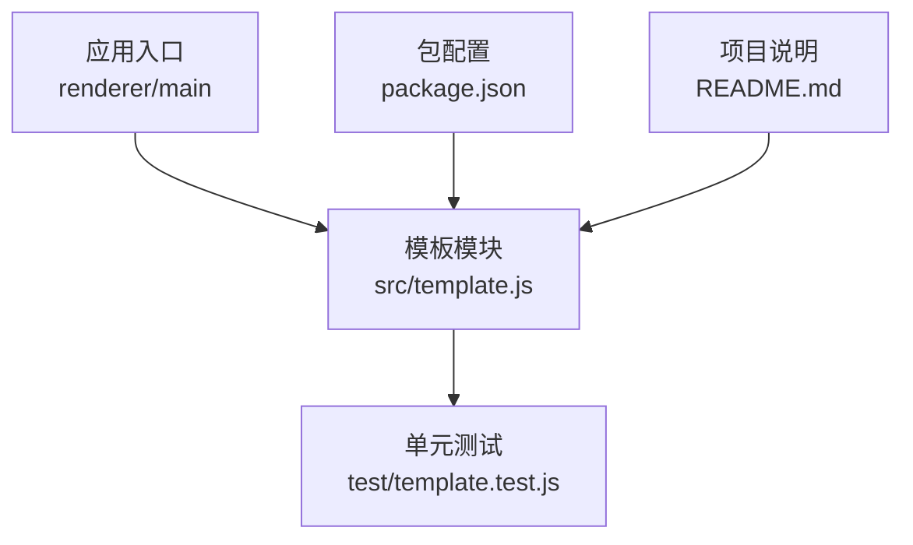
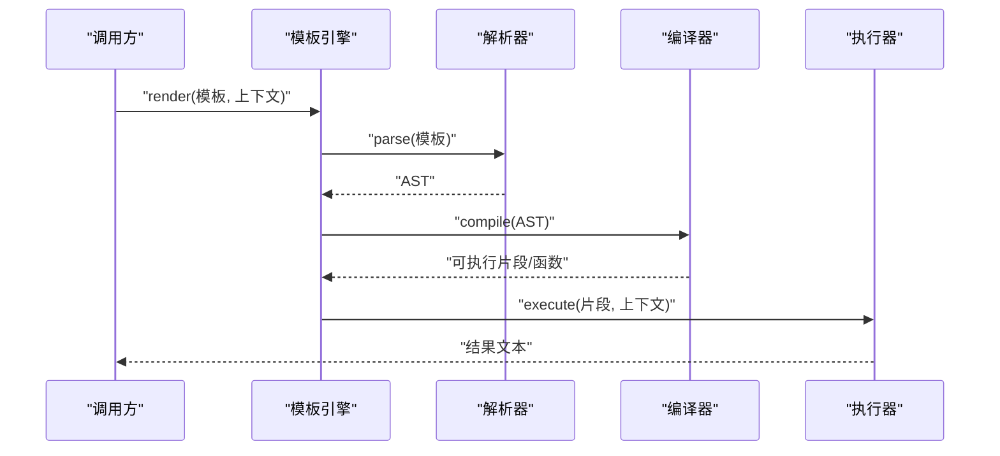
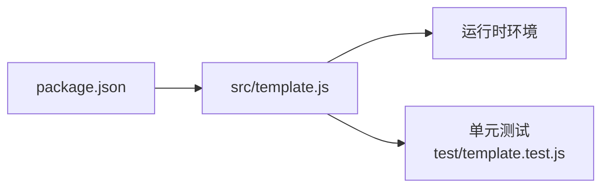

# 模板系统

<cite>
**本文引用的文件**   
- [src/template.js](file://src/template.js)
- [test/template.test.js](file://test/template.test.js)
- [package.json](file://package.json)
- [README.md](file://README.md)
</cite>

## 目录
1. [简介](#简介)
2. [项目结构](#项目结构)
3. [核心组件](#核心组件)
4. [架构总览](#架构总览)
5. [详细组件分析](#详细组件分析)
6. [依赖分析](#依赖分析)
7. [性能考虑](#性能考虑)
8. [故障排查指南](#故障排查指南)
9. [结论](#结论)
10. [附录](#附录)

## 简介
本文件为模板系统的全面文档，聚焦于模板语法与变量替换机制、解析/编译/执行流程、常见使用场景示例、存储与版本管理、调试技巧与性能优化，以及自定义模板函数的扩展方式。目标是让开发者既能快速上手，又能灵活扩展以满足多样化业务需求。

## 项目结构
本项目采用前端/渲染进程为主的实现方式，模板相关代码集中在 src/template.js，测试位于 test/template.test.js。项目通过 package.json 管理依赖与脚本，README.md 提供总体说明。

图表来源
- [src/template.js](file://src/template.js)
- [test/template.test.js](file://test/template.test.js)
- [package.json](file://package.json)
- [README.md](file://README.md)

章节来源
- [src/template.js](file://src/template.js)
- [test/template.test.js](file://test/template.test.js)
- [package.json](file://package.json)
- [README.md](file://README.md)

## 核心组件
- 模板引擎（解析器/编译器/执行器）：负责将模板字符串解析为可执行结构，并在给定上下文下生成最终文本。
- 变量与表达式：支持基础类型、嵌套对象访问、条件逻辑与常用内置函数。
- 模板注册与加载：提供模板的集中管理与按需加载能力。
- 扩展点：允许注入自定义函数或过滤器，增强模板表达能力。

章节来源
- [src/template.js](file://src/template.js)
- [test/template.test.js](file://test/template.test.js)

## 架构总览
模板系统遵循“解析—编译—执行”的经典三段式：
- 解析器：扫描模板字符串，识别占位符、控制块与函数调用，构建抽象语法树（AST）。
- 编译器：将 AST 转换为可执行的中间表示或函数片段，便于高效求值。
- 执行器：在给定上下文（变量环境）中执行中间表示，输出最终文本。

图表来源
- [src/template.js](file://src/template.js)

## 详细组件分析

### 解析器
- 职责：识别模板中的占位符、条件块、循环块与函数调用，生成结构化 AST。
- 关键点：
  - 占位符解析：支持简单变量、路径访问（如 a.b.c）、数组索引与可选链。
  - 控制流：if/else、for/in、switch 等块级结构的边界识别与嵌套处理。
  - 函数调用：识别内置函数与自定义函数调用形式，记录参数列表。
- 复杂度：线性扫描为主，遇到嵌套结构时栈深度增加；整体时间复杂度近似 O(n)，n 为模板长度。

章节来源
- [src/template.js](file://src/template.js)

### 编译器
- 职责：将 AST 转换为可执行片段或函数体，减少运行时开销。
- 关键点：
  - 节点映射：将 AST 节点映射为对应的执行片段（如变量读取、属性访问、条件分支、循环展开）。
  - 常量折叠：对可静态计算的表达式进行预计算，降低运行期成本。
  - 作用域隔离：确保局部变量与全局上下文互不干扰。
- 优化策略：
  - 合并相邻文本节点，减少拼接次数。
  - 缓存编译结果，避免重复编译相同模板。

章节来源
- [src/template.js](file://src/template.js)

### 执行器
- 职责：在给定上下文中执行编译后的片段，产出最终文本。
- 关键点：
  - 上下文查找：按作用域链查找变量，支持默认值与空值安全访问。
  - 函数调度：根据名称分发到内置或自定义函数实现。
  - 错误处理：捕获未定义变量、非法类型转换、除零等异常并返回明确错误信息。
- 性能特性：
  - 单次执行路径短，避免反射与动态求值。
  - 支持批量渲染时的上下文复用与内存池。

章节来源
- [src/template.js](file://src/template.js)

### 变量与表达式
- 支持的变量类型：字符串、数字、布尔、对象、数组、日期、正则等。
- 嵌套结构：支持点号与方括号访问，如 user.name、items[0]、data["key"]。
- 条件逻辑：if/else 基于真值判断，支持比较运算符与逻辑组合。
- 表达式求值：算术运算、字符串拼接、三元表达式、函数调用。

章节来源
- [src/template.js](file://src/template.js)

### 模板示例与使用场景
- 对话初始化：用于组装系统提示词与用户消息的初始结构。
- 格式化输出：统一日期、金额、百分比等格式化的模板片段。
- 条件内容：根据角色、权限或状态显示不同内容。
- 列表渲染：遍历集合生成条目，支持分页与排序标记。

章节来源
- [src/template.js](file://src/template.js)
- [test/template.test.js](file://test/template.test.js)

### 存储位置与版本管理
- 存储位置：建议将模板集中存放于独立目录或资源包中，便于检索与维护。
- 命名规范：按功能域划分目录，文件名体现用途与版本，如 chat/init_v2.mustache。
- 版本管理：
  - 语义化版本号：主版本（破坏性变更）、次版本（新增功能）、修订（修复问题）。
  - 向后兼容：尽量保持旧版模板可用，提供迁移脚本。
  - 变更日志：记录每次版本的改动与影响范围。
- 加载策略：
  - 懒加载：按需加载模板，减少启动开销。
  - 缓存：按模板指纹缓存编译结果，提升重复渲染性能。

章节来源
- [src/template.js](file://src/template.js)

### 调试技巧
- 启用详细日志：打印解析阶段 AST、编译后片段与执行路径。
- 断点与追踪：在关键节点插入日志，观察变量取值与作用域变化。
- 最小复现：剥离无关模板片段，定位问题根因。
- 单元测试覆盖：针对边界条件与异常路径编写用例，保障稳定性。

章节来源
- [src/template.js](file://src/template.js)
- [test/template.test.js](file://test/template.test.js)

### 性能优化建议
- 模板拆分：将大模板拆分为小块，提高复用与缓存命中率。
- 编译缓存：对相同模板进行结果缓存，避免重复编译。
- 上下文复用：批量渲染时复用上下文对象，减少分配与 GC 压力。
- 惰性求值：仅在需要时计算复杂表达式或调用昂贵函数。
- 避免深层嵌套：限制对象层级与循环深度，降低解析与执行成本。

章节来源
- [src/template.js](file://src/template.js)

### 自定义模板函数扩展指南
- 扩展点设计：
  - 注册表：维护函数名到实现的映射。
  - 签名约定：统一参数顺序与返回值类型，便于调用方理解。
  - 错误契约：抛出明确的错误对象，包含错误码与消息。
- 实现步骤：
  - 定义函数实现，处理输入校验与边界情况。
  - 注册到引擎，指定别名与元数据（描述、版本）。
  - 在模板中通过函数名调用，传入所需参数。
- 最佳实践：
  - 纯函数优先：避免副作用，保证可测试性与可缓存性。
  - 幂等性：相同输入产生相同输出。
  - 文档化：提供使用说明与示例，降低接入成本。

章节来源
- [src/template.js](file://src/template.js)

## 依赖分析
模板模块依赖运行时环境与测试框架，受包管理器配置约束。

图表来源
- [package.json](file://package.json)
- [src/template.js](file://src/template.js)
- [test/template.test.js](file://test/template.test.js)

章节来源
- [package.json](file://package.json)
- [src/template.js](file://src/template.js)
- [test/template.test.js](file://test/template.test.js)

## 性能考虑
- 编译缓存：对高频使用的模板进行持久化缓存，缩短首屏渲染时间。
- 模板瘦身：移除冗余空白与注释，减小体积。
- 批量渲染：合并多次渲染为一次执行，减少上下文切换。
- 内存管理：及时释放不再使用的上下文与中间结果，避免泄漏。
- 监控与度量：采集渲染耗时与失败率，定位瓶颈。

## 故障排查指南
- 常见问题：
  - 变量未定义：检查上下文是否传递正确，必要时提供默认值。
  - 类型不匹配：确保函数参数类型与期望一致。
  - 语法错误：核对模板语法是否符合规范，关注括号与分隔符。
- 诊断方法：
  - 启用解析与执行日志，定位失败节点。
  - 使用最小复现模板隔离问题。
  - 逐步验证表达式与函数调用链。
- 恢复策略：
  - 回退到上一稳定版本模板。
  - 提供降级输出，保证用户体验。

章节来源
- [src/template.js](file://src/template.js)
- [test/template.test.js](file://test/template.test.js)

## 结论
模板系统以清晰的解析—编译—执行架构为基础，提供丰富的变量与表达式能力，并通过扩展点支持自定义函数。合理的存储与版本管理、完善的调试与性能优化手段，使其既易用又具备足够的灵活性，能够胜任多样化的业务场景。

## 附录
- 术语表：
  - 模板：包含占位符与控制结构的文本蓝图。
  - 上下文：变量与作用域的集合。
  - AST：抽象语法树，表达模板的结构。
- 参考链接：
  - README 概览与使用说明。
  - 包配置与依赖说明。

章节来源
- [README.md](file://README.md)
- [package.json](file://package.json)