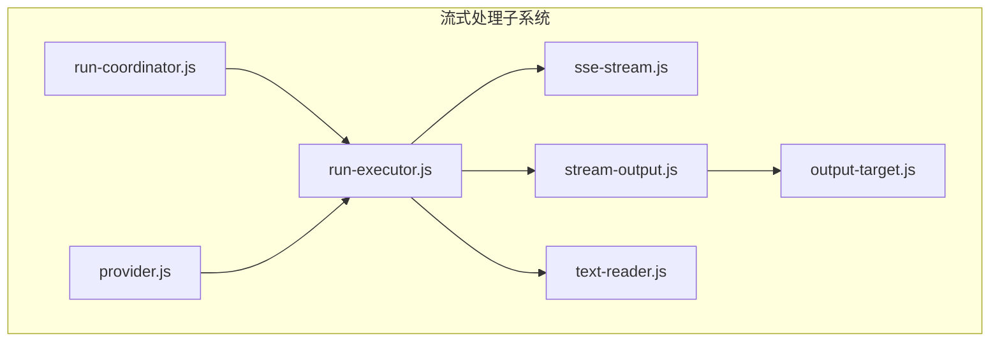
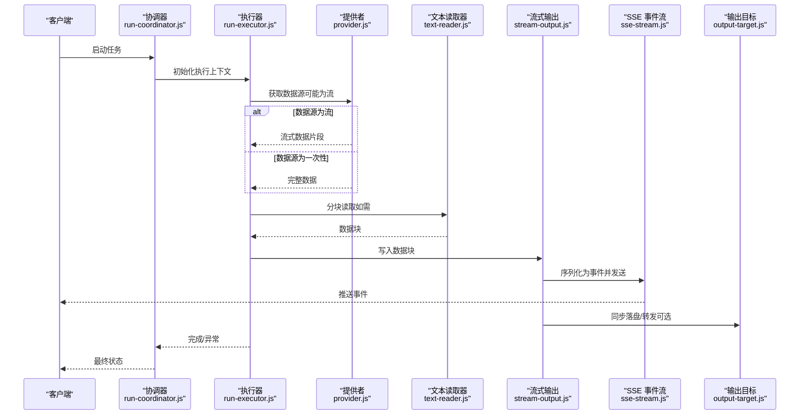
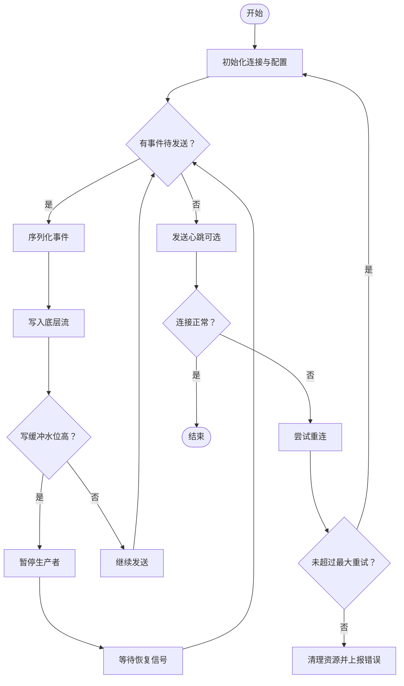
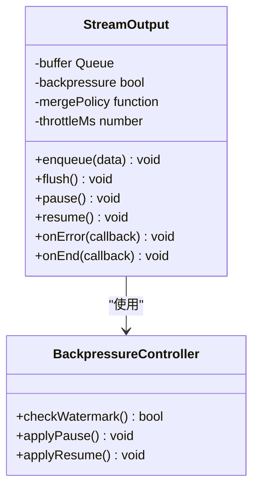
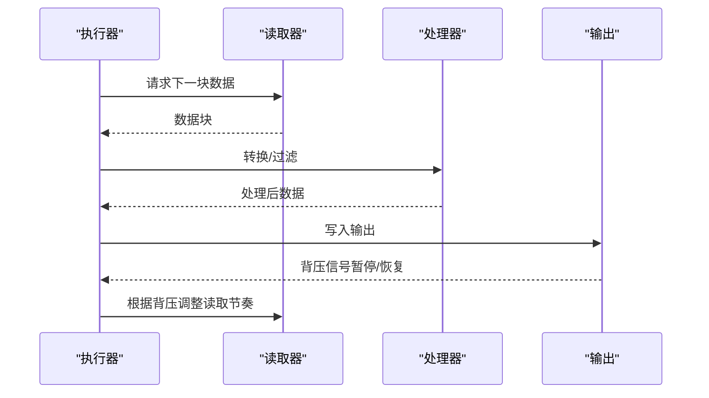
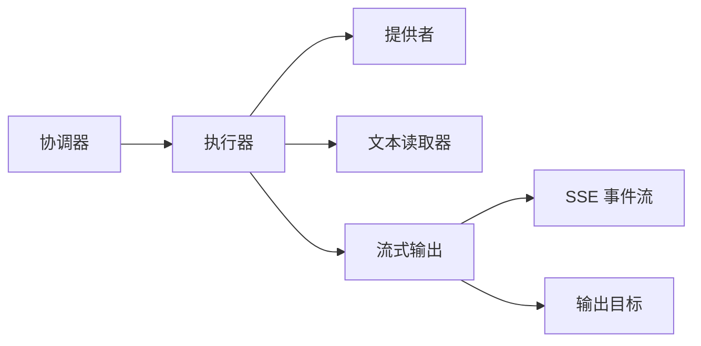

# 流式处理

<cite>
**本文引用的文件**   
- [src/run/sse-stream.js](file://src/run/sse-stream.js)
- [src/run/stream-output.js](file://src/run/stream-output.js)
- [src/run/run-executor.js](file://src/run/run-executor.js)
- [src/run/run-coordinator.js](file://src/run/run-coordinator.js)
- [src/run/output-target.js](file://src/run/output-target.js)
- [src/run/text-reader.js](file://src/run/text-reader.js)
- [src/provider.js](file://src/provider.js)
- [package.json](file://package.json)
</cite>

## 目录
1. [简介](#简介)
2. [项目结构](#项目结构)
3. [核心组件](#核心组件)
4. [架构总览](#架构总览)
5. [详细组件分析](#详细组件分析)
6. [依赖关系分析](#依赖关系分析)
7. [性能考量](#性能考量)
8. [故障排查指南](#故障排查指南)
9. [结论](#结论)
10. [附录](#附录)

## 简介
本文件围绕服务端推送事件（SSE）的流式处理进行系统化说明，涵盖实现原理、数据处理流程、缓冲与背压策略、内存管理、不完整流数据与网络中断处理、实时显示与用户体验优化、性能监控与调试技巧，并通过实际代码路径展示如何构建高效的流式数据处理管道。同时对比传统一次性响应方式的优势与适用场景，帮助读者在工程实践中做出合理选择。

## 项目结构
本项目采用按功能模块组织的方式，流式处理相关能力集中在 src/run 目录下：
- sse-stream.js：负责 SSE 事件的创建、发送与生命周期管理
- stream-output.js：面向下游消费端的流式输出封装
- run-executor.js：执行器，协调任务执行与流式输出
- run-coordinator.js：协调器，编排多个阶段或任务的运行
- output-target.js：输出目标抽象，统一不同输出通道
- text-reader.js：文本读取器，提供分块读取能力
- provider.js：提供者抽象，对接外部服务或模型

图表来源
- [src/run/run-coordinator.js](file://src/run/run-coordinator.js)
- [src/run/run-executor.js](file://src/run/run-executor.js)
- [src/run/sse-stream.js](file://src/run/sse-stream.js)
- [src/run/stream-output.js](file://src/run/stream-output.js)
- [src/run/output-target.js](file://src/run/output-target.js)
- [src/run/text-reader.js](file://src/run/text-reader.js)
- [src/provider.js](file://src/provider.js)

章节来源
- [src/run/sse-stream.js](file://src/run/sse-stream.js)
- [src/run/stream-output.js](file://src/run/stream-output.js)
- [src/run/run-executor.js](file://src/run/run-executor.js)
- [src/run/run-coordinator.js](file://src/run/run-coordinator.js)
- [src/run/output-target.js](file://src/run/output-target.js)
- [src/run/text-reader.js](file://src/run/text-reader.js)
- [src/provider.js](file://src/provider.js)

## 核心组件
- SSE 事件流（sse-stream.js）
  - 职责：建立并维护 SSE 连接，序列化事件，处理写回失败与重连逻辑
  - 关键点：事件类型定义、消息体构造、错误边界、关闭与清理
- 流式输出（stream-output.js）
  - 职责：将上游数据以增量方式推送到 SSE 或本地消费者
  - 关键点：缓冲队列、背压控制、节流/合并策略、完成与异常信号
- 执行器（run-executor.js）
  - 职责：驱动任务执行，串联读取、处理、输出环节
  - 关键点：异步流水线、错误传播、资源释放
- 协调器（run-coordinator.js）
  - 职责：编排多阶段任务，管理上下文与共享状态
  - 关键点：阶段间数据传递、并发度控制、超时与取消
- 输出目标（output-target.js）
  - 职责：抽象输出通道，支持多种目标（如控制台、文件、网络）
  - 关键点：统一接口、可插拔实现
- 文本读取器（text-reader.js）
  - 职责：分块读取输入源，避免一次性加载大文件
  - 关键点：流式读取、编码处理、结束与错误信号
- 提供者（provider.js）
  - 职责：封装外部服务调用，返回流式或一次性结果
  - 关键点：适配层、重试与降级

章节来源
- [src/run/sse-stream.js](file://src/run/sse-stream.js)
- [src/run/stream-output.js](file://src/run/stream-output.js)
- [src/run/run-executor.js](file://src/run/run-executor.js)
- [src/run/run-coordinator.js](file://src/run/run-coordinator.js)
- [src/run/output-target.js](file://src/run/output-target.js)
- [src/run/text-reader.js](file://src/run/text-reader.js)
- [src/provider.js](file://src/provider.js)

## 架构总览
下图展示了从输入到输出的完整流式处理链路，以及 SSE 作为传输通道的角色。

图表来源
- [src/run/run-coordinator.js](file://src/run/run-coordinator.js)
- [src/run/run-executor.js](file://src/run/run-executor.js)
- [src/provider.js](file://src/provider.js)
- [src/run/text-reader.js](file://src/run/text-reader.js)
- [src/run/stream-output.js](file://src/run/stream-output.js)
- [src/run/sse-stream.js](file://src/run/sse-stream.js)
- [src/run/output-target.js](file://src/run/output-target.js)

## 详细组件分析

### SSE 事件流（sse-stream.js）
- 设计要点
  - 事件类型：区分数据、心跳、错误、结束等事件
  - 消息体：最小化冗余字段，确保客户端可解析
  - 连接管理：自动重连、退避策略、最大重试次数
  - 错误处理：捕获写失败、网络异常，触发清理与通知
- 背压与缓冲
  - 基于底层写缓冲水位线判断是否暂停生产端
  - 当缓冲区过大时，向生产者发送暂停信号；恢复时再恢复
- 内存管理
  - 及时释放事件对象引用，避免长期驻留
  - 限制单条事件大小，防止内存峰值过高

图表来源
- [src/run/sse-stream.js](file://src/run/sse-stream.js)

章节来源
- [src/run/sse-stream.js](file://src/run/sse-stream.js)

### 流式输出（stream-output.js）
- 设计要点
  - 缓冲队列：环形缓冲或数组队列，支持批量合并
  - 背压策略：根据下游消费速度动态调整写入速率
  - 节流与合并：对高频小事件进行合并，降低网络开销
  - 完成与异常：明确结束信号与错误传播
- 内存管理
  - 设置队列长度上限，超限则丢弃最旧或拒绝新数据
  - 定期清理已消费项，避免内存泄漏

图表来源
- [src/run/stream-output.js](file://src/run/stream-output.js)

章节来源
- [src/run/stream-output.js](file://src/run/stream-output.js)

### 执行器（run-executor.js）
- 设计要点
  - 流水线：读取→转换→过滤→聚合→输出
  - 错误传播：任何阶段失败立即终止并清理
  - 资源释放：确保文件句柄、网络连接正确关闭
- 背压协同
  - 监听输出端背压信号，动态调节读取速率
  - 支持暂停/恢复机制，避免内存暴涨

图表来源
- [src/run/run-executor.js](file://src/run/run-executor.js)
- [src/run/text-reader.js](file://src/run/text-reader.js)
- [src/run/stream-output.js](file://src/run/stream-output.js)

章节来源
- [src/run/run-executor.js](file://src/run/run-executor.js)

### 协调器（run-coordinator.js）
- 设计要点
  - 阶段编排：定义阶段顺序、依赖关系与并行度
  - 上下文管理：共享变量、状态持久化
  - 超时与取消：全局超时控制与任务取消
- 监控与日志
  - 记录各阶段耗时、吞吐、错误率
  - 暴露指标用于性能分析与告警

章节来源
- [src/run/run-coordinator.js](file://src/run/run-coordinator.js)

### 输出目标（output-target.js）
- 设计要点
  - 统一接口：write(chunk)、end()、error(err)
  - 多目标支持：控制台、文件、网络等
  - 错误隔离：单个目标失败不影响其他目标

章节来源
- [src/run/output-target.js](file://src/run/output-target.js)

### 文本读取器（text-reader.js）
- 设计要点
  - 分块读取：按固定大小或行分隔读取
  - 编码处理：UTF-8/BOM 处理与校验
  - 流式协议：ReadableStream 或 Node.js Readable 兼容

章节来源
- [src/run/text-reader.js](file://src/run/text-reader.js)

### 提供者（provider.js）
- 设计要点
  - 适配器模式：统一不同后端服务的接口
  - 流式适配：将一次性结果包装为流
  - 重试与降级：网络抖动时的自动重试与备选方案

章节来源
- [src/provider.js](file://src/provider.js)

## 依赖关系分析
- 低耦合高内聚
  - 各组件通过明确接口交互，减少直接依赖
- 关键依赖链
  - 协调器 → 执行器 → 读取器/提供者 → 输出 → SSE
- 潜在循环依赖
  - 避免输出模块反向依赖执行器，使用回调或事件解耦

图表来源
- [src/run/run-coordinator.js](file://src/run/run-coordinator.js)
- [src/run/run-executor.js](file://src/run/run-executor.js)
- [src/provider.js](file://src/provider.js)
- [src/run/text-reader.js](file://src/run/text-reader.js)
- [src/run/stream-output.js](file://src/run/stream-output.js)
- [src/run/sse-stream.js](file://src/run/sse-stream.js)
- [src/run/output-target.js](file://src/run/output-target.js)

章节来源
- [package.json](file://package.json)

## 性能考量
- 缓冲与背压
  - 合理设置缓冲队列长度与阈值，避免内存占用过高
  - 使用水位线机制实现细粒度背压控制
- 事件合并与节流
  - 对高频小事件进行时间窗口合并，降低网络与渲染压力
  - 根据客户端能力动态调整合并策略
- 内存管理
  - 及时释放事件对象与中间数据引用
  - 限制单条事件大小，避免大对象阻塞
- I/O 优化
  - 使用零拷贝或内存映射（视平台能力）
  - 批量写入减少系统调用次数
- 监控与指标
  - 采集吞吐、延迟、错误率、内存使用等指标
  - 结合日志定位瓶颈与异常

[本节为通用指导，不直接分析具体文件]

## 故障排查指南
- 常见问题
  - 连接频繁断开：检查网络稳定性与服务端心跳配置
  - 数据丢失：确认缓冲队列未溢出，背压策略生效
  - 内存泄漏：检查事件对象引用与定时器清理
  - 乱码或解析错误：验证编码与事件格式
- 调试技巧
  - 启用详细日志，记录事件生命周期
  - 使用抓包工具观察网络流量
  - 模拟弱网与断网场景，验证重连与恢复逻辑
  - 通过指标面板观察吞吐与延迟变化

章节来源
- [src/run/sse-stream.js](file://src/run/sse-stream.js)
- [src/run/stream-output.js](file://src/run/stream-output.js)
- [src/run/run-executor.js](file://src/run/run-executor.js)

## 结论
流式处理通过 SSE 实现了低延迟、增量式的用户反馈，显著提升了交互体验与资源利用率。合理的缓冲与背压策略、完善的错误处理与监控机制是保障稳定性的关键。相比一次性响应，流式处理更适合长任务、大数据量与实时性要求高的场景。在实际工程中，应结合业务需求选择合适的策略与参数，持续优化性能与可靠性。

[本节为总结性内容，不直接分析具体文件]

## 附录
- 与传统一次性响应的对比
  - 优势：首字节延迟更低、内存占用更可控、用户体验更佳
  - 适用场景：长任务、大文件处理、实时聊天、AI 对话生成
  - 注意事项：需处理网络不稳定、客户端兼容性、复杂度提升
- 最佳实践清单
  - 明确事件语义与格式规范
  - 实现健壮的背压与重连机制
  - 完善监控与日志体系
  - 进行充分的负载与异常测试

[本节为补充信息，不直接分析具体文件]