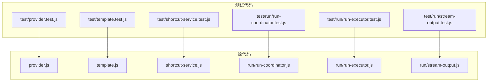
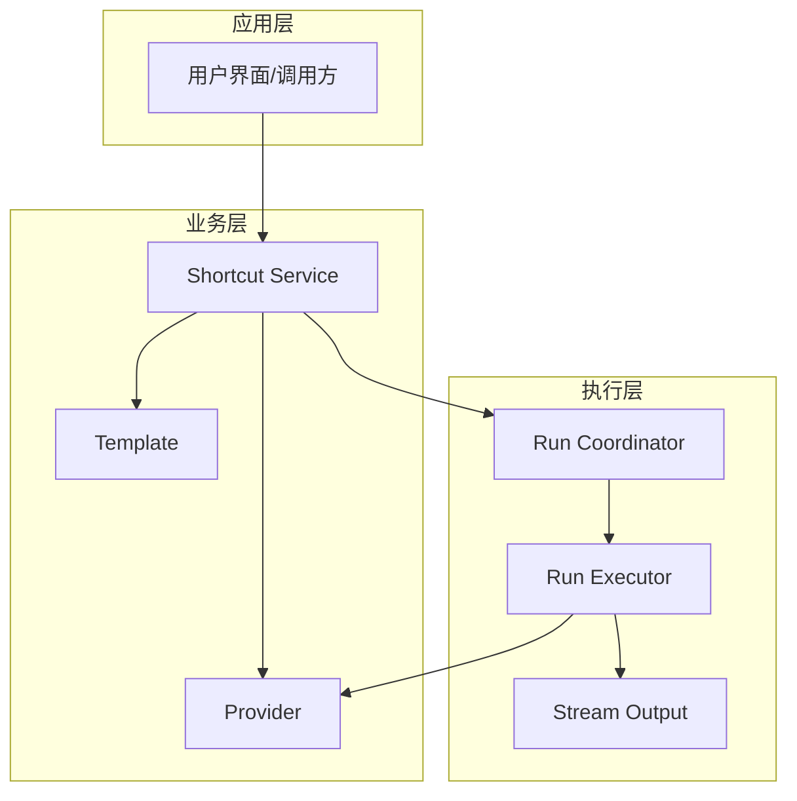
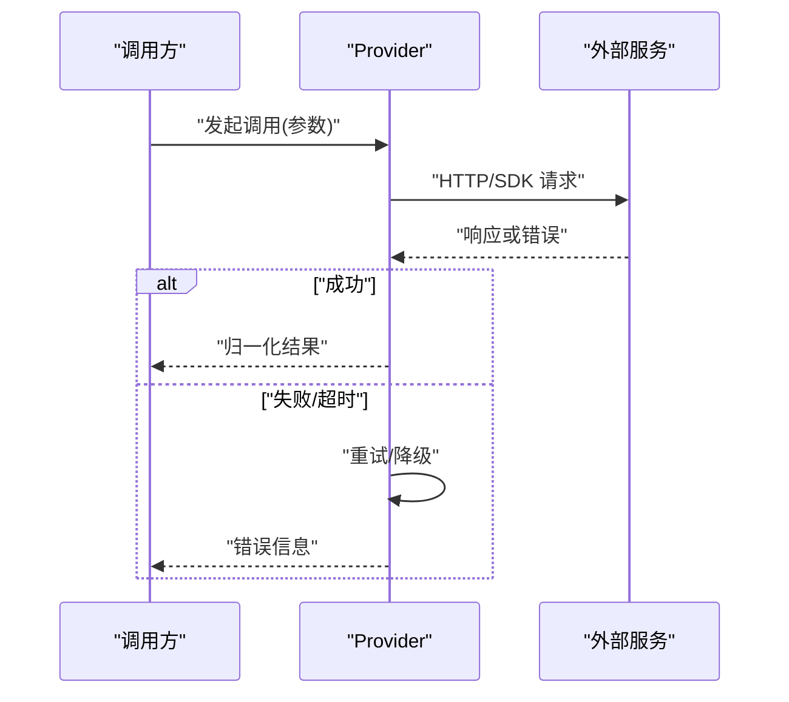
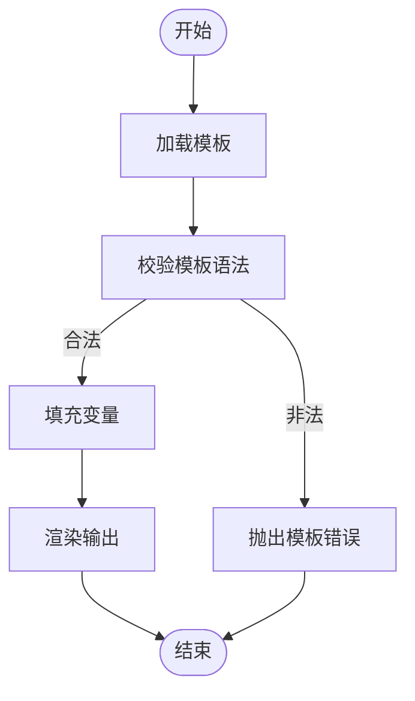
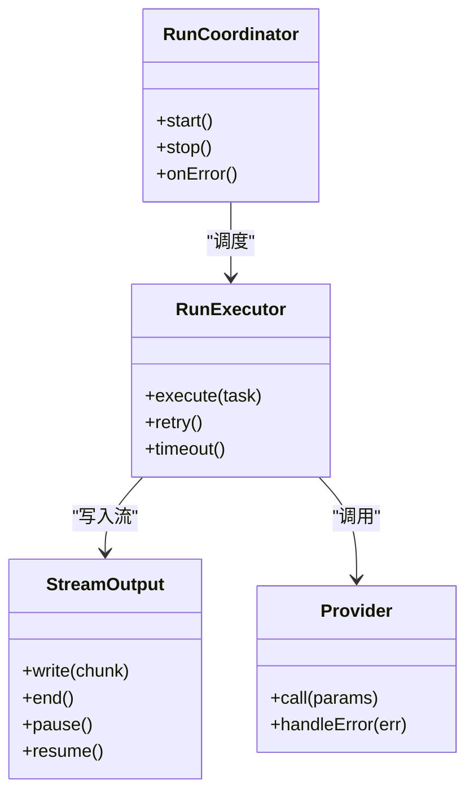
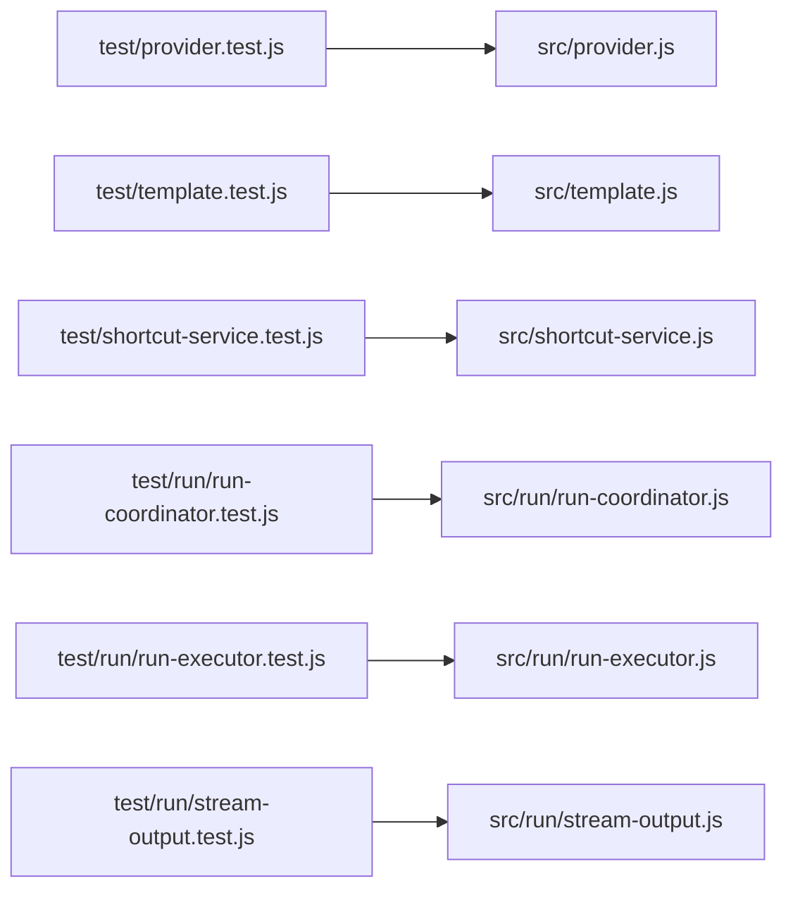

# 测试指南

<cite>
**本文引用的文件**   
- [package.json](file://package.json)
- [README.md](file://README.md)
- [src/provider.js](file://src/provider.js)
- [src/template.js](file://src/template.js)
- [src/shortcut-service.js](file://src/shortcut-service.js)
- [src/run/run-coordinator.js](file://src/run/run-coordinator.js)
- [src/run/run-executor.js](file://src/run/run-executor.js)
- [src/run/stream-output.js](file://src/run/stream-output.js)
- [test/provider.test.js](file://test/provider.test.js)
- [test/template.test.js](file://test/template.test.js)
- [test/shortcut-service.test.js](file://test/shortcut-service.test.js)
- [test/run/run-coordinator.test.js](file://test/run/run-coordinator.test.js)
- [test/run/run-executor.test.js](file://test/run/run-executor.test.js)
- [test/run/stream-output.test.js](file://test/run/stream-output.test.js)
</cite>

## 目录
1. [简介](#简介)
2. [项目结构](#项目结构)
3. [核心组件](#核心组件)
4. [架构总览](#架构总览)
5. [详细组件分析](#详细组件分析)
6. [依赖关系分析](#依赖关系分析)
7. [性能考量](#性能考量)
8. [故障排查指南](#故障排查指南)
9. [结论](#结论)
10. [附录](#附录)

## 简介
本指南面向希望为该项目编写高质量测试的开发者，涵盖测试策略、框架选择、单元测试规范、模拟外部依赖与异步操作技巧、集成与端到端测试最佳实践，以及覆盖率统计与持续集成配置方法。文档以仓库现有测试结构与实现为依据，提供循序渐进的学习路径和可操作的实践建议。

## 项目结构
项目的测试代码位于 test 目录，按功能模块组织，与 src 目录保持对应关系：
- 单测入口与脚本由 package.json 中的测试命令驱动
- 测试用例按模块划分，如 provider、template、shortcut-service、run/* 等
- 运行器相关模块（run-coordinator、run-executor、stream-output）均有对应的测试文件

图表来源
- [package.json](file://package.json)
- [src/provider.js](file://src/provider.js)
- [src/template.js](file://src/template.js)
- [src/shortcut-service.js](file://src/shortcut-service.js)
- [src/run/run-coordinator.js](file://src/run/run-coordinator.js)
- [src/run/run-executor.js](file://src/run/run-executor.js)
- [src/run/stream-output.js](file://src/run/stream-output.js)
- [test/provider.test.js](file://test/provider.test.js)
- [test/template.test.js](file://test/template.test.js)
- [test/shortcut-service.test.js](file://test/shortcut-service.test.js)
- [test/run/run-coordinator.test.js](file://test/run/run-coordinator.test.js)
- [test/run/run-executor.test.js](file://test/run/run-executor.test.js)
- [test/run/stream-output.test.js](file://test/run/stream-output.test.js)

章节来源
- [package.json](file://package.json)
- [README.md](file://README.md)

## 核心组件
本项目涉及的核心业务组件包括：
- Provider：统一抽象不同模型提供方，负责调用与结果归一化
- Template：模板引擎或模板管理，用于渲染提示词或输出格式
- Shortcut Service：快捷键服务，处理快捷键注册、事件分发与状态管理
- Run 子系统：协调执行流程（run-coordinator）、任务执行（run-executor）、流式输出（stream-output）

这些组件在测试中通过独立的测试文件进行覆盖，确保职责清晰、行为可验证。

章节来源
- [src/provider.js](file://src/provider.js)
- [src/template.js](file://src/template.js)
- [src/shortcut-service.js](file://src/shortcut-service.js)
- [src/run/run-coordinator.js](file://src/run/run-coordinator.js)
- [src/run/run-executor.js](file://src/run/run-executor.js)
- [src/run/stream-output.js](file://src/run/stream-output.js)

## 架构总览
下图展示了核心组件之间的交互关系，以及测试如何围绕这些组件进行断言与模拟：

图表来源
- [src/shortcut-service.js](file://src/shortcut-service.js)
- [src/template.js](file://src/template.js)
- [src/provider.js](file://src/provider.js)
- [src/run/run-coordinator.js](file://src/run/run-coordinator.js)
- [src/run/run-executor.js](file://src/run/run-executor.js)
- [src/run/stream-output.js](file://src/run/stream-output.js)

## 详细组件分析

### Provider 组件测试
- 目标：验证不同 Provider 的调用契约、错误处理与结果归一化
- 要点：
  - 使用模拟对象替代真实网络请求或第三方 SDK
  - 针对成功、失败、超时、重试等场景编写用例
  - 断言返回数据结构一致性与字段完整性
- 参考测试文件：[test/provider.test.js](file://test/provider.test.js)

章节来源
- [src/provider.js](file://src/provider.js)
- [test/provider.test.js](file://test/provider.test.js)

### Template 组件测试
- 目标：验证模板渲染逻辑、变量替换与边界条件
- 要点：
  - 构造输入模板与上下文数据，断言输出字符串符合预期
  - 覆盖缺失变量、非法字符、超长文本等异常路径
  - 若模板包含异步加载资源，需使用 Promise 模拟
- 参考测试文件：[test/template.test.js](file://test/template.test.js)

章节来源
- [src/template.js](file://src/template.js)
- [test/template.test.js](file://test/template.test.js)

### Shortcut Service 组件测试
- 目标：验证快捷键注册、事件监听、去重与冲突处理
- 要点：
  - 模拟键盘事件与系统快捷键回调
  - 断言事件触发顺序、回调参数与状态变更
  - 对重复注册、无效组合键进行防御性校验
- 参考测试文件：[test/shortcut-service.test.js](file://test/shortcut-service.test.js)

章节来源
- [src/shortcut-service.js](file://src/shortcut-service.js)
- [test/shortcut-service.test.js](file://test/shortcut-service.test.js)

### Run 子系统测试（Coordinator、Executor、Stream Output）
- 目标：验证执行流程编排、任务调度与流式输出稳定性
- 要点：
  - Coordinator：编排步骤顺序、并发控制、错误回滚
  - Executor：任务执行、重试策略、超时处理
  - Stream Output：流式写入、背压处理、中断恢复
- 参考测试文件：
  - [test/run/run-coordinator.test.js](file://test/run/run-coordinator.test.js)
  - [test/run/run-executor.test.js](file://test/run/run-executor.test.js)
  - [test/run/stream-output.test.js](file://test/run/stream-output.test.js)

章节来源
- [src/run/run-coordinator.js](file://src/run/run-coordinator.js)
- [src/run/run-executor.js](file://src/run/run-executor.js)
- [src/run/stream-output.js](file://src/run/stream-output.js)
- [test/run/run-coordinator.test.js](file://test/run/run-coordinator.test.js)
- [test/run/run-executor.test.js](file://test/run/run-executor.test.js)
- [test/run/stream-output.test.js](file://test/run/stream-output.test.js)

#### 序列图：Provider 调用流程（含错误分支）

图表来源
- [src/provider.js](file://src/provider.js)
- [test/provider.test.js](file://test/provider.test.js)

#### 流程图：Template 渲染逻辑

图表来源
- [src/template.js](file://src/template.js)
- [test/template.test.js](file://test/template.test.js)

#### 类图：Run 子系统协作

图表来源
- [src/run/run-coordinator.js](file://src/run/run-coordinator.js)
- [src/run/run-executor.js](file://src/run/run-executor.js)
- [src/run/stream-output.js](file://src/run/stream-output.js)
- [src/provider.js](file://src/provider.js)

## 依赖关系分析
- 测试与源码的耦合点集中在模块接口与事件回调上
- 通过模拟外部依赖（网络、文件系统、系统 API）降低测试脆弱性
- 避免跨模块隐式依赖，优先使用依赖注入或工厂模式

图表来源
- [test/provider.test.js](file://test/provider.test.js)
- [src/provider.js](file://src/provider.js)
- [test/template.test.js](file://test/template.test.js)
- [src/template.js](file://src/template.js)
- [test/shortcut-service.test.js](file://test/shortcut-service.test.js)
- [src/shortcut-service.js](file://src/shortcut-service.js)
- [test/run/run-coordinator.test.js](file://test/run/run-coordinator.test.js)
- [src/run/run-coordinator.js](file://src/run/run-coordinator.js)
- [test/run/run-executor.test.js](file://test/run/run-executor.test.js)
- [src/run/run-executor.js](file://src/run/run-executor.js)
- [test/run/stream-output.test.js](file://test/run/stream-output.test.js)
- [src/run/stream-output.js](file://src/run/stream-output.js)

章节来源
- [package.json](file://package.json)

## 性能考量
- 单测应避免真实 I/O 与网络请求，使用内存模拟提升执行速度
- 对耗时操作采用延迟模拟与时间推进（如定时器、Promise.resolve）
- 流式输出测试应关注背压与内存占用，避免一次性写入过大数据
- 并行执行测试时注意隔离全局状态，防止相互干扰

## 故障排查指南
- 常见错误类型：
  - 未正确模拟异步导致竞态条件
  - 事件监听未清理造成内存泄漏
  - 模板变量缺失引发渲染失败
  - Provider 错误码映射不一致
- 定位方法：
  - 增加关键路径日志与断点
  - 缩小测试范围，逐步复现问题
  - 检查外部依赖版本与接口变更

章节来源
- [test/provider.test.js](file://test/provider.test.js)
- [test/template.test.js](file://test/template.test.js)
- [test/shortcut-service.test.js](file://test/shortcut-service.test.js)
- [test/run/run-coordinator.test.js](file://test/run/run-coordinator.test.js)
- [test/run/run-executor.test.js](file://test/run/run-executor.test.js)
- [test/run/stream-output.test.js](file://test/run/stream-output.test.js)

## 结论
通过模块化测试组织、严格的模拟策略与清晰的断言约定，本项目能够在保证质量的同时维持良好的可维护性。建议持续完善覆盖率指标，并将测试纳入持续集成流程，确保每次提交都经过充分验证。

## 附录

### 测试策略与框架选择
- 框架选择：基于 Node.js 环境，推荐使用成熟的测试框架（如 Jest/Mocha），结合断言库与模拟工具
- 测试分层：
  - 单元测试：聚焦函数与模块行为，快速反馈
  - 集成测试：验证模块间协作与外部依赖交互
  - 端到端测试：模拟用户操作与完整业务流程
- 命名约定：
  - 测试文件与源码同名且后缀 .test.js
  - 用例描述使用自然语言，表达“当...时，应该...”
  - 分组使用 describe/it 结构，层次清晰

章节来源
- [package.json](file://package.json)
- [README.md](file://README.md)

### 单元测试编写规范
- 组织结构：
  - 每个被测模块一个测试文件
  - 用例按功能点分组，覆盖正常、异常、边界情况
- 命名约定：
  - describe("模块名", ...)
  - it("场景描述", async () => {...})
- 断言原则：
  - 明确输入与期望输出
  - 对副作用进行断言（状态、事件、I/O）
  - 避免模糊断言，尽量精确匹配

章节来源
- [test/provider.test.js](file://test/provider.test.js)
- [test/template.test.js](file://test/template.test.js)
- [test/shortcut-service.test.js](file://test/shortcut-service.test.js)
- [test/run/run-coordinator.test.js](file://test/run/run-coordinator.test.js)
- [test/run/run-executor.test.js](file://test/run/run-executor.test.js)
- [test/run/stream-output.test.js](file://test/run/stream-output.test.js)

### 模拟外部依赖与异步操作技巧
- 网络请求：使用 fetch/XMLHttpRequest 拦截或 Mock 客户端
- 文件系统：挂载内存文件系统或使用临时目录
- 系统 API：劫持 process、fs、os 等模块
- 异步操作：
  - Promise：使用 resolve/reject 控制成功与失败
  - 定时器：使用 jest.useFakeTimers 或等价机制推进时间
  - 流式数据：使用 Readable/Writable 模拟流

章节来源
- [test/provider.test.js](file://test/provider.test.js)
- [test/run/stream-output.test.js](file://test/run/stream-output.test.js)

### 集成测试与端到端测试最佳实践
- 集成测试：
  - 搭建最小可用环境（数据库、消息队列、缓存）
  - 使用测试容器或内存数据库加速执行
  - 清理测试数据，保证幂等性
- 端到端测试：
  - 模拟用户操作（点击、输入、导航）
  - 断言页面状态与后端数据一致性
  - 使用稳定的选择器与等待策略

章节来源
- [README.md](file://README.md)

### 覆盖率统计与持续集成配置
- 覆盖率统计：
  - 启用覆盖率报告（如 Istanbul/nyc）
  - 设置最低覆盖率阈值，阻止低质量合并
- 持续集成：
  - 在 CI 中安装依赖、运行测试、生成报告
  - 缓存依赖与构建产物，缩短流水线时间
  - 失败时通知团队并保留日志

章节来源
- [package.json](file://package.json)
- [README.md](file://README.md)