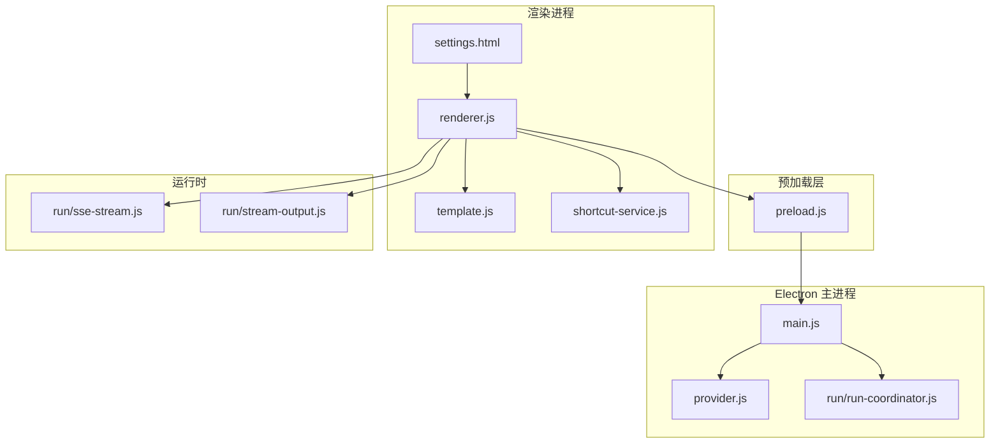
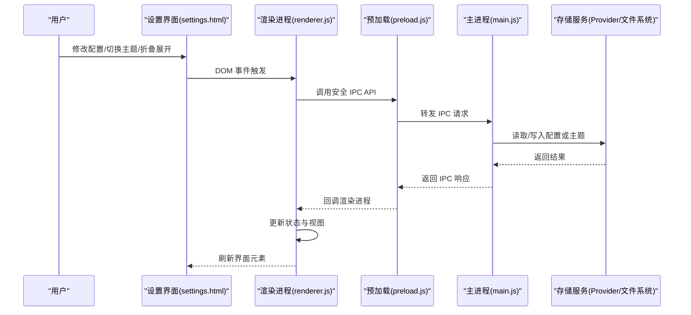
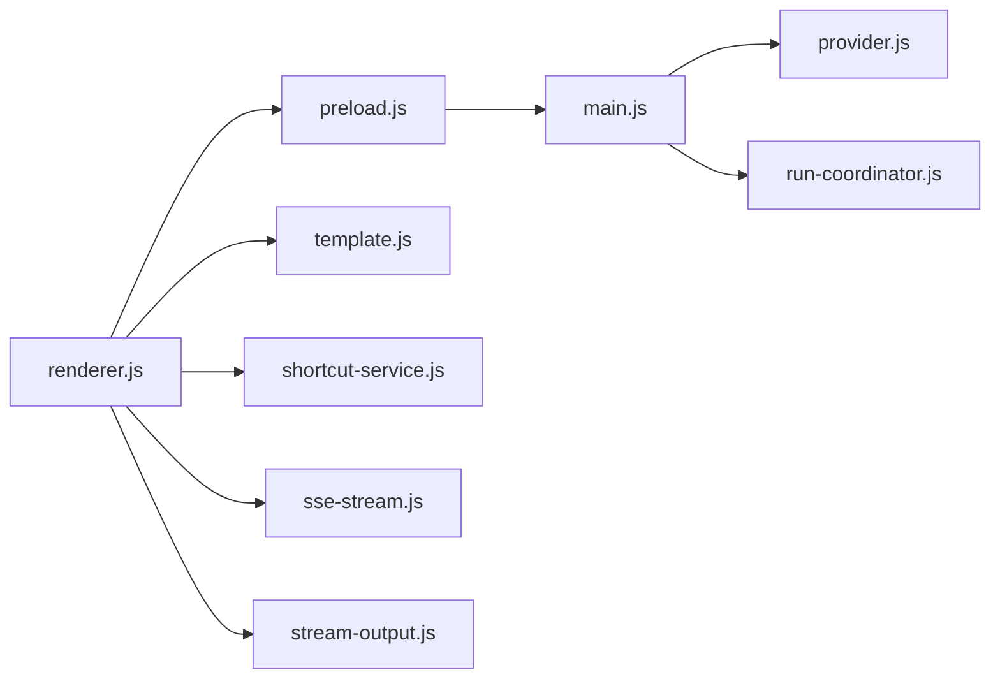

# 用户界面组件

<cite>
**本文引用的文件**   
- [settings.html](file://src/settings.html)
- [renderer.js](file://src/renderer.js)
- [preload.js](file://src/preload.js)
- [main.js](file://src/main.js)
- [template.js](file://src/template.js)
- [shortcut-service.js](file://src/shortcut-service.js)
- [provider.js](file://src/provider.js)
- [run-coordinator.js](file://src/run/run-coordinator.js)
- [sse-stream.js](file://src/run/sse-stream.js)
- [stream-output.js](file://src/run/stream-output.js)
- [settings-theme.test.js](file://test/settings-theme.test.js)
</cite>

## 更新摘要
**所做更改**
- 更新了设置界面结构，将"关于"部分与"Mac权限设置指南"合并为单个可折叠框架
- 修改了HTML模板中的相关结构和样式
- 更新了渲染进程中的JavaScript逻辑以支持新的可折叠交互
- 保持了原有的主题切换、IPC通信和响应式设计功能

## 目录
1. [简介](#简介)
2. [项目结构](#项目结构)
3. [核心组件](#核心组件)
4. [架构总览](#架构总览)
5. [详细组件分析](#详细组件分析)
6. [依赖关系分析](#依赖关系分析)
7. [性能考虑](#性能考虑)
8. [故障排查指南](#故障排查指南)
9. [结论](#结论)
10. [附录](#附录)

## 简介
本文件面向用户界面（UI）组件，重点围绕设置界面的 HTML 结构与样式设计、前后端通信机制（事件处理与状态同步）、主题切换功能实现与自定义样式方法、响应式设计与无障碍访问支持，以及扩展 UI 组件的实践进行系统化说明。文档同时解释前端代码的组织结构与模块化设计，帮助读者在不深入源码细节的前提下快速上手与二次开发。

**最新更新**：设置界面已重新结构化，将"关于"部分与"Mac权限设置指南"合并为单个可折叠框架，提升了用户体验和信息组织效率。

## 项目结构
本项目采用 Electron 架构：主进程负责系统级能力与窗口管理，渲染进程承载页面与交互逻辑，预加载脚本桥接两者并提供安全 API。设置界面由独立的 HTML 模板与渲染脚本组成，并通过 IPC 与主进程通信；运行子系统通过流式输出与 SSE 提供实时数据展示。

图表来源
- [main.js](file://src/main.js)
- [preload.js](file://src/preload.js)
- [renderer.js](file://src/renderer.js)
- [settings.html](file://src/settings.html)
- [template.js](file://src/template.js)
- [shortcut-service.js](file://src/shortcut-service.js)
- [provider.js](file://src/provider.js)
- [run-coordinator.js](file://src/run/run-coordinator.js)
- [sse-stream.js](file://src/run/sse-stream.js)
- [stream-output.js](file://src/run/stream-output.js)

章节来源
- [main.js](file://src/main.js)
- [preload.js](file://src/preload.js)
- [renderer.js](file://src/renderer.js)
- [settings.html](file://src/settings.html)

## 核心组件
- 设置界面（HTML + 渲染脚本）：提供配置项的可视化编辑、保存与预览，支持主题切换与快捷键设置。**新增**：可折叠框架用于整合"关于"和"Mac权限设置指南"内容。
- 预加载脚本：暴露安全的 IPC API，隔离 Node/Electron 原生能力，保障渲染进程安全。
- 主进程服务：窗口管理、Provider 集成、运行协调器与流式输出控制。
- 模板与快捷方式：模板渲染与快捷键服务的注册、监听与持久化。
- 运行时流：SSE 连接与流式输出渲染，提升长任务体验。

章节来源
- [renderer.js](file://src/renderer.js)
- [preload.js](file://src/preload.js)
- [main.js](file://src/main.js)
- [template.js](file://src/template.js)
- [shortcut-service.js](file://src/shortcut-service.js)
- [run-coordinator.js](file://src/run/run-coordinator.js)
- [sse-stream.js](file://src/run/sse-stream.js)
- [stream-output.js](file://src/run/stream-output.js)

## 架构总览
下图展示了设置界面从用户操作到数据落盘与视图更新的完整链路，包括 IPC 事件、状态同步与主题切换流程。

图表来源
- [settings.html](file://src/settings.html)
- [renderer.js](file://src/renderer.js)
- [preload.js](file://src/preload.js)
- [main.js](file://src/main.js)
- [provider.js](file://src/provider.js)

章节来源
- [renderer.js](file://src/renderer.js)
- [preload.js](file://src/preload.js)
- [main.js](file://src/main.js)
- [provider.js](file://src/provider.js)

## 详细组件分析

### 设置界面（HTML 结构与样式设计）
- 结构要点
  - 使用语义化标签组织表单区域、分组标题、输入控件与按钮。
  - **新增**：可折叠框架结构，用于整合"关于"和"Mac权限设置指南"内容。
  - 为关键控件添加 aria-* 属性与可聚焦能力，确保键盘导航与屏幕阅读器可用。
  - 将主题相关控件集中放置，便于统一管理与切换。
- 样式要点
  - 基于 CSS 变量定义主题色板，通过切换根节点类名实现主题切换。
  - 使用相对单位与弹性布局，保证在不同分辨率下的自适应。
  - 对焦点态、禁用态与错误态提供清晰视觉反馈。
  - **新增**：可折叠区域的过渡动画和状态指示样式。
- 示例路径
  - 设置界面 HTML 模板：[settings.html](file://src/settings.html)

**更新**：设置了界面结构重组，将原本分离的"关于"部分和"Mac权限设置指南"合并为单个可折叠框架，优化了信息组织和用户体验。

章节来源
- [settings.html](file://src/settings.html)

### 前端与后端通信机制（IPC 事件与状态同步）
- 通信模型
  - 渲染进程通过预加载脚本暴露的安全 API 发起 IPC 请求。
  - 主进程接收并处理请求，读写 Provider 或系统资源后返回结果。
- 事件处理
  - 渲染进程监听 DOM 事件，聚合参数后调用 IPC。
  - **新增**：可折叠框架的展开/收起事件处理逻辑。
  - 主进程分发到对应处理器，执行完成后以 Promise/回调形式返回。
- 状态同步
  - 渲染进程维护本地状态树，收到 IPC 响应后局部更新视图。
  - 对于长任务，结合流式输出实时更新进度与结果。
- 示例路径
  - 渲染进程逻辑：[renderer.js](file://src/renderer.js)
  - 预加载桥接：[preload.js](file://src/preload.js)
  - 主进程入口与服务：[main.js](file://src/main.js)
  - Provider 集成：[provider.js](file://src/provider.js)

章节来源
- [renderer.js](file://src/renderer.js)
- [preload.js](file://src/preload.js)
- [main.js](file://src/main.js)
- [provider.js](file://src/provider.js)

### 主题切换功能的实现原理与自定义样式
- 实现原理
  - 在根节点切换主题类名，CSS 变量随之变化，所有依赖变量的样式自动更新。
  - 主题选择变更时，通过 IPC 持久化当前主题键值。
  - 应用启动时读取已保存的主题并应用到根节点。
- 自定义样式
  - 新增主题只需扩展 CSS 变量映射，无需改动业务逻辑。
  - 建议按"基础色板—语义色—组件色"分层定义，便于维护。
- 示例路径
  - 主题测试用例（验证行为）：[settings-theme.test.js](file://test/settings-theme.test.js)
  - 设置界面与渲染逻辑：[settings.html](file://src/settings.html), [renderer.js](file://src/renderer.js)

章节来源
- [settings-theme.test.js](file://test/settings-theme.test.js)
- [settings.html](file://src/settings.html)
- [renderer.js](file://src/renderer.js)

### 响应式设计最佳实践
- 布局策略
  - 使用 Flexbox/Grid 构建弹性布局，避免固定宽度。
  - 通过媒体查询适配不同断点，调整排版与间距。
  - **新增**：可折叠框架在不同屏幕尺寸下的自适应显示。
- 字体与触控
  - 使用相对单位（rem/em），保证缩放一致性。
  - 触控目标尺寸不小于推荐值，提升移动端可用性。
- 性能优化
  - 减少重排重绘，批量更新 DOM。
  - 图片与图标按需加载，避免阻塞渲染。
- 示例路径
  - 渲染进程与模板：[renderer.js](file://src/renderer.js), [template.js](file://src/template.js)

章节来源
- [renderer.js](file://src/renderer.js)
- [template.js](file://src/template.js)

### 无障碍访问（a11y）支持措施
- 语义化与标注
  - 为表单控件提供 label 或 aria-label，确保可读性。
  - 使用 role、aria-* 描述动态内容变化与状态。
  - **新增**：可折叠框架的 aria-expanded 属性和键盘导航支持。
- 键盘可达性
  - 保证 Tab 顺序合理，Enter/Space 触发预期动作。
  - 焦点可见且符合对比度要求。
- 屏幕阅读器友好
  - 对错误提示与成功反馈使用 live region 播报。
  - **新增**：可折叠状态变化的语音播报支持。
- 示例路径
  - 设置界面与渲染逻辑：[settings.html](file://src/settings.html), [renderer.js](file://src/renderer.js)

章节来源
- [settings.html](file://src/settings.html)
- [renderer.js](file://src/renderer.js)

### 扩展 UI 组件与新增界面元素的实践
- 步骤概览
  - 在设置界面 HTML 中新增语义化结构与必要属性。
  - 在渲染进程中绑定事件、校验输入、调用 IPC 保存。
  - 若涉及主题，扩展 CSS 变量并在主题切换时生效。
  - 编写单元测试覆盖新增逻辑与边界情况。
  - **新增**：对于可折叠组件，确保正确的状态管理和无障碍支持。
- 示例路径
  - 模板与快捷方式服务：[template.js](file://src/template.js), [shortcut-service.js](file://src/shortcut-service.js)
  - 设置界面与渲染逻辑：[settings.html](file://src/settings.html), [renderer.js](file://src/renderer.js)

章节来源
- [template.js](file://src/template.js)
- [shortcut-service.js](file://src/shortcut-service.js)
- [settings.html](file://src/settings.html)
- [renderer.js](file://src/renderer.js)

### 运行时流式输出与状态同步
- 流式输出
  - 通过 SSE 建立长连接，服务端推送增量数据。
  - 渲染进程解析并追加到输出区域，保持滚动与性能。
- 状态同步
  - 将运行状态与输出内容分离，避免频繁全量重绘。
  - 对大文本进行分片渲染与虚拟滚动（如需要）。
- 示例路径
  - SSE 流：[sse-stream.js](file://src/run/sse-stream.js)
  - 流式输出渲染：[stream-output.js](file://src/run/stream-output.js)
  - 运行协调器：[run-coordinator.js](file://src/run/run-coordinator.js)

章节来源
- [sse-stream.js](file://src/run/sse-stream.js)
- [stream-output.js](file://src/run/stream-output.js)
- [run-coordinator.js](file://src/run/run-coordinator.js)

## 依赖关系分析
- 模块耦合
  - 渲染进程依赖预加载桥接与模板/快捷方式服务。
  - 主进程依赖 Provider 与运行协调器，对外暴露稳定 IPC 接口。
- 外部依赖
  - SSE 与流式输出用于长任务与实时数据展示。
  - 文件系统/Provider 用于配置与主题持久化。
- 潜在循环依赖
  - 通过 IPC 解耦渲染与主进程，避免直接导入造成循环。

图表来源
- [renderer.js](file://src/renderer.js)
- [preload.js](file://src/preload.js)
- [template.js](file://src/template.js)
- [shortcut-service.js](file://src/shortcut-service.js)
- [sse-stream.js](file://src/run/sse-stream.js)
- [stream-output.js](file://src/run/stream-output.js)
- [main.js](file://src/main.js)
- [provider.js](file://src/provider.js)
- [run-coordinator.js](file://src/run/run-coordinator.js)

章节来源
- [renderer.js](file://src/renderer.js)
- [preload.js](file://src/preload.js)
- [main.js](file://src/main.js)
- [provider.js](file://src/provider.js)
- [run-coordinator.js](file://src/run/run-coordinator.js)
- [sse-stream.js](file://src/run/sse-stream.js)
- [stream-output.js](file://src/run/stream-output.js)

## 性能考虑
- 渲染优化
  - 合并 DOM 更新，避免频繁重排；对长列表使用虚拟滚动。
  - 节流/防抖高频事件（如输入、滚动）。
  - **新增**：可折叠框架的动画性能优化，使用 CSS transform 而非位置属性。
- 网络与流
  - 合理设置 SSE 心跳与重试策略，降低抖动影响。
  - 对大消息进行分片与去重，减少内存占用。
- 主题切换
  - 仅切换类名与 CSS 变量，避免重建样式表。
- 示例路径
  - 流式输出与协调器：[stream-output.js](file://src/run/stream-output.js), [run-coordinator.js](file://src/run/run-coordinator.js)

章节来源
- [stream-output.js](file://src/run/stream-output.js)
- [run-coordinator.js](file://src/run/run-coordinator.js)

## 故障排查指南
- 常见问题
  - IPC 调用失败：检查预加载是否暴露正确 API，主进程是否注册对应处理器。
  - 主题未生效：确认根节点类名切换与 CSS 变量覆盖优先级。
  - 流式输出卡顿：检查分片大小与渲染频率，必要时引入虚拟滚动。
  - **新增**：可折叠功能异常：检查事件绑定和状态管理逻辑。
- 定位手段
  - 在主进程与渲染进程分别打印关键日志。
  - 使用浏览器 DevTools 观察网络与事件流。
- 示例路径
  - 预加载与主进程：[preload.js](file://src/preload.js), [main.js](file://src/main.js)
  - 流式输出与协调器：[stream-output.js](file://src/run/stream-output.js), [run-coordinator.js](file://src/run/run-coordinator.js)

章节来源
- [preload.js](file://src/preload.js)
- [main.js](file://src/main.js)
- [stream-output.js](file://src/run/stream-output.js)
- [run-coordinator.js](file://src/run/run-coordinator.js)

## 结论
本文围绕设置界面的 HTML 结构与样式、前后端通信、主题切换、响应式与无障碍、组件扩展与运行时流式输出等方面进行了系统化说明。遵循本文档的最佳实践，可在保证可维护性与用户体验的同时，高效扩展与定制 UI 组件。

**最新更新**：设置界面的重新结构设计提升了信息组织的效率和用户体验，特别是将相关内容整合为可折叠框架的做法值得在其他界面组件中借鉴。

## 附录
- 术语
  - IPC：进程间通信
  - SSE：服务器发送事件
  - a11y：无障碍访问
- 参考路径
  - 设置界面与渲染：[settings.html](file://src/settings.html), [renderer.js](file://src/renderer.js)
  - 预加载与主进程：[preload.js](file://src/preload.js), [main.js](file://src/main.js)
  - 模板与快捷方式：[template.js](file://src/template.js), [shortcut-service.js](file://src/shortcut-service.js)
  - Provider 与运行：[provider.js](file://src/provider.js), [run-coordinator.js](file://src/run/run-coordinator.js)
  - 流式输出：[sse-stream.js](file://src/run/sse-stream.js), [stream-output.js](file://src/run/stream-output.js)