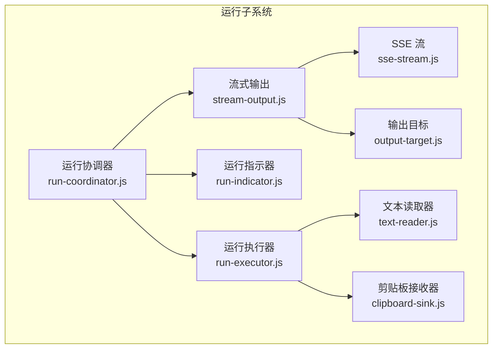
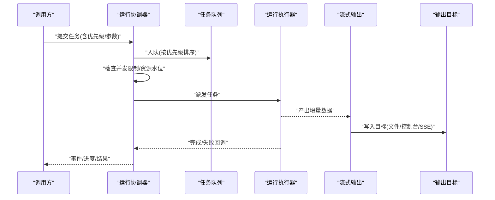
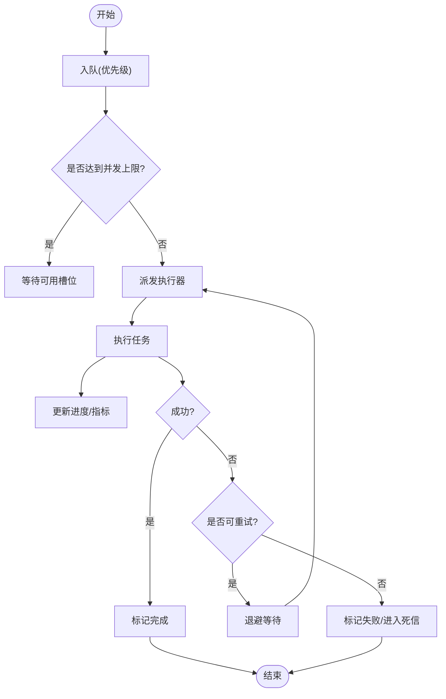
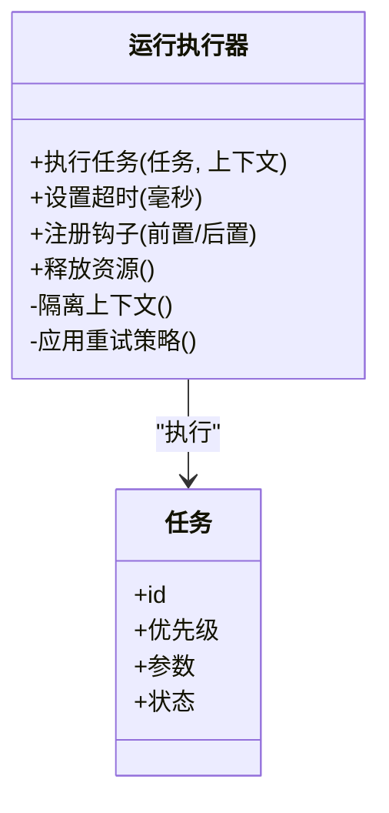
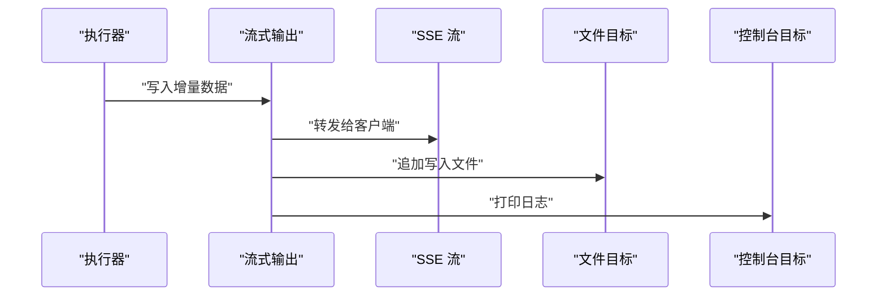
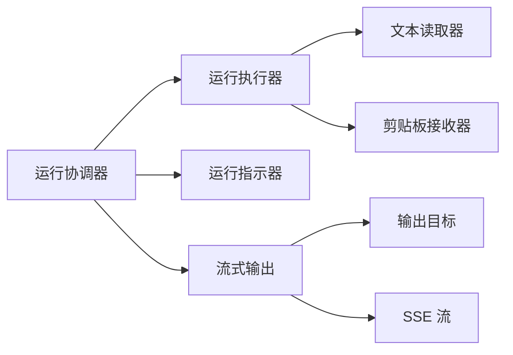

# 运行协调器

<cite>
**本文档引用的文件**   
- [run-coordinator.js](file://src/run/run-coordinator.js)
- [run-executor.js](file://src/run/run-executor.js)
- [run-indicator.js](file://src/run/run-indicator.js)
- [stream-output.js](file://src/run/stream-output.js)
- [sse-stream.js](file://src/run/sse-stream.js)
- [output-target.js](file://src/run/output-target.js)
- [text-reader.js](file://src/run/text-reader.js)
- [clipboard-sink.js](file://src/run/clipboard-sink.js)
- [run-coordinator.test.js](file://test/run/run-coordinator.test.js)
- [run-executor.test.js](file://test/run/run-executor.test.js)
</cite>

## 目录
1. [简介](#简介)
2. [项目结构](#项目结构)
3. [核心组件](#核心组件)
4. [架构总览](#架构总览)
5. [详细组件分析](#详细组件分析)
6. [依赖关系分析](#依赖关系分析)
7. [性能考虑](#性能考虑)
8. [故障排查指南](#故障排查指南)
9. [结论](#结论)
10. [附录：使用示例与最佳实践](#附录使用示例与最佳实践)

## 简介
本文件面向“运行协调器”（Run Coordinator），聚焦其在任务调度与资源管理中的核心职责。文档从系统架构、数据流、并发控制、错误恢复、监控反馈与性能调优等维度进行系统化说明，并通过图示帮助读者快速理解运行协调器如何组织并驱动多个异步任务的执行。

## 项目结构
运行协调器位于 src/run 目录下，围绕“协调器—执行器—输出目标—流式处理”的层次化设计展开。测试用例位于 test/run 下，覆盖协调器与执行器的关键路径。

图表来源
- [run-coordinator.js](file://src/run/run-coordinator.js)
- [run-executor.js](file://src/run/run-executor.js)
- [run-indicator.js](file://src/run/run-indicator.js)
- [stream-output.js](file://src/run/stream-output.js)
- [sse-stream.js](file://src/run/sse-stream.js)
- [output-target.js](file://src/run/output-target.js)
- [text-reader.js](file://src/run/text-reader.js)
- [clipboard-sink.js](file://src/run/clipboard-sink.js)

章节来源
- [run-coordinator.js](file://src/run/run-coordinator.js)
- [run-executor.js](file://src/run/run-executor.js)
- [run-indicator.js](file://src/run/run-indicator.js)
- [stream-output.js](file://src/run/stream-output.js)
- [sse-stream.js](file://src/run/sse-stream.js)
- [output-target.js](file://src/run/output-target.js)
- [text-reader.js](file://src/run/text-reader.js)
- [clipboard-sink.js](file://src/run/clipboard-sink.js)

## 核心组件
- 运行协调器：负责任务队列的组织、优先级排序、生命周期管理与并发控制；对外暴露统一的提交、启动、暂停、恢复与停止接口；聚合指标与事件上报。
- 运行执行器：负责具体任务的执行上下文、资源分配、重试策略与错误隔离；提供可插拔的执行钩子。
- 运行指示器：统一采集与广播任务进度、状态变更与统计指标，供 UI 或外部系统消费。
- 流式输出：将执行过程中的增量数据以流式方式推送至多种目标（控制台、文件、网络 SSE 等）。
- 输出目标：抽象各类输出目的地，实现统一写入接口与背压处理。
- 文本读取器：对输入源进行分块读取与缓冲，适配不同数据源。
- 剪贴板接收器：作为特殊输出目标，将结果写入系统剪贴板。

章节来源
- [run-coordinator.js](file://src/run/run-coordinator.js)
- [run-executor.js](file://src/run/run-executor.js)
- [run-indicator.js](file://src/run/run-indicator.js)
- [stream-output.js](file://src/run/stream-output.js)
- [output-target.js](file://src/run/output-target.js)
- [text-reader.js](file://src/run/text-reader.js)
- [clipboard-sink.js](file://src/run/clipboard-sink.js)

## 架构总览
运行协调器采用“队列 + 执行器池 + 流式输出”的架构模式。任务进入协调器后，按优先级入队；协调器根据当前负载与资源水位，动态调度到执行器池；执行器在独立上下文中运行任务，并将中间结果通过流式输出管道分发到各目标；运行指示器持续收集状态与指标，形成可观测性闭环。

图表来源
- [run-coordinator.js](file://src/run/run-coordinator.js)
- [run-executor.js](file://src/run/run-executor.js)
- [stream-output.js](file://src/run/stream-output.js)
- [output-target.js](file://src/run/output-target.js)

## 详细组件分析

### 运行协调器（任务队列与并发控制）
- 任务队列管理
  - 支持优先级队列，确保高优先级任务优先执行。
  - 维护任务状态机（待执行、运行中、已完成、已取消、失败），并提供查询接口。
  - 生命周期管理包括创建、入队、出队、执行、完成、清理等阶段。
- 并发控制策略
  - 基于令牌桶或信号量模型限制同时运行的任务数。
  - 结合资源水位（CPU/内存/IO）动态调整并发度，避免过载。
  - 支持任务分组与隔离，防止相互影响。
- 监控与反馈
  - 统一的事件总线用于发布任务状态、进度与指标。
  - 提供快照接口获取当前队列长度、活跃任务数、吞吐与延迟分布。
- 错误恢复与重试
  - 支持指数退避与最大重试次数配置。
  - 失败任务可进入死信队列，便于后续人工干预或自动补偿。

图表来源
- [run-coordinator.js](file://src/run/run-coordinator.js)

章节来源
- [run-coordinator.js](file://src/run/run-coordinator.js)
- [run-coordinator.test.js](file://test/run/run-coordinator.test.js)

### 运行执行器（任务执行与资源隔离）
- 执行上下文
  - 为每个任务提供独立的执行环境，隔离副作用与状态。
  - 支持超时控制与取消信号，避免长时间阻塞。
- 资源竞争处理
  - 通过互斥锁或读写锁保护共享资源访问。
  - 对 IO 密集型任务采用缓冲与批处理降低争用。
- 重试与容错
  - 可配置的重试策略（固定间隔、指数退避、抖动）。
  - 异常分类与降级策略，保证整体可用性。

图表来源
- [run-executor.js](file://src/run/run-executor.js)

章节来源
- [run-executor.js](file://src/run/run-executor.js)
- [run-executor.test.js](file://test/run/run-executor.test.js)

### 运行指示器（监控与进度反馈）
- 指标采集
  - 实时统计任务数量、成功率、平均耗时、P95/P99 延迟。
  - 记录队列深度、并发度、资源利用率。
- 事件广播
  - 统一事件类型：任务开始、进度更新、完成、失败、取消。
  - 支持订阅/取消订阅机制，供 UI 或外部系统消费。
- 可视化与告警
  - 提供阈值告警与趋势分析接口。
  - 导出指标以便接入监控系统。

章节来源
- [run-indicator.js](file://src/run/run-indicator.js)

### 流式输出与输出目标（增量数据处理）
- 流式输出
  - 将执行过程中的增量数据以流式方式推送，减少内存占用与延迟。
  - 支持背压控制，避免下游处理瓶颈。
- 输出目标
  - 抽象统一写入接口，支持多目标并行写入。
  - 提供缓冲、压缩与编码选项。
- SSE 集成
  - 通过 Server-Sent Events 将进度与结果实时推送到前端。

图表来源
- [stream-output.js](file://src/run/stream-output.js)
- [sse-stream.js](file://src/run/sse-stream.js)
- [output-target.js](file://src/run/output-target.js)

章节来源
- [stream-output.js](file://src/run/stream-output.js)
- [sse-stream.js](file://src/run/sse-stream.js)
- [output-target.js](file://src/run/output-target.js)

### 文本读取器与剪贴板接收器（输入/输出适配器）
- 文本读取器
  - 分块读取大文本，支持编码转换与行级处理。
  - 提供迭代器与流式接口，便于与执行器对接。
- 剪贴板接收器
  - 将最终结果写入系统剪贴板，便于用户直接粘贴使用。
  - 处理权限与兼容性差异。

章节来源
- [text-reader.js](file://src/run/text-reader.js)
- [clipboard-sink.js](file://src/run/clipboard-sink.js)

## 依赖关系分析
运行协调器依赖执行器、指示器与流式输出模块；执行器依赖文本读取器与剪贴板接收器等适配器；流式输出依赖输出目标与 SSE 流。整体耦合清晰，模块职责单一。

图表来源
- [run-coordinator.js](file://src/run/run-coordinator.js)
- [run-executor.js](file://src/run/run-executor.js)
- [run-indicator.js](file://src/run/run-indicator.js)
- [stream-output.js](file://src/run/stream-output.js)
- [output-target.js](file://src/run/output-target.js)
- [sse-stream.js](file://src/run/sse-stream.js)
- [text-reader.js](file://src/run/text-reader.js)
- [clipboard-sink.js](file://src/run/clipboard-sink.js)

章节来源
- [run-coordinator.js](file://src/run/run-coordinator.js)
- [run-executor.js](file://src/run/run-executor.js)
- [run-indicator.js](file://src/run/run-indicator.js)
- [stream-output.js](file://src/run/stream-output.js)
- [output-target.js](file://src/run/output-target.js)
- [sse-stream.js](file://src/run/sse-stream.js)
- [text-reader.js](file://src/run/text-reader.js)
- [clipboard-sink.js](file://src/run/clipboard-sink.js)

## 性能考虑
- 并发度调优
  - 根据 CPU 核数与 IO 特性设置合适的并发上限，避免上下文切换开销过大。
  - 针对 CPU 密集型任务降低并发，针对 IO 密集型任务适当提高并发。
- 背压与缓冲
  - 在流式输出链路上启用背压，防止下游慢导致上游积压。
  - 合理设置缓冲区大小，平衡内存占用与吞吐。
- 重试与退避
  - 使用指数退避与抖动策略，避免雪崩效应。
  - 区分可重试与不可重试错误，减少无效重试。
- 资源隔离
  - 为高优先级任务预留资源配额，保障 SLA。
  - 使用隔离的执行上下文，避免跨任务污染。

[本节为通用指导，不直接分析具体文件]

## 故障排查指南
- 常见问题定位
  - 任务堆积：检查队列长度与并发上限，确认是否存在慢任务或阻塞点。
  - 频繁重试：查看错误分类与重试策略，确认是否为瞬时错误。
  - 输出丢失：验证输出目标连接状态与权限，检查背压与缓冲配置。
- 诊断手段
  - 启用详细日志与指标采集，关注 P95/P99 延迟与失败率。
  - 使用快照接口获取运行时状态，辅助定位热点任务。
  - 对关键路径添加埋点，追踪端到端耗时。

章节来源
- [run-coordinator.test.js](file://test/run/run-coordinator.test.js)
- [run-executor.test.js](file://test/run/run-executor.test.js)

## 结论
运行协调器通过优先级队列、并发控制、流式输出与统一监控，构建了稳定高效的异步任务执行框架。其模块化设计与清晰的职责边界，使得扩展与优化变得简单直观。在生产环境中，建议结合业务特征调优并发与重试策略，并完善监控与告警体系，以确保系统的可靠性与可观测性。

[本节为总结性内容，不直接分析具体文件]

## 附录：使用示例与最佳实践
- 基本用法
  - 创建协调器实例，配置并发上限与重试策略。
  - 提交任务时指定优先级与参数，监听进度与完成事件。
  - 启动协调器后，任务按优先级与资源水位自动调度。
- 复杂流程编排
  - 将多个任务组合成有向无环图（DAG），定义依赖关系与分支条件。
  - 使用流式输出串联中间结果，减少序列化与存储开销。
- 最佳实践
  - 明确任务边界与失败语义，避免隐式副作用。
  - 为关键路径设置超时与熔断，提升鲁棒性。
  - 定期评估并发与缓冲参数，结合监控数据进行调优。

章节来源
- [run-coordinator.js](file://src/run/run-coordinator.js)
- [run-executor.js](file://src/run/run-executor.js)
- [stream-output.js](file://src/run/stream-output.js)
- [output-target.js](file://src/run/output-target.js)
- [sse-stream.js](file://src/run/sse-stream.js)
- [text-reader.js](file://src/run/text-reader.js)
- [clipboard-sink.js](file://src/run/clipboard-sink.js)
- [run-coordinator.test.js](file://test/run/run-coordinator.test.js)
- [run-executor.test.js](file://test/run/run-executor.test.js)