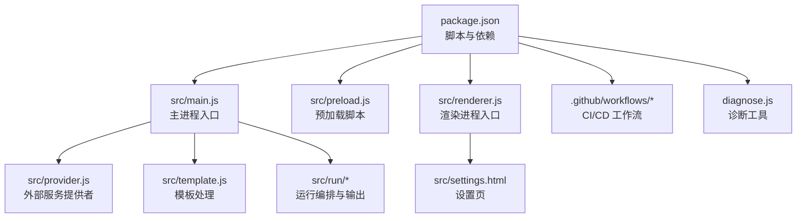
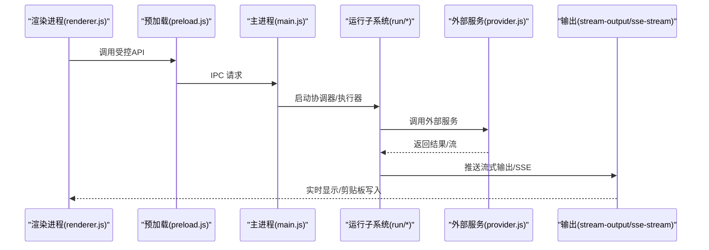
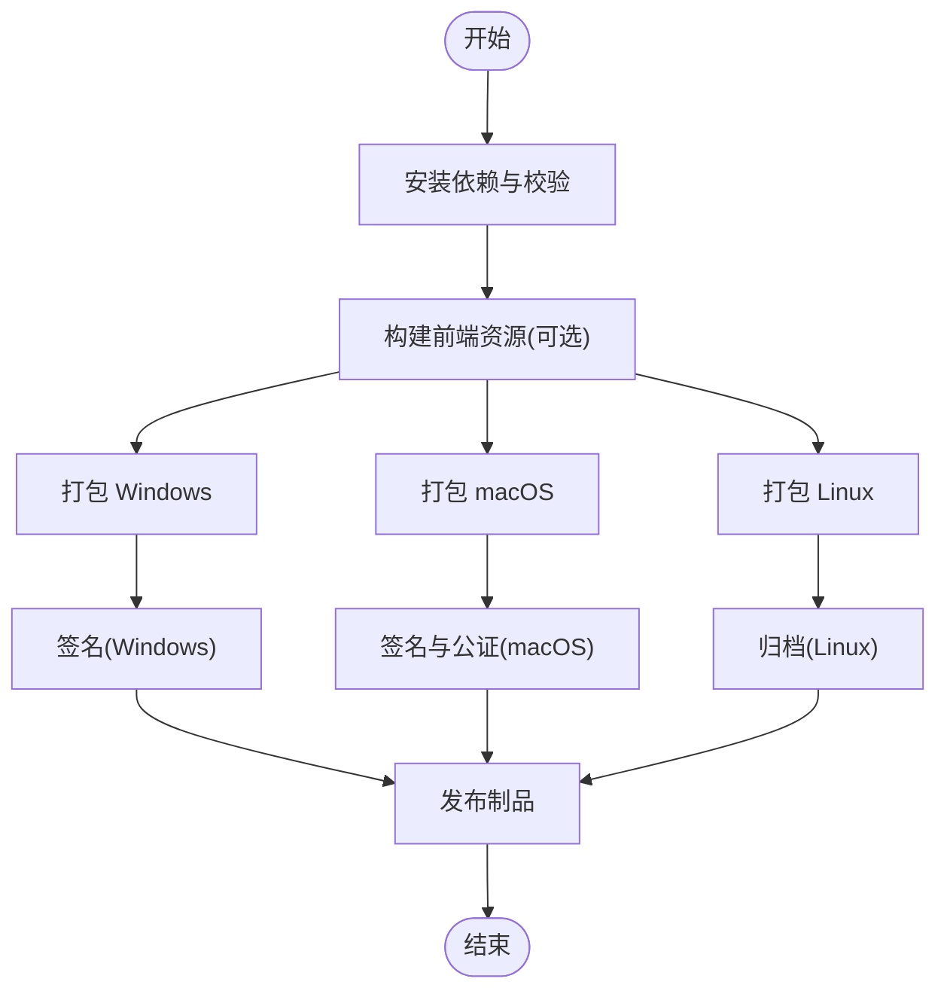
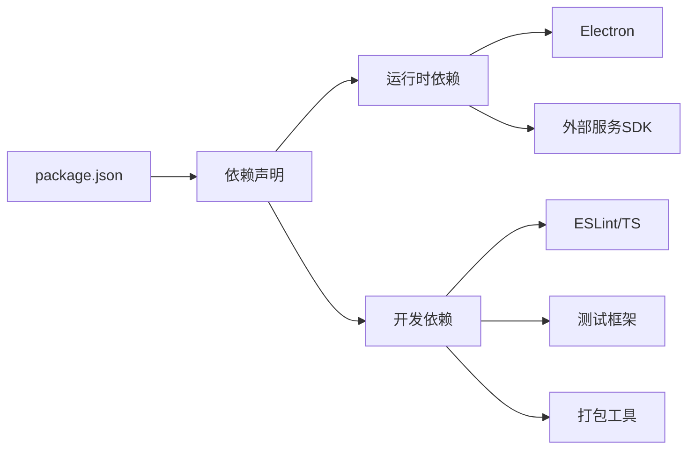

# 部署与构建

<cite>
**本文引用的文件**   
- [package.json](file://package.json)
- [README.md](file://README.md)
- [.github/workflows/verify.yml.bak](file://.github/workflows/verify.yml.bak)
- [.github/workflows/openissues_handle.yml](file://.github/workflows/openissues_handle.yml)
- [diagnose.js](file://diagnose.js)
- [src/main.js](file://src/main.js)
- [src/preload.js](file://src/preload.js)
- [src/renderer.js](file://src/renderer.js)
- [src/provider.js](file://src/provider.js)
- [src/template.js](file://src/template.js)
- [src/settings.html](file://src/settings.html)
- [src/run/run-coordinator.js](file://src/run/run-coordinator.js)
- [src/run/run-executor.js](file://src/run/run-executor.js)
- [src/run/stream-output.js](file://src/run/stream-output.js)
- [src/run/sse-stream.js](file://src/run/sse-stream.js)
- [src/run/output-target.js](file://src/run/output-target.js)
- [src/run/clipboard-sink.js](file://src/run/clipboard-sink.js)
- [src/run/text-reader.js](file://src/run/text-reader.js)
- [src/run/run-indicator.js](file://src/run/run-indicator.js)
- [eslint.config.js](file://eslint.config.js)
- [tsconfig.json](file://tsconfig.json)
</cite>

## 目录
1. [简介](#简介)
2. [项目结构](#项目结构)
3. [核心组件](#核心组件)
4. [架构总览](#架构总览)
5. [详细组件分析](#详细组件分析)
6. [依赖分析](#依赖分析)
7. [性能考虑](#性能考虑)
8. [故障排查指南](#故障排查指南)
9. [结论](#结论)
10. [附录](#附录)

## 简介
本文件面向“部署与构建”，覆盖多平台打包（Windows、macOS、Linux）、生产环境优化（代码压缩、资源优化、安全加固）、发布流程与版本管理最佳实践、诊断工具使用与常见问题排查，以及 CI/CD 流水线配置示例与自定义构建脚本。目标是确保应用在不同环境下稳定运行并具备可重复、可审计的构建与发布能力。

## 项目结构
仓库采用典型的 Electron 应用结构：
- src：主进程、预加载脚本、渲染进程与业务模块
- .github/workflows：CI/CD 工作流
- diagnose.js：诊断与问题定位工具
- package.json：项目元数据、脚本命令与依赖声明
- eslint.config.js、tsconfig.json：代码质量与类型配置

**图表来源** 
- [package.json](file://package.json)
- [src/main.js](file://src/main.js)
- [src/preload.js](file://src/preload.js)
- [src/renderer.js](file://src/renderer.js)
- [src/provider.js](file://src/provider.js)
- [src/template.js](file://src/template.js)
- [src/settings.html](file://src/settings.html)
- [src/run/run-coordinator.js](file://src/run/run-coordinator.js)
- [src/run/run-executor.js](file://src/run/run-executor.js)
- [src/run/stream-output.js](file://src/run/stream-output.js)
- [src/run/sse-stream.js](file://src/run/sse-stream.js)
- [src/run/output-target.js](file://src/run/output-target.js)
- [src/run/clipboard-sink.js](file://src/run/clipboard-sink.js)
- [src/run/text-reader.js](file://src/run/text-reader.js)
- [src/run/run-indicator.js](file://src/run/run-indicator.js)
- [.github/workflows/verify.yml.bak](file://.github/workflows/verify.yml.bak)
- [.github/workflows/openissues_handle.yml](file://.github/workflows/openissues_handle.yml)
- [diagnose.js](file://diagnose.js)

**章节来源**
- [package.json](file://package.json)
- [README.md](file://README.md)

## 核心组件
- 主进程（main.js）：负责窗口创建、生命周期管理、IPC 通道、与系统交互及启动子任务。
- 预加载脚本（preload.js）：在渲染进程暴露安全的 API，隔离 Node 能力。
- 渲染进程（renderer.js + settings.html）：用户界面与交互逻辑。
- 运行子系统（src/run/*）：协调执行、流式输出、SSE 推送、剪贴板写入、文本读取等。
- 外部服务集成（provider.js）：统一抽象外部服务调用。
- 模板引擎（template.js）：动态生成内容或配置。
- 诊断工具（diagnose.js）：收集环境与运行时信息，辅助定位问题。

**章节来源**
- [src/main.js](file://src/main.js)
- [src/preload.js](file://src/preload.js)
- [src/renderer.js](file://src/renderer.js)
- [src/settings.html](file://src/settings.html)
- [src/provider.js](file://src/provider.js)
- [src/template.js](file://src/template.js)
- [src/run/run-coordinator.js](file://src/run/run-coordinator.js)
- [src/run/run-executor.js](file://src/run/run-executor.js)
- [src/run/stream-output.js](file://src/run/stream-output.js)
- [src/run/sse-stream.js](file://src/run/sse-stream.js)
- [src/run/output-target.js](file://src/run/output-target.js)
- [src/run/clipboard-sink.js](file://src/run/clipboard-sink.js)
- [src/run/text-reader.js](file://src/run/text-reader.js)
- [src/run/run-indicator.js](file://src/run/run-indicator.js)
- [diagnose.js](file://diagnose.js)

## 架构总览
下图展示主进程、预加载、渲染进程与运行子系统的交互关系，以及外部服务与 SSE 输出路径。

**图表来源** 
- [src/renderer.js](file://src/renderer.js)
- [src/preload.js](file://src/preload.js)
- [src/main.js](file://src/main.js)
- [src/run/run-coordinator.js](file://src/run/run-coordinator.js)
- [src/run/run-executor.js](file://src/run/run-executor.js)
- [src/provider.js](file://src/provider.js)
- [src/run/stream-output.js](file://src/run/stream-output.js)
- [src/run/sse-stream.js](file://src/run/sse-stream.js)

## 详细组件分析

### 构建与打包（Electron 多平台）
- 目标产物：Windows（exe/msi）、macOS（dmg/app）、Linux（AppImage/deb/rpm）。
- 关键步骤：
  - 安装依赖与校验（lint、类型检查、测试）
  - 构建前端资源（如需要）
  - 打包 Electron 应用（按平台指定 target）
  - 签名与公证（macOS），数字签名（Windows）
  - 生成更新包与分发制品
- 建议脚本组织：
  - build:win / build:mac / build:linux
  - package:all（并行或串行构建多平台）
  - release:prepare（打标签、生成变更日志）
  - publish:dist（上传到 GitHub Releases）

[本节为通用指导，不直接分析具体文件]

### 生产环境优化
- 代码压缩与混淆：启用 Terser/UglifyJS，移除调试语句，最小化体积。
- 资源优化：图片压缩、字体子集化、静态资源缓存策略。
- 安全加固：禁用不必要的 Node 集成、限制 CSP、严格模式、输入校验。
- 构建产物：分离 vendor 与业务代码，启用增量构建与缓存。

[本节为通用指导，不直接分析具体文件]

### 发布流程与版本管理
- 语义化版本（SemVer）：主版本.次版本.修订号
- 自动化：
  - 通过 Git Tag 触发构建与发布
  - 自动生成变更日志
  - 上传至 GitHub Releases 或私有仓库
- 回滚策略：保留历史版本与校验和

[本节为通用指导，不直接分析具体文件]

### 诊断工具与常见问题排查
- 诊断工具（diagnose.js）：收集系统信息、环境变量、依赖版本、端口占用、网络连通性等。
- 常见症状与定位：
  - 启动失败：检查主进程日志、权限、路径
  - 渲染空白：检查 CSP、预加载脚本、资源路径
  - 外部服务不可用：检查网络、代理、证书
  - 流式输出异常：检查 SSE 连接、缓冲区、编码
- 建议：
  - 在 CI 中记录构建与运行日志
  - 提供本地诊断脚本一键采集信息

**章节来源**
- [diagnose.js](file://diagnose.js)

### CI/CD 流水线（GitHub Actions）
- 验证工作流（verify.yml.bak）：用于示例参考，包含安装、测试、构建步骤。
- 问题处理工作流（openissues_handle.yml）：演示事件驱动的处理流程。
- 建议：
  - 矩阵构建（Node 版本、操作系统）
  - 缓存 node_modules 与构建缓存
  - 并行构建多平台产物
  - 失败通知与重试机制

**章节来源**
- [.github/workflows/verify.yml.bak](file://.github/workflows/verify.yml.bak)
- [.github/workflows/openissues_handle.yml](file://.github/workflows/openissues_handle.yml)

### 自定义构建脚本与性能优化
- 脚本职责：
  - 清理构建目录、复制静态资源
  - 条件编译（开发/生产）
  - 并行任务（并发构建）
  - 产物校验（哈希、大小阈值）
- 性能优化：
  - 使用缓存（文件系统、远程缓存）
  - 增量构建与跳过未变更步骤
  - 减少 IO 与进程切换开销

[本节为通用指导，不直接分析具体文件]

## 依赖分析
- 运行时依赖：Electron、Node 模块、外部服务 SDK
- 开发依赖：ESLint、TypeScript、测试框架、打包工具
- 构建依赖：平台特定工具链（codesign、signtool、appimagetool 等）

**图表来源** 
- [package.json](file://package.json)
- [eslint.config.js](file://eslint.config.js)
- [tsconfig.json](file://tsconfig.json)

**章节来源**
- [package.json](file://package.json)
- [eslint.config.js](file://eslint.config.js)
- [tsconfig.json](file://tsconfig.json)

## 性能考虑
- 构建阶段：
  - 启用并行构建与缓存
  - 按需引入与 Tree Shaking
  - 避免大依赖与重复依赖
- 运行阶段：
  - 控制内存占用与 GC 频率
  - 流式处理大数据，避免阻塞主线程
  - 合理设置超时与重试策略

[本节为通用指导，不直接分析具体文件]

## 故障排查指南
- 快速定位：
  - 使用诊断工具采集环境信息
  - 查看主进程与渲染进程日志
  - 复现最小用例，逐步缩小范围
- 常见问题：
  - 权限不足：检查文件读写、注册表/系统权限
  - 网络问题：代理、防火墙、证书信任
  - 资源缺失：路径错误、相对路径解析
  - 兼容性问题：Node/Electron 版本差异

**章节来源**
- [diagnose.js](file://diagnose.js)

## 结论
通过规范的构建与打包流程、生产环境优化、严格的发布与版本管理、完善的诊断与 CI/CD 支持，可显著提升应用的稳定性与可维护性。建议在团队内统一脚本与规范，持续监控构建与运行指标，快速定位与修复问题。

## 附录
- 术语：
  - 主进程：Electron 的主线程，负责窗口与系统交互
  - 渲染进程：页面渲染与用户交互
  - 预加载脚本：桥接主进程与渲染进程的桥梁
  - SSE：服务端发送事件，用于实时推送
- 参考：
  - README 中的使用说明与背景信息
  - 工作流文件作为 CI/CD 示例

**章节来源**
- [README.md](file://README.md)