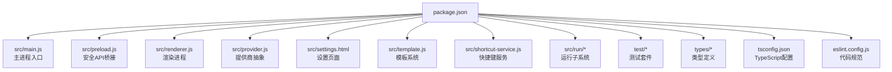
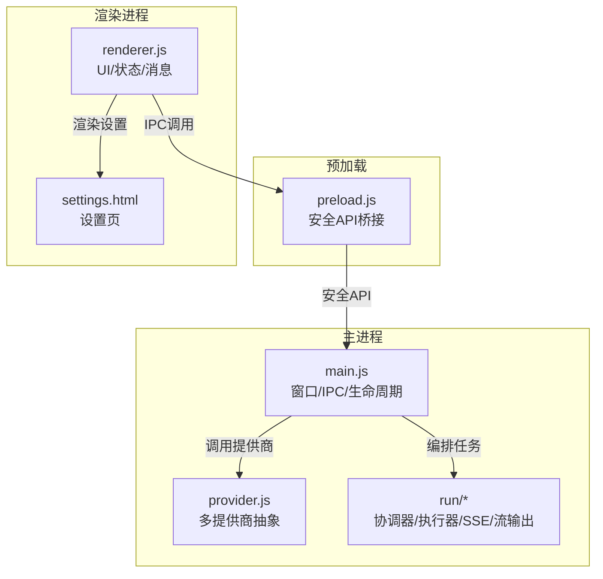
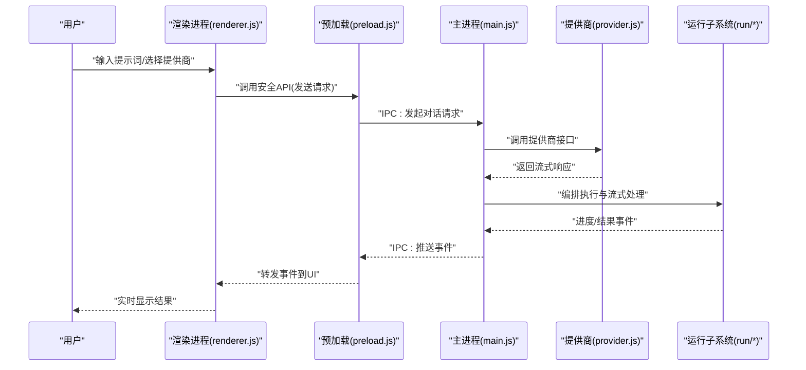
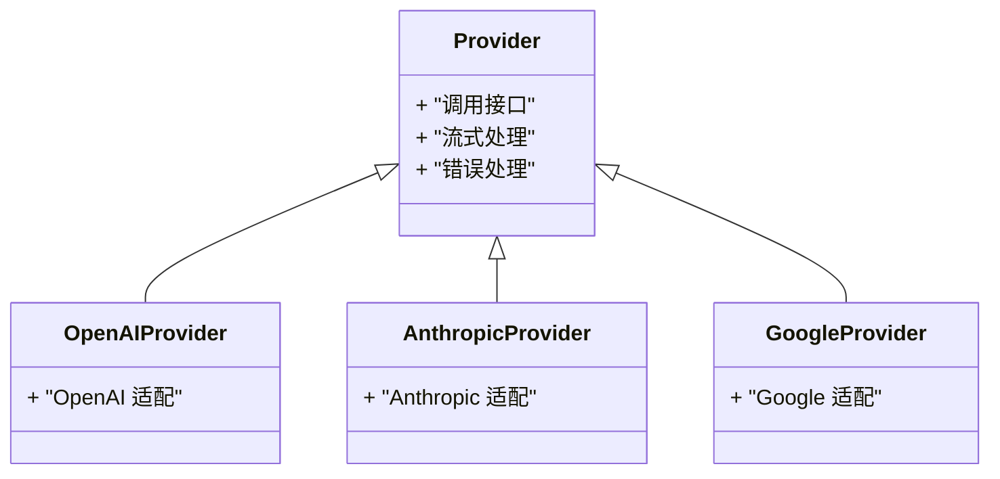
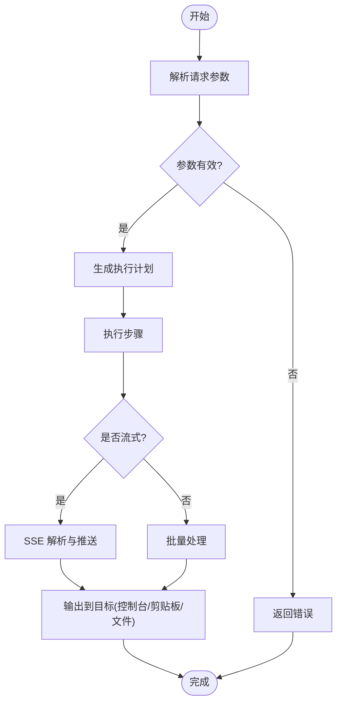
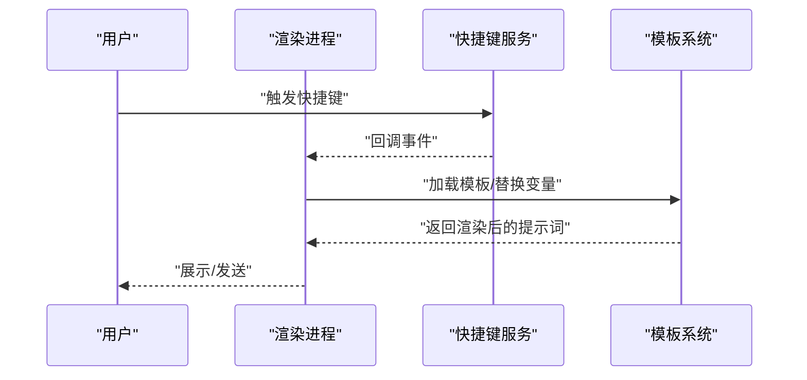
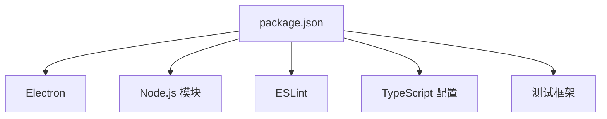

# 项目概览

<cite>
**本文引用的文件**   
- [package.json](file://package.json)
- [README.md](file://README.md)
- [src/main.js](file://src/main.js)
- [src/preload.js](file://src/preload.js)
- [src/renderer.js](file://src/renderer.js)
- [src/provider.js](file://src/provider.js)
- [src/settings.html](file://src/settings.html)
- [src/template.js](file://src/template.js)
- [src/shortcut-service.js](file://src/shortcut-service.js)
- [src/run/run-coordinator.js](file://src/run/run-coordinator.js)
- [src/run/run-executor.js](file://src/run/run-executor.js)
- [src/run/sse-stream.js](file://src/run/sse-stream.js)
- [src/run/stream-output.js](file://src/run/stream-output.js)
- [src/run/text-reader.js](file://src/run/text-reader.js)
- [src/run/output-target.js](file://src/run/output-target.js)
- [src/run/clipboard-sink.js](file://src/run/clipboard-sink.js)
- [src/run/run-indicator.js](file://src/run/run-indicator.js)
- [test/provider.test.js](file://test/provider.test.js)
- [test/run/run-coordinator.test.js](file://test/run/run-coordinator.test.js)
- [test/run/run-executor.test.js](file://test/run/run-executor.test.js)
- [test/run/stream-output.test.js](file://test/run/stream-output.test.js)
- [test/run/clipboard-sink.test.js](file://test/run/clipboard-sink.test.js)
- [test/settings-theme.test.js](file://test/settings-theme.test.js)
- [test/shortcut-draft.test.js](file://test/shortcut-draft.test.js)
- [test/shortcut-service.test.js](file://test/shortcut-service.test.js)
- [test/template.test.js](file://test/template.test.js)
- [tsconfig.json](file://tsconfig.json)
- [eslint.config.js](file://eslint.config.js)
- [AGENTS.md](file://AGENTS.md)
- [CONTEXT.md](file://CONTEXT.md)
</cite>

## 更新摘要
**所做更改**   
- 增强了项目文档结构，添加了全面的根编排细节
- 改进了模块描述和依赖关系分析
- 更新了架构总览以反映主进程、渲染进程和预加载脚本的职责分工
- 完善了运行子系统的协调器与执行器分离设计说明
- 增强了快捷键服务与模板系统的交互流程描述

## 目录
1. [简介](#简介)
2. [项目结构](#项目结构)
3. [核心组件](#核心组件)
4. [架构总览](#架构总览)
5. [详细组件分析](#详细组件分析)
6. [依赖关系分析](#依赖关系分析)
7. [性能考量](#性能考量)
8. [故障排查指南](#故障排查指南)
9. [结论](#结论)
10. [附录](#附录)

## 简介
prompt_gogo 是一个基于 Electron 的 AI 提示词管理工具，提供统一的对话界面，支持多提供商（如 OpenAI、Anthropic、Google 等）的模型接入。项目采用主进程与渲染进程分离的架构，通过预加载脚本暴露安全 API，将 UI 与系统能力解耦。技术栈以 JavaScript/TypeScript 为主，配合 ESLint 与 TypeScript 配置进行工程化治理，测试覆盖核心模块，便于持续集成与质量保障。

## 项目结构
项目采用分层与按功能组织相结合的结构：
- src：应用源码，包含主进程、预加载、渲染逻辑、提供商抽象、快捷键服务、运行子系统与模板系统等。
- test：单元测试与行为验证，覆盖 provider、运行子系统、快捷键、模板与设置主题等。
- types：浏览器全局类型声明。
- docs：架构决策记录与代理相关文档。
- .github/workflows：CI 工作流。
- package.json：项目元数据、脚本与依赖。

**图表来源**
- [package.json](file://package.json)
- [src/main.js](file://src/main.js)
- [src/preload.js](file://src/preload.js)
- [src/renderer.js](file://src/renderer.js)
- [src/provider.js](file://src/provider.js)
- [src/settings.html](file://src/settings.html)
- [src/template.js](file://src/template.js)
- [src/shortcut-service.js](file://src/shortcut-service.js)
- [src/run/run-coordinator.js](file://src/run/run-coordinator.js)
- [src/run/run-executor.js](file://src/run/run-executor.js)
- [src/run/sse-stream.js](file://src/run/sse-stream.js)
- [src/run/stream-output.js](file://src/run/stream-output.js)
- [src/run/text-reader.js](file://src/run/text-reader.js)
- [src/run/output-target.js](file://src/run/output-target.js)
- [src/run/clipboard-sink.js](file://src/run/clipboard-sink.js)
- [src/run/run-indicator.js](file://src/run/run-indicator.js)
- [test/provider.test.js](file://test/provider.test.js)
- [test/run/run-coordinator.test.js](file://test/run/run-coordinator.test.js)
- [test/run/run-executor.test.js](file://test/run/run-executor.test.js)
- [test/run/stream-output.test.js](file://test/run/stream-output.test.js)
- [test/run/clipboard-sink.test.js](file://test/run/clipboard-sink.test.js)
- [test/settings-theme.test.js](file://test/settings-theme.test.js)
- [test/shortcut-draft.test.js](file://test/shortcut-draft.test.js)
- [test/shortcut-service.test.js](file://test/shortcut-service.test.js)
- [test/template.test.js](file://test/template.test.js)
- [tsconfig.json](file://tsconfig.json)
- [eslint.config.js](file://eslint.config.js)

**章节来源**
- [package.json](file://package.json)
- [README.md](file://README.md)

## 核心组件
- 主进程（main.js）：负责创建窗口、注册 IPC、生命周期管理与系统集成。
- 预加载（preload.js）：桥接渲染进程与主进程，暴露最小必要 API，确保安全性。
- 渲染进程（renderer.js）：承载 UI 交互、状态管理与消息展示。
- 提供商抽象（provider.js）：统一不同 AI 提供商的调用接口，屏蔽差异。
- 运行子系统（run/*）：编排任务执行、流式输出、SSE 处理、文本读取与剪贴板写入等。
- 快捷键服务（shortcut-service.js）：监听并处理全局或窗口级快捷键。
- 模板系统（template.js）：管理提示词模板与变量替换。
- 设置页（settings.html）：用户配置入口，含主题与提供商配置。

**章节来源**
- [src/main.js](file://src/main.js)
- [src/preload.js](file://src/preload.js)
- [src/renderer.js](file://src/renderer.js)
- [src/provider.js](file://src/provider.js)
- [src/run/run-coordinator.js](file://src/run/run-coordinator.js)
- [src/run/run-executor.js](file://src/run/run-executor.js)
- [src/run/sse-stream.js](file://src/run/sse-stream.js)
- [src/run/stream-output.js](file://src/run/stream-output.js)
- [src/run/text-reader.js](file://src/run/text-reader.js)
- [src/run/output-target.js](file://src/run/output-target.js)
- [src/run/clipboard-sink.js](file://src/run/clipboard-sink.js)
- [src/run/run-indicator.js](file://src/run/run-indicator.js)
- [src/shortcut-service.js](file://src/shortcut-service.js)
- [src/template.js](file://src/template.js)
- [src/settings.html](file://src/settings.html)

## 架构总览
Electron 应用由主进程、预加载与渲染进程组成，UI 与系统能力通过 IPC 通信。提供商抽象层屏蔽各 AI 厂商差异，运行子系统负责任务编排与流式数据处理。

**图表来源**
- [src/main.js](file://src/main.js)
- [src/preload.js](file://src/preload.js)
- [src/renderer.js](file://src/renderer.js)
- [src/provider.js](file://src/provider.js)
- [src/run/run-coordinator.js](file://src/run/run-coordinator.js)
- [src/run/run-executor.js](file://src/run/run-executor.js)
- [src/run/sse-stream.js](file://src/run/sse-stream.js)
- [src/run/stream-output.js](file://src/run/stream-output.js)
- [src/settings.html](file://src/settings.html)

## 详细组件分析

### 主进程与预加载
- 主进程负责创建窗口、注册 IPC 通道、处理系统事件与应用生命周期。
- 预加载脚本在渲染进程上下文注入安全 API，限制直接访问 Node/Electron 能力，仅暴露必要方法。

**图表来源**
- [src/renderer.js](file://src/renderer.js)
- [src/preload.js](file://src/preload.js)
- [src/main.js](file://src/main.js)
- [src/provider.js](file://src/provider.js)
- [src/run/run-coordinator.js](file://src/run/run-coordinator.js)
- [src/run/run-executor.js](file://src/run/run-executor.js)
- [src/run/sse-stream.js](file://src/run/sse-stream.js)
- [src/run/stream-output.js](file://src/run/stream-output.js)

**章节来源**
- [src/main.js](file://src/main.js)
- [src/preload.js](file://src/preload.js)
- [src/renderer.js](file://src/renderer.js)

### 提供商抽象层
- 统一不同 AI 提供商的调用方式，对外暴露一致的接口，内部根据配置选择具体实现。
- 支持流式响应与错误处理，便于扩展新提供商。

**图表来源**
- [src/provider.js](file://src/provider.js)

**章节来源**
- [src/provider.js](file://src/provider.js)
- [test/provider.test.js](file://test/provider.test.js)

### 运行子系统（协调器/执行器/流式处理）
- 协调器负责任务编排、调度与状态管理。
- 执行器负责具体步骤执行与资源管理。
- SSE 流处理与流式输出模块负责解析与服务端事件推送。
- 文本读取与剪贴板写入作为输出目标之一。

**图表来源**
- [src/run/run-coordinator.js](file://src/run/run-coordinator.js)
- [src/run/run-executor.js](file://src/run/run-executor.js)
- [src/run/sse-stream.js](file://src/run/sse-stream.js)
- [src/run/stream-output.js](file://src/run/stream-output.js)
- [src/run/text-reader.js](file://src/run/text-reader.js)
- [src/run/output-target.js](file://src/run/output-target.js)
- [src/run/clipboard-sink.js](file://src/run/clipboard-sink.js)

**章节来源**
- [src/run/run-coordinator.js](file://src/run/run-coordinator.js)
- [src/run/run-executor.js](file://src/run/run-executor.js)
- [src/run/sse-stream.js](file://src/run/sse-stream.js)
- [src/run/stream-output.js](file://src/run/stream-output.js)
- [src/run/text-reader.js](file://src/run/text-reader.js)
- [src/run/output-target.js](file://src/run/output-target.js)
- [src/run/clipboard-sink.js](file://src/run/clipboard-sink.js)
- [src/run/run-indicator.js](file://src/run/run-indicator.js)
- [test/run/run-coordinator.test.js](file://test/run/run-coordinator.test.js)
- [test/run/run-executor.test.js](file://test/run/run-executor.test.js)
- [test/run/stream-output.test.js](file://test/run/stream-output.test.js)
- [test/run/clipboard-sink.test.js](file://test/run/clipboard-sink.test.js)

### 快捷键服务与模板系统
- 快捷键服务监听并处理快捷键事件，提升操作效率。
- 模板系统管理提示词模板与变量替换，支持动态内容注入。

**图表来源**
- [src/shortcut-service.js](file://src/shortcut-service.js)
- [src/template.js](file://src/template.js)

**章节来源**
- [src/shortcut-service.js](file://src/shortcut-service.js)
- [src/template.js](file://src/template.js)
- [test/shortcut-service.test.js](file://test/shortcut-service.test.js)
- [test/shortcut-draft.test.js](file://test/shortcut-draft.test.js)
- [test/template.test.js](file://test/template.test.js)

### 设置页与主题
- 设置页提供提供商配置、主题切换与基础偏好设置。
- 主题样式与状态管理在渲染进程中维护。

**章节来源**
- [src/settings.html](file://src/settings.html)
- [test/settings-theme.test.js](file://test/settings-theme.test.js)

## 依赖关系分析
- 工程化依赖：ESLint 用于代码规范检查，TypeScript 配置用于类型定义与编译选项。
- 运行时依赖：Electron 提供桌面应用框架；Node.js 模块用于文件系统、网络与流处理。
- 测试依赖：单元测试框架覆盖核心模块，保证稳定性。

**图表来源**
- [package.json](file://package.json)
- [eslint.config.js](file://eslint.config.js)
- [tsconfig.json](file://tsconfig.json)

**章节来源**
- [package.json](file://package.json)
- [eslint.config.js](file://eslint.config.js)
- [tsconfig.json](file://tsconfig.json)

## 性能考量
- 流式处理：使用 SSE 与流式输出降低首屏延迟，提升用户体验。
- 任务编排：协调器与执行器分离，避免阻塞主线程，提高并发处理能力。
- 内存管理：合理拆分模块与事件驱动，减少不必要的对象持有。
- 网络优化：连接池与重试策略可进一步提升稳定性与吞吐。

[本节为通用指导，不直接分析具体文件]

## 故障排查指南
- 启动失败：检查 Node/Electron 版本兼容性与依赖安装完整性。
- 提供商调用失败：确认 API Key、网络连通与速率限制；查看错误日志与重试策略。
- 流式输出异常：检查 SSE 解析与事件分发逻辑；确认输出目标权限。
- 快捷键无效：确认快捷键冲突与事件监听范围；检查渲染进程上下文。
- 模板渲染错误：校验模板语法与变量映射；查看测试用例覆盖情况。

**章节来源**
- [test/provider.test.js](file://test/provider.test.js)
- [test/run/run-coordinator.test.js](file://test/run/run-coordinator.test.js)
- [test/run/run-executor.test.js](file://test/run/run-executor.test.js)
- [test/run/stream-output.test.js](file://test/run/stream-output.test.js)
- [test/run/clipboard-sink.test.js](file://test/run/clipboard-sink.test.js)
- [test/settings-theme.test.js](file://test/settings-theme.test.js)
- [test/shortcut-service.test.js](file://test/shortcut-service.test.js)
- [test/shortcut-draft.test.js](file://test/shortcut-draft.test.js)
- [test/template.test.js](file://test/template.test.js)

## 结论
prompt_gogo 通过 Electron 构建跨平台桌面应用，结合多提供商抽象与运行子系统，实现了统一的 AI 提示词管理与对话体验。清晰的职责划分与安全隔离设计使系统具备良好的可扩展性与可维护性。建议在新增提供商时遵循现有抽象接口，并在运行子系统中完善流式处理与错误恢复机制。

[本节为总结性内容，不直接分析具体文件]

## 附录
- 快速开始
  - 安装依赖：在项目根目录执行包管理器命令安装依赖。
  - 启动应用：执行开发模式命令启动应用。
  - 基本使用：打开设置页配置提供商与主题，输入提示词并选择提供商进行对话。
- 许可证与贡献
  - 许可证信息请参考项目根目录说明文件。
  - 贡献指南请参考 AGENTS.md 与 CONTEXT.md，了解提交规范与工作流程。

**章节来源**
- [README.md](file://README.md)
- [AGENTS.md](file://AGENTS.md)
- [CONTEXT.md](file://CONTEXT.md)