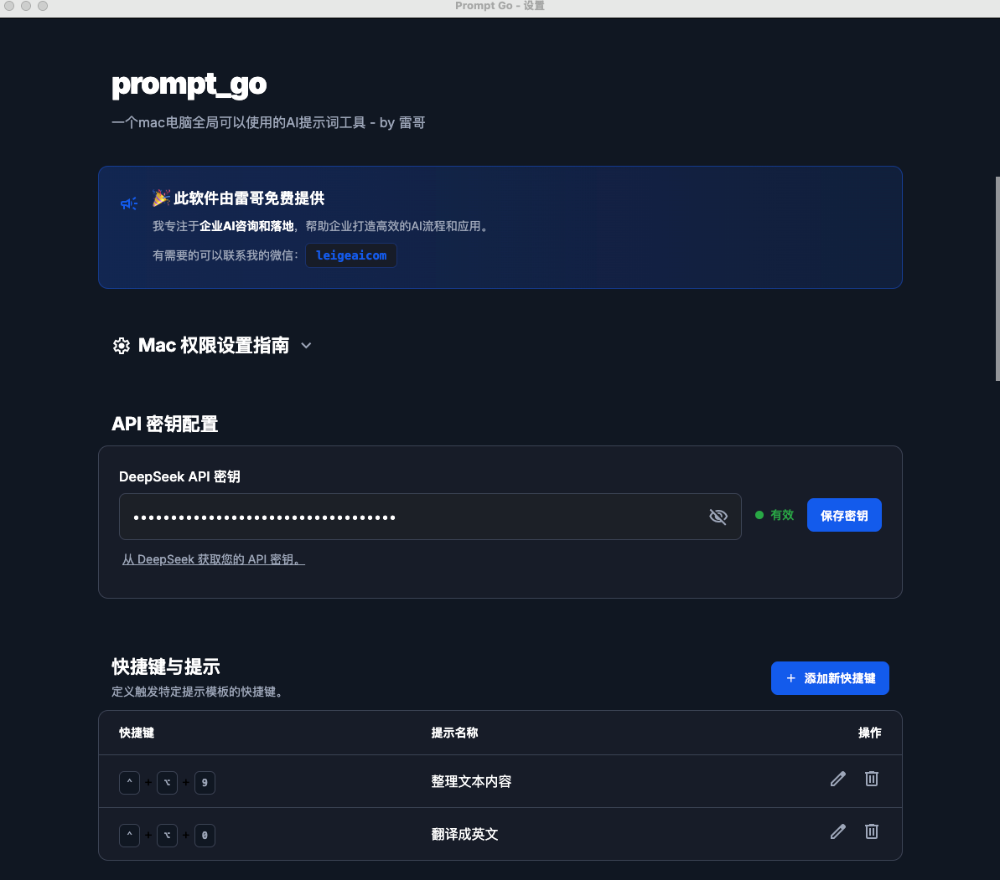

# Prompt Go

一个 macOS 桌面应用，可在任何应用中通过键盘快捷键快速处理选中的文本，使用 AI 驱动的自定义提示模板。



## 功能特性

- **全局键盘快捷键**：在任何应用中一键触发 AI 文本处理
- **自定义提示模板**：使用 `{{select_content}}` 占位符定义你自己的提示词模板
- **DeepSeek AI 集成**：基于 DeepSeek 大语言模型驱动
- **设置界面**：便捷管理 API 密钥和快捷键
- **深色模式**：优雅的深色主题界面

## 快速开始

### 普通用户（使用 DMG 安装包）

#### 安装步骤

由于应用未经过 Apple 官方签名，首次安装需要以下步骤：

1. **下载并打开 DMG 文件**
   - 双击下载的 `Prompt Go-1.0.0-arm64.dmg` 文件
   - 将 Prompt Go 图标拖入 Applications（应用程序）文件夹

2. **清除应用的扩展属性** ⚠️ 重要步骤
   - 打开**终端**应用（在"应用程序 → 实用工具"中）
   - 复制并执行以下命令：
   ```bash
   xattr -cr /Applications/Prompt\ Go.app
   ```
   - 这个命令会清除 macOS 对未签名应用的隔离标记
   - 如果提示需要管理员权限，可能需要在命令前加 `sudo`

3. **首次打开应用** ⚠️ 两种方法任选其一

   **方法一：右键打开（推荐）**
   - 打开 Finder，进入 Applications（应用程序）文件夹
   - 找到 Prompt Go 应用
   - **右键点击（或 Control+点击）** → 选择 **"打开"**
   - 在弹出的对话框中，点击 **"打开"** 按钮
   - 成功打开一次后，以后就可以正常双击打开了

   **方法二：终端命令打开**
   ```bash
   open /Applications/Prompt\ Go.app
   ```

4. **配置辅助功能权限**
   - 首次运行时应用会请求"辅助功能"权限
   - 打开 **系统设置** → **隐私与安全性** → **辅助功能**
   - 在列表中找到 **Prompt Go** 并勾选启用
   - 这个权限用于让应用捕获全局键盘快捷键和获取选中的文本

5. **配置 API 密钥**
   - 在设置界面输入你的 DeepSeek API Key（[在这里获取](https://platform.deepseek.com/api_keys)）
   - 配置键盘快捷键和提示词模板
   - 每个模板必须包含 `{{select_content}}` 占位符

#### 故障排除

**问题：提示"无法打开应用，因为无法验证开发者"**
- 解决方法 1：执行 `xattr -cr /Applications/Prompt\ Go.app` 命令
- 解决方法 2：使用"右键 → 打开"的方式首次启动
- 解决方法 3：在"系统设置 → 隐私与安全性"中点击"仍要打开"

**问题：快捷键不生效**
- 检查是否授予了"辅助功能"权限
- 确保快捷键没有与系统快捷键冲突
- 尝试重启应用
- 在"系统设置 → 隐私与安全性 → 辅助功能"中移除并重新添加 Prompt Go

**问题：无法获取选中的文本**
- 确认已授予"辅助功能"权限
- 某些应用（如密码管理器）出于安全考虑可能会阻止文本读取

### 开发者

#### 安装依赖

1. 克隆仓库
2. 安装依赖：
```bash
npm install
```

#### 运行应用

```bash
# 开发模式
npm run dev

# 生产模式
npm start
```

#### 打包发布

```bash
npm run dist
```

### 使用方法

1. 在任何应用中选中一段文本
2. 按下你配置的快捷键（例如 `Cmd+Shift+1`）
3. 应用会：
   - 捕获选中的文本
   - 使用你的提示词模板通过 DeepSeek AI 处理
   - 将结果自动复制到剪贴板
4. 处理完成后会显示通知

## 默认快捷键

- **Cmd+Shift+1**：总结文本
- **Cmd+Shift+2**：翻译成英文
- **Cmd+Shift+3**：解释代码

你可以在设置中修改这些快捷键或添加新的。

## 系统架构

- **主进程**（`src/main.js`）：Electron 主进程，处理窗口管理、全局快捷键和 API 调用
- **预加载脚本**（`src/preload.js`）：主进程和渲染进程之间的安全 IPC 桥接
- **渲染进程**（`src/renderer.js`）：设置界面的前端逻辑
- **设置界面**（`src/settings.html`）：配置界面

## 系统要求

- macOS 10.15 或更高版本
- Node.js 16 或更高版本（仅开发者需要）
- DeepSeek API 密钥

## 开源协议

MIT License
